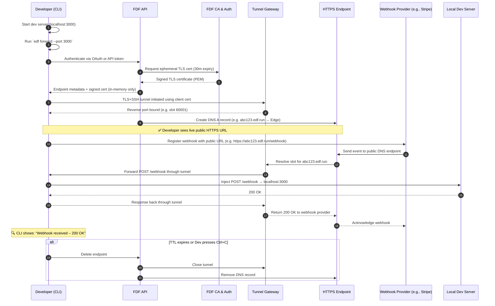
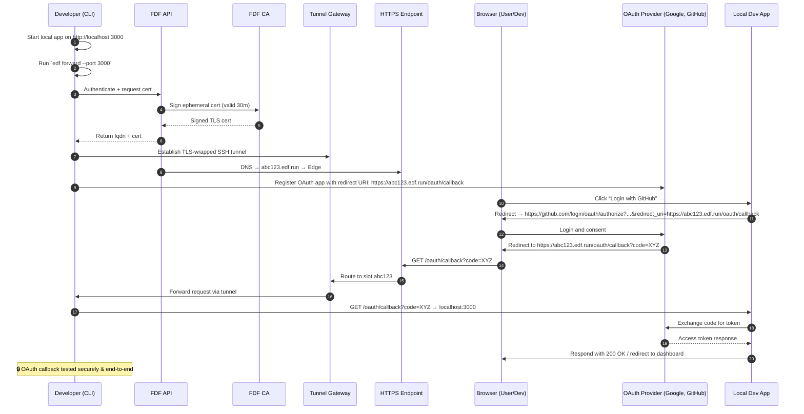
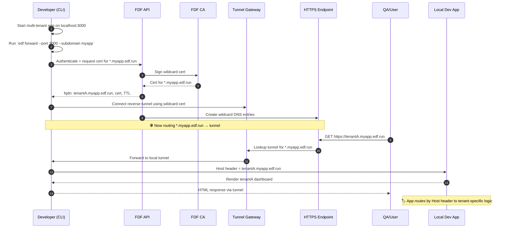

# 🌐 Fleeting DNS Forwarder (FDF)

**Instant, Secure, and Temporary DNS Endpoints for Development & Testing**

---

## 🚀 What is Ephemeral DNS Forwarder?

Ephemeral DNS Forwarder is a secure, easy-to-use service that provides temporary, publicly accessible DNS endpoints, instantly forwarding traffic to your local machine or continuous integration (CI) environment. Built specifically for developers and CI pipelines, it solves common problems faced during testing, including external integrations such as webhooks, OAuth callbacks, and multi-tenant application routing.

---

## 🛠️ Why Do Developers Need FDF?

Developers frequently face challenges when testing systems that require external services:

* **OAuth flows**: Need public URLs for callback validations.
* **Webhooks**: Services like Stripe, GitHub, or Slack need publicly accessible endpoints.
* **Integration Tests**: Require realistic public DNS scenarios.
* **Multi-tenant Applications**: Need separate subdomains to replicate production routing and authentication.

Using localhost or editing local DNS entries (`/etc/hosts`) is cumbersome and doesn't replicate real-world scenarios accurately.

FDF resolves these pain points by creating secure, ephemeral, and publicly resolvable DNS endpoints that seamlessly route traffic back to your local development or CI environment.

---

## ✅ Key Features

* **Instant DNS Creation**: Generate temporary endpoints instantly from the command line.
* **Automatic Cleanup**: Endpoints self-destruct after their set TTL (time-to-live).
* **TLS Security**: Traffic is encrypted and secured using ephemeral SSL certificates.
* **Auth Support**: Supports Basic Authentication, HMAC verification, and OIDC token validation.
* **Easy Integration**: SDKs available for Python, JavaScript, and Go.
* **CI/CD Ready**: GitHub Actions integration for seamless automated testing.
* **Customizable Plans**: Stripe-powered payment tiers, including free, supporter, team, and organizational options.

---

## 🔍 When Should You Use FDF?

* Testing **OAuth and OpenID Connect flows** locally or in CI.
* Validating external **webhook integrations** (Stripe, GitHub, Twilio).
* Running **integration tests** that require public DNS entries.
* Simulating **multi-tenant routing** (host-header-based routing).
* Debugging scenarios that require realistic public network environments.

---

## 🧑‍💻 Example Scenario: Stripe Webhook Integration

Traditional testing requires exposing a local port publicly or deploying test instances, both tedious and insecure.

With FDF:

```bash
fleetingdns forward --port 3000 --ttl 1800
```

This command instantly creates a public DNS endpoint (e.g., `https://abc123.fleetingdns.run`) that Stripe can use to send webhook events directly to your locally running test server. FDF handles the routing securely, and after 30 minutes, the endpoint and tunnel close automatically.

---


### ✅ Use Case: Developer Using FDF to Test a Webhook



---

### ✅ Use Case: Developer Testing OAuth Login Flow Locally



---

### ✅ Use Case: Multi-Tenant App Routing with Subdomain Matching



---

### 🧭 What It Shows

This diagram represents the normal “happy path” flow for a developer:

* Starts a local app
* Opens a secure, time-limited public endpoint
* Tests an integration (e.g. a webhook or OAuth redirect)
* Tunnels are secure and isolated per session
* DNS and tunnel clean up automatically when done

---

## 📚 Documentation and SDKs

SDKs available for easy integration:

* [Python SDK](https://pypi.org/project/fleetingdns-client)
* [JavaScript SDK](https://npmjs.com/package/@fleetingdns/client)
* [Go SDK](https://github.com/fleetingdns/sdk-go)
* Java
* Kotlin
* C\#
* TypeScript
* Ruby
* Swift
* Rust

Detailed documentation and API references available [here](https://docs.fleetingdns.run).

---

## 🔒 Security First

* Ephemeral TLS certificates for each session.
* Secure tunnels with TLS-wrapped SSH.
* Rate limiting, brute-force prevention, and comprehensive audit logs.
* Authentication support (Basic, HMAC, OAuth/OIDC).
* Zero-trust, ephemeral infrastructure ensuring no persistent exposure.

---

## 🚧 GitHub Actions Integration

Easily integrate with your automated workflows:

```yaml
- uses: fleetingdns/fleetingdns-action@v1
  with:
    port: 3000
    ttl: 1200
    auth: true
```

---

## 🌟 Get Started Today

Visit our [GitHub repository](https://github.com/fleetingdns) or install directly:

```bash
curl -sSfL https://fleetingdns.sh/install | sh
```

Transform your development and testing workflow today!

---

© 2025 Ephemeral DNS Forwarder
