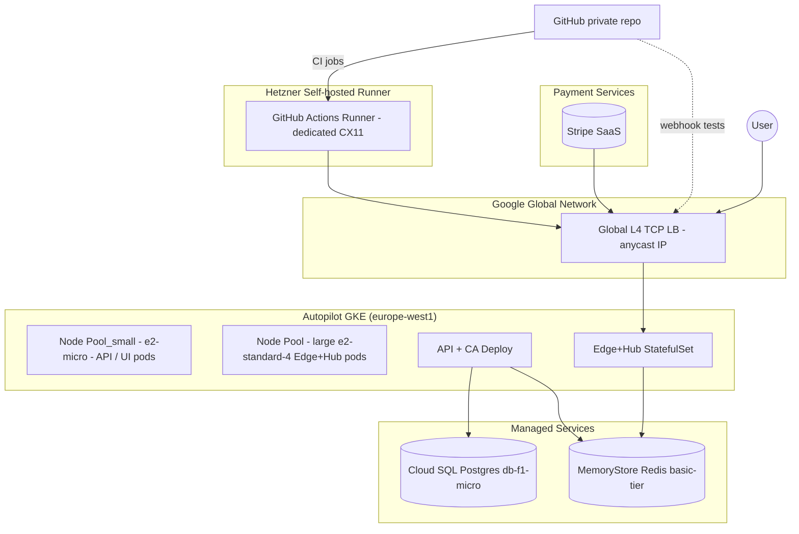
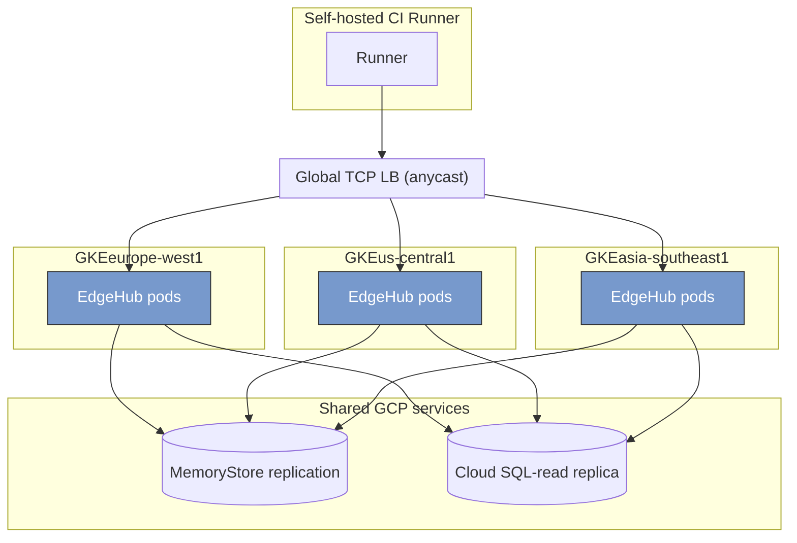

# 📘 **E0 – Infrastructure & GCP Deployment (Designv0.1)**

> *Foundation epic for all runtime and Ops work.  Replaces earlier Hetzner notes; assumes primary cloud = GoogleCloud Platform.*

---

## 1 ▪ WHY GCP?

| Factor                          | Rationale                                                                                                         |
| ------------------------------- | ----------------------------------------------------------------------------------------------------------------- |
| **Global any‑cast L4 TCP LB**   | Single public IP close to every user; no DIY BGP / Keepalived.                                                    |
| **Generous free tier**          | CloudSQL `db‑f1‑micro`, GKE Autopilot free control plane, e2‑micro compute credits → perfect for MVP flush burn. |
| **Crossplane.io provider‑gcp**  | Provision clusters, node‑pools, CloudSQL, Redis **GitOps‑style** from YAML.                                      |
| **Rapid scale**                 | Autopilot auto‑adds nodes; can flip to committed‑use discounts or Spot pools as we grow.                          |
| **Managed Redis (MemoryStore)** | 0‑ops instead of self‑hosted Helm chart.                                                                          |

---

## 2 ▪ High‑level architecture graph



*Crossplane compositions declare **GKE cluster**, **node pools**, **redis‑instance**, **sql‑instance**; FluxCD applies them on each commit.   Self‑hosted runner lives outside GCP to avoid paid minutes.* compositions declare **GKE cluster**, **node pools**, **redis‑instance**, **sql‑instance**; FluxCD applies them on each commit.\*

---

## 3 ▪ Resource specification (Crossplane XR snippets)

```yaml
apiVersion: container.gcp.crossplane.io/v1beta2
kind: GKECluster
metadata: {name: edf-dev}
spec:
  location: europe-west1
  autopilot: true
---
apiVersion: container.gcp.crossplane.io/v1alpha1
kind: NodePool
metadata: {name: edge-large}
spec:
  clusterRef: {name: edf-dev}
  config:
    machineType: e2-standard-4
    spot: true
  autoscaling:
    minNodeCount: 0
    maxNodeCount: 2
```

(Full compositions in `/infra/` directory.)

---

## 4 ▪ MVP OPEX (August2025€)

| Service                          | SKU / Node           | Qty         | Unit€    | Est.€/mo                        | Notes                           |
| -------------------------------- | -------------------- | ----------- | --------- | -------------------------------- | ------------------------------- |
| GKE Autopilot control plane      | free                 | —           | —         | **0.00**                         | MVP fits in free tier.          |
| Autopilot compute\*              | 2×e2‑micro (730h) | 1vCPU/1GB | **0.00**  | within free 744vCPU‑sec credit. |                                 |
| Spot node‑pool (e2‑standard‑4)   | 0–1 node, avg10h   | 0.0104/h    | **0.10**  | Only when load‑test on.          |                                 |
| L4 TCP LB                        | 1 rule               | 0.0065/h    | **4.70**  | plus tiny data charge.           |                                 |
| CloudSQL Postgres               | db‑f1‑micro          | 744h       | free tier | **0.00**                         | 10GB storage free.             |
| MemoryStore Redis                | basic‑tier1GB      | 744h       | 0.0267/h  | **19.80**                        | Smallest allowed tier.          |
| CloudLogging + Metrics          | 5GB ingest          | 0.50/GB     | **2.50**  | Assuming log sampling.           |                                 |
| CloudNAT egress                 | 1GB                 | 0.11/GB     | **0.11**  | Webhook replies.                 |                                 |
| **Hetzner CI Runner**            | CX11 dedicated       | 1×720 h   | 49.00/mo  | **49.00**                        | Unlimited private‑repo minutes. |
| **Estimated monthly OPEX (MVP)** |                      |             |           | **≈€76.21**                     | Still <€3/day.               |

\*Autopilot charges vCPU/Memory per‑pod; e2‑micro pods fit free quota.\*\* |  |  |  | **≈€27.21** | <€1/day. |

\*Autopilot charges vCPU/Memory per‑pod; e2‑micro pods fit free quota.

---

## 5 ▪ Roll‑out phases

1. **Week1**— Crossplane bootstrap (`kubectl crossplane install`).
2. **Week2**— Deploy API + Edge Hub; internal test with GitHub Action.
3. **Week3**— Hook up CloudSQL & Redis secrets via `Workload Identity`.
4. **Week4**— Enable global LB, managed cert, DNS A → LB IP.
5. **Week5**— Stress‑test 50k tunnels/day; observe MemStore CPU.
6. **Week6**— Turn on Spot pool autoscaling; pre‑prod cut‑over.

---

## 6 ▪ Risks & Mitigations

| Risk                                             | Mitigation                                           |
| ------------------------------------------------ | ---------------------------------------------------- |
| Redis basic tier caps at 1GB RAM / \~15k conns | Scale to standard‑tier when concurrent tunnels >5k. |
| GKE free‑tier Pod quotas exhausted in heavy CI   | NodePool autoscaling to Spot restores headroom.      |
| Global LB cold‑start 90s new back‑end health    | Pre‑warm by rolling update strategy `maxSurge=1`.    |

---

## 7 ▪ Multi‑Region NEG Topology (future phase)



*Each region registers its NEG back‑end to the global LB. `cluster_id` bits (E1f) ensure the receiving Edge can redirect to correct region if cross‑hit.*

---

©2025 Ephemeral DNS Forwarder — **Infrastructure Epic (GCP)**\*\*
