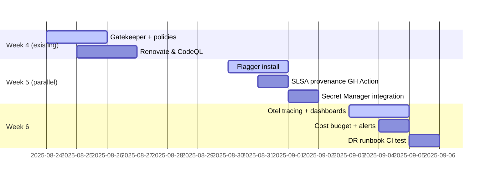

# 📘 **E0a – Process & Ops Enhancements (Designv0.1)**

*Companion epic to E0 – Infrastructure.  Focuses on security, CI/CD hygiene, observability, and cost-control upgrades.*

---

## 1 ▪ Scope Overview

We lock down the supply chain, add automated rollouts with **Flagger** (Flux-native), integrate observability, and enforce org‑wide guard rails — all incremental to the existing six‑week plan.

| Area                 | Tool                                   | Outcome                                                                            |
| -------------------- | -------------------------------------- | ---------------------------------------------------------------------------------- |
| Policy-as-Code       | Gatekeeper (OPA)                       | Blocks bad Kubernetes manifests (e.g., `runAsRoot`, wrong namespace) at admission. |
| Dependency hygiene   | Renovate + CodeQL                      | Auto‑bump crates & scan for CVEs; GH Actions fails if scan critical.               |
| Build provenance     | SLSA‑level 2 (GitHub generator)        | Signed attestations on each container image in GHCR.                               |
| Progressive delivery | **Flagger + Contour** (uses LB weight) | Canary/blue‑green for Edge pods; auto‑rollback on 5xx or latency SLO.              |
| Tracing & metrics    | OpenTelemetry → Cloud Trace + Prom     | End‑to‑end request latency, pod metrics exported.                                  |
| Secrets management   | GCP Secret Manager + SealedSecrets     | Zero plaintext tokens in git; Crossplane ProviderConfigs reference SM.             |
| Cost governance      | GCP Budget alerts + Grafana Cloud      | Daily burn dashboard + 50/90% email webhooks.                                      |
| DR runbook           | k3s + Flux bootstrap script            | One‑command infra‑cluster rebuild test nightly.                                    |

---

## 2 ▪ Implementation Timeline



---

## 3 ▪ Key Design Details

### 3.1 Flagger rollouts (Edge pods)

* Meshless → uses **GCP TCP LB NEG weight** via Contour HTTPProxy CR.
* Canary SLO: <2% 5xx and p95 latency <200ms over 30s window.
* Automates `kubectl rollout undo` if SLO fails.

### 3.2 Gatekeeper policy examples

```rego
package edf.policies
violation[msg] {
  input.review.kind.kind == "Deployment"
  container := input.review.object.spec.template.spec.containers[_]
  container.securityContext.runAsNonRoot == false
  msg := "Containers must not run as root"
}
```

### 3.3 SLSA workflow step

```yaml
- name: Generate SLSA provenance
  uses: slsa-framework/slsa-github-generator@v2
  with:
    base-image-digest: ${{ steps.build.outputs.digest }}
```

Artifact uploaded to GHCR alongside image.

---

## 4 ▪ Risks & Mitigations

| Risk                                       | Mitigation                                             |
| ------------------------------------------ | ------------------------------------------------------ |
| Gatekeeper blocks urgent hotfix            | Provide `breakglass` label + monitor audit violations. |
| Flagger mis‑config rolls back good release | Start with 1% traffic canary, expand after confidence. |
| Extra CI minutes cost                      | Self‑hosted Hetzner runner absorbs overhead.           |

---

## 5 ▪ Deliverables

* [ ] Flux `kustomization` overlays for Gatekeeper, Flagger, Otel Collector.
* [ ] Sample Gatekeeper constraint library.
* [ ] Grafana Cloud public dashboard link.
* [ ] Runbook markdown in `/docs/ops/dr.md` executed nightly by CI.

---

©2025 Ephemeral DNS Forwarder — Process & Ops Enhancements
