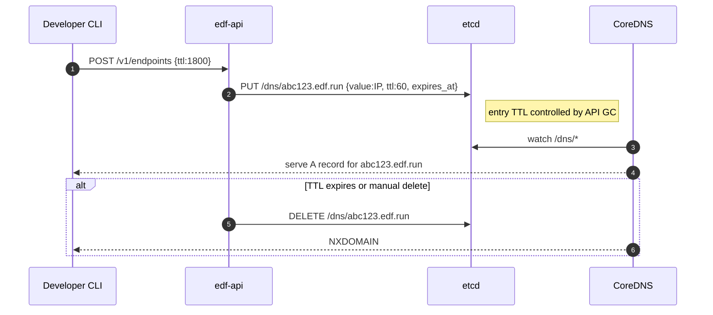

# 📘 E1 – Core DNS Service (Design v0.1)

## 🧭 Overview

This document details the design of the **Core DNS Service** component for Ephemeral DNS Forwarder. It defines how DNS records are provisioned dynamically for short-lived endpoints via CoreDNS and `etcd`. This is the authoritative DNS zone backing the `*.edf.run` domain.

EDF uses CoreDNS + `etcd` as the authoritative resolver for ephemeral endpoint domains. Endpoints are created via the control API, stored in `etcd`, and served in real-time without requiring DNS server restarts. Each endpoint lives for a fixed TTL and is auto-cleaned.

---

## 🎯 Objectives

* Dynamically create/delete DNS A/AAAA records
* TTL-controlled ephemeral lifecycle per endpoint
* Serve DNS records with low latency from CoreDNS
* Isolate records by user/session ID if needed

---

## 📦 Components Involved

| Component  | Role                                                   |
| ---------- | ------------------------------------------------------ |
| `edf-api`  | Calls etcd to write/delete records based on API usage  |
| `etcd`     | Key-value store holding DNS mappings                   |
| `coredns`  | Reads from etcd using `etcd` plugin and serves records |
| `api::dns` | Rust module handling DNS key generation logic          |

---

## 📁 Key/Value Schema in etcd

```text
/dns/{subdomain}.{zone} = {
  "type": "A",     # or AAAA or CNAME
  "value": "192.0.2.50",
  "ttl": 60,
  "expires_at": "2025-07-02T12:34:56Z",
  "mode": "tunnel",
  "slot": 60312,
  "owner": "user_abc",
  "redirect_to": null
}
```

Stored under prefix `/dns/`. The TTL field is used by CoreDNS `etcd` plugin if supported, otherwise CoreDNS is configured to default all records to 60s TTL.

---

## 🔄 Sequence Diagram – DNS Record Lifecycle



---

## ⚙️ CoreDNS Configuration Example

```hcl
edf.run:53 {
  etcd {
    path /dns
    endpoint http://127.0.0.1:2379
  }
  cache 30
  log
  errors
}
```

We configure CoreDNS to serve from `/dns` prefix. A-side TTL is handled by the API lifecycle logic.

---

## 🔐 Security Notes

* No user data is stored in the DNS values.
* Records include an `owner` field in etcd (not in DNS response) for traceability.
* Subdomain collision is avoided via random 16–20 character slug.

---

## 📆 API GC Behavior

* TTL enforced at control plane level, not via DNS protocol expiry alone.
* Every 30s, a GC job checks etcd for records with `expires_at < now()` and deletes them.
* Any attempt to resolve after expiry results in NXDOMAIN.

---

## 📌 Future Extensions

* DNSSEC zone signing support (v2)
* Multi-region etcd mirroring (HA)
* SRV record support for custom port routes

---

## ✅ Deliverables for E1 Completion

* [ ] CoreDNS running on Hetzner VM, integrated with etcd
* [ ] API functions for `create_dns_record`, `delete_dns_record`
* [ ] TTL expiry GC job scheduled every 30s
* [ ] Manual CLI test confirms record appears/disappears via `dig`

---

© 2025 Ephemeral DNS Forwarder
