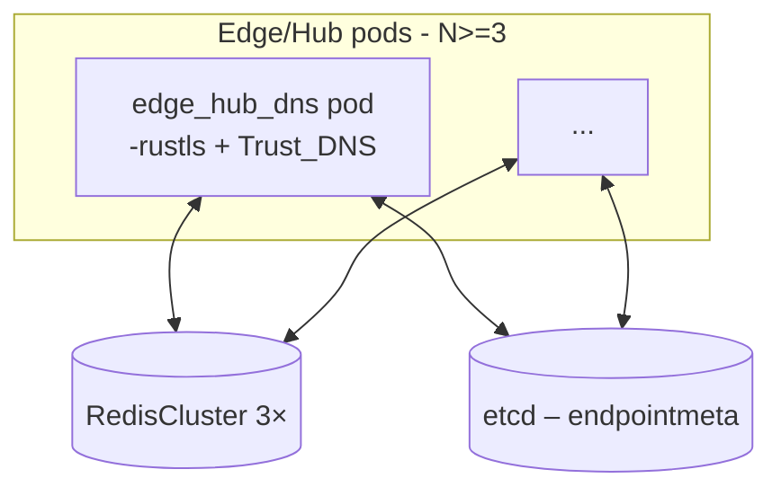
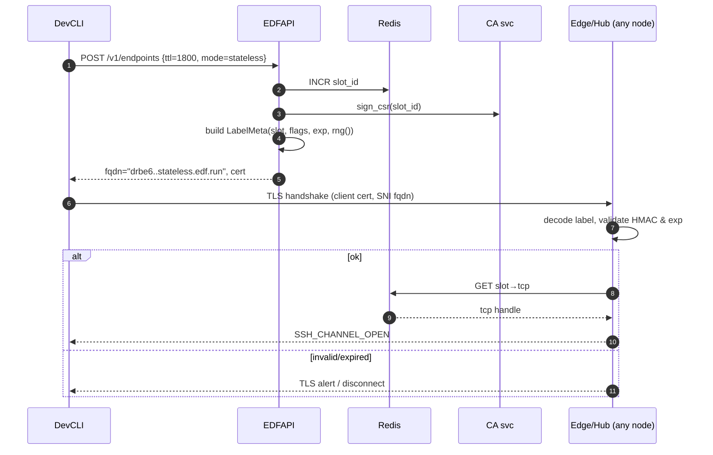
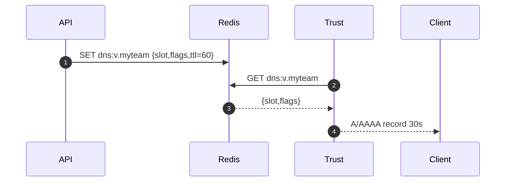
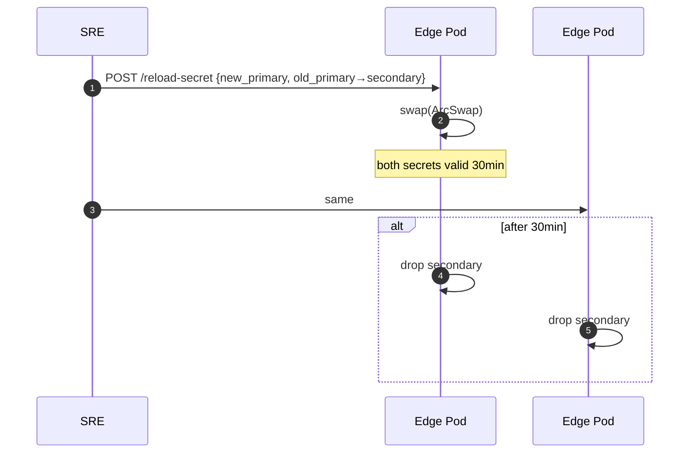

# 📘 **E1 – DNS Architecture (Stateless+Redis) – Designv0.1**

> *This Epic supersedes the original **E1Core‑DNS** and **E1b** drafts. It formalises a **hybrid authoritative DNS layer** blending Redis‑driven records with a **stateless, HMAC‑validated label** scheme inspired by [`taskcluster/stateless-dns-server`](https://github.com/taskcluster/stateless-dns-server).*
> Goal: **sub‑second DNS live‑ness** for throw‑away tunnels **and** rich metadata support (auth flags, vanity names) without external dependencies.


---
## 🎯 Objectives

* Dynamically create/delete DNS A/AAAA records
* TTL-controlled ephemeral lifecycle per endpoint
* Serve DNS records with low latency from CoreDNS
* Isolate records by user/session ID if needed

---

## 📦 Components Involved

| Component  | Role                                                   |
| ---------- | ------------------------------------------------------ |
| `edf-api`  | Calls etcd to write/delete records based on API usage  |
| `etcd`     | Key-value store holding DNS mappings                   |
| `coredns`  | Reads from etcd using `etcd` plugin and serves records |
| `api::dns` | Rust module handling DNS key generation logic          |

---

## 1▪ WHY

| Pain‑point                                                                     | Consequence                             | Desired outcome                                                 |
| ------------------------------------------------------------------------------ | --------------------------------------- | --------------------------------------------------------------- |
| High‑frequency tunnel churn (CI jobs) floods Redis w/ A‑record writes          | Redis write/evict load⟶latency spikes | **Eliminate writes** for random slugs                           |
| Need vanity / policy‑rich endpoints (`foo.edf.run`, redirect mode, OIDC flags) | Can’t encode in stateless label         | **Keep** minimal state store for these                          |
| Multi‑node PoP⟶DNS answers must be identical on every edge                   | Stateful per‑node caches diverge        | Shared algorithmic validation + central cache for slot metadata |

Hybrid model gives us best of both worlds:

* **Stateless authority** → encodes `slot+flags+expiry+HMAC` in the left‑most label ⇒ zero DB writes, <1µs decode.
* **Redis authority** → for vanity or advanced endpoints.

---

## 2▪ WHAT (functional scope)

* Provide authoritative answers for **`*.edf.run.`**

    * `*.stateless.edf.run.` → stateless resolver (99% of CI load).
    * `*.v.edf.run.` (vanity) + custom domains → Redis‑backed.
* TTL hard‑coded to **30s** (stateless) / **user‑set** (Redis).
* Online secret rotation (`PRIMARY`, `SECONDARY`).
* IPv4 + IPv6 support.
* DNSSEC signing optional (future; Trust‑DNS has primitives).

---

## 3▪ HOW– High‑level system graph



*Pods embed two Trust‑DNS authorities in a single catalog.*

---

##4▪ Label format (stateless path)

| Field   | bits | Description                          |
| ------- | ---- | ------------------------------------ |
| `slot`  | 32 | hub port/slot assigned by API        |
| `flags` | 8  | bit0=redirect,1=basic‑auth,2=oidc |
| `exp`   | 32 | Unixepoch(s) expiry <=+1800s     |
| `nonce` | 16  | random salt (prevents rainbow)       |
| `hmac`  | 128 | HMAC‑SHA256 over previous fields     |

Total=32bytes → 52‑char Base32‑Crockford label.

```rust
#[derive(Debug)]
struct LabelMeta { slot: u32, flags: u8, exp: u32, nonce: u16 }
```

Encoding snippet:

```rust
fn encode(meta: &LabelMeta, key: &hmac::Key) -> String {
    let mut buf = Vec::with_capacity(14);
    buf.extend(&meta.slot.to_be_bytes());
    buf.push(meta.flags);
    buf.extend(&meta.exp.to_be_bytes());
    buf.extend(&meta.nonce.to_be_bytes());
    let tag = hmac::sign(key, &buf);
    buf.extend(&tag.as_ref()[..16]); // 128‑bit truncate
    data_encoding::BASE32.encode(&buf)
}
```

---

##5▪ Trust‑DNS catalog wiring

```rust
let stateless = StatelessAuthority::new(primary, secondary, ttl);
let redis_auth = RedisAuthority::new(redis_pool, ttl_custom);
let mut catalog = Catalog::new();
catalog.upsert(Name::from_ascii("stateless.edf.run").?, Box::new(stateless));
catalog.upsert(Name::from_ascii("edf.run").?, Box::new(redis_auth));
ServerFuture::new(catalog).listen(...);
```

*All in one binary – no external CoreDNS.*

---

##6▪ Sequence diagrams

### 6.1TunnelProvision(Stateless)



### 6.2Vanity domain (Redis authority)



###6.3Secret rotation



---

##7▪ Failure handling & edge‑cases

| Scenario                  | Behaviour                                                                                |
| ------------------------- | ---------------------------------------------------------------------------------------- |
| Redis down                | Stateless lookups unaffected; vanity lookups NXDOMAIN until Redis recovers               |
| Label replay after expiry | decode→exp < now ⇒ NXDOMAIN, handshake fails                                             |
| Key rotation race         | Secondary key validates pre‑rotation labels; after 30min no labels remain with old key. |
| Duplicate slot reuse      | API ensures monotonic slot\_id (Redis INCR) → no collision.                              |

---

##8▪ Deliverables / Acceptance

* [ ] `stateless-dns` crate with encode/decode + unit tests (90%+ coverage).
* [ ] `StatelessAuthority` implementing `trust_dns_server::authority::Authority`.
* [ ] Dual‑secret hot‑reload (`SIGHUP`) & metrics (`stateless_label_invalid_total`).
* [ ] Hybrid catalog integration + feature flag `--stateless-dns`.
* [ ] Bench: ≥200k QPS per core, p99 <50µs.
* [ ] Docs: SDK guidelines, CLI `--stateless` flag.

---

##9▪ Open issues / future work

1. DNSSEC signing of stateless answers ⇒ embed RRSIG using same HMAC key.
2. Support TXT record for debug (`_edfmeta.<label>`).
3. Investigate `Domain` crate for zero‑copy DNS encode (perf micro‑opt).
4. Evaluate sharding slot space (>4B slots) into `cluster_id` bits.

---

©2025 EphemeralDNSForwarder – DNS Epic (Stateless+Redis)
