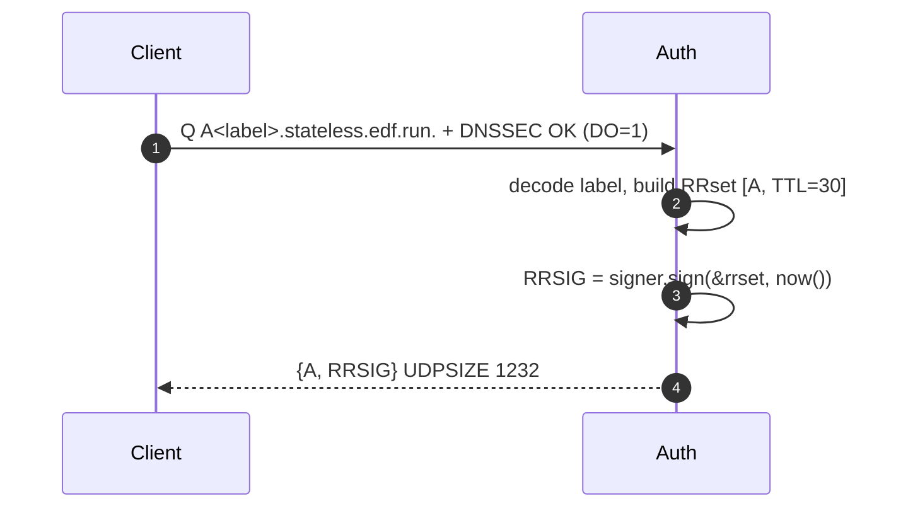
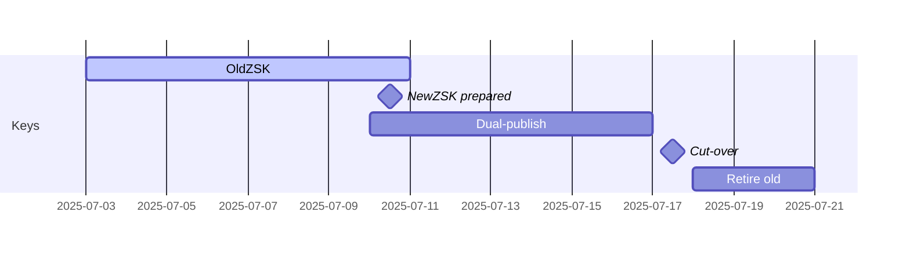

# 📘 E1c– DNSSEC for Stateless Authority (Designv0.1)

## 0 ▪ TL;DR

*We will extend the **StatelessAuthority** to emit fully‐valid DNSSEC signatures (RRSIG) for every on‑the‑fly answer, without persisting any zone keys.*
Approach: **derive a deterministic ZSK from the HMAC secret** and sign A/AAAA RRsets at query time.No key‑files, no state.

---

## 1 ▪WHY

| Threat                              | Impact without DNSSEC                                                      | Benefit with on‑the‑fly RRSIG                                    |
| ----------------------------------- | -------------------------------------------------------------------------- | ---------------------------------------------------------------- |
| Resolver spoofing / cache‑poisoning | Attacker injects forged `A` → hijacks webhook traffic before TLS handshake | Validating resolvers will reject forged answers (RRSIG fails)    |
| Anycast node mismatch (race)        | Different PoP answers for same label during propagation window             | RRSIG ensures consistency; mismatched secret ⇒ signature invalid |

DNSSEC is optional for consumers, but many corporate resolvers (and GooglePublicDNS) validate by default. Shipping signed answers improves trust with enterprise users.

---

## 2 ▪ WHAT (requirements)

1. **Algorithm13RSA‑SHA256** for broad validator compatibility (Trust‑DNS has mature impl).
2. **Single ZSK per secret‑era** (e.g., `PRIMARY_SECRET`).
3. RRSIG TTL == RR TTL (30s).
4. KSK / DS remains static, published once in a real zonefile at registrar.
5. Roll secrets ⇒ derive new ZSK, publish as second DNSKEY a week ahead, then retire old.

---

## 3 ▪ HOW

### 3.1 Key derivation

```
K_ZSK = HMAC_SHA256(PRIMARY_SECRET, "zsk")  -> 256‑bit
Take first 2048bits via HKDF → RSA private key
```

*Deterministic*: every node holding `PRIMARY_SECRET` regenerates identical RSA key in memory on boot.

### 3.2 Trust‑DNS glue

```rust
use trust_dns_server::rr::dnssec::*;
let zsk = Rsa::from_der(&derive_rsa_der(secret))?;
let signer = Signer::dnssec(RRKeyPair::new(zsk, Algo::RSASHA256)?,
                            Name::from_ascii("stateless.edf.run")?,
                            true /* is_zsk */, 0);
// Cache Signer in Authority struct
```

### 3.3 Answer path



*Signing cost*: RSA‑2048 ≈0.2ms; with 30s TTL and typical QPS, one CPU core can still manage >5k req/s.We will micro‑bench and optionally cache `(label → RRSIG)` in an LRU for the 30s window.

### 3.4 Key‑roll schedule

```
T‑14d: Generate new PRIMARY_SECRET' (offline)
T‑7d : Deploy SECONDARY_SECRET=PRIMARY', PRIMARY=old
       => two DNSKEY (old ZSK, new ZSK) signed by KSK
T0    : Flip env: PRIMARY=PRIMARY', SECONDARY=old
T+30m: All outstanding labels w/ old secret expired
T+1d : Drop SECONDARY + remove old DNSKEY
```

Diagram:



---

## 4 ▪ Edge‑cases

| Case                                         | Handling                                                                                 |
| -------------------------------------------- | ---------------------------------------------------------------------------------------- |
| Client does **not** set DO bit               | Return unsigned response (size < 512B) for perf; controlled by `dnssec_opt_in` flag.    |
| UDPsize > 1232                              | Truncate → TC=1, client retries over TCP; fine for validating resolvers.                 |
| Node missing SECONDARY secret after rotation | Label signed w/ old key fails ⟶ NXDOMAIN; mitigated by deploy automation validating env. |

---

## 5 ▪ Deliverables

* [ ] `derive_rsa_der(secret)` util + unit tests cross‑verifying deterministic key.
* [ ] `Signer` cached in `StatelessAuthority`.
* [ ] RRSIG attached when EDNSDO flag set.
* [ ] Bench p99<0.4ms signing or 100µs from LRU.
* [ ] Integration test with `delv +dnssec` and GooglePublicDNS.

---

©2025Ephemeral DNSForwarder– DNSSEC Module
