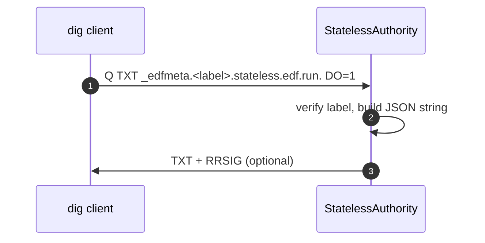

# 📘 E1d– Debug TXT Records for Stateless Labels (Designv0.1)

> **Goal:** expose ephemeral, signed TXT records that let SDKs or operators introspect
> tunnel metadata (slot, flags, expiry) via DNS queries without hitting Redis or the
> REST API.
>
> Pattern: ask for `_edfmeta.<label>.stateless.edf.run.` and receive a single‑line TXT
> with JSON payload. Works from any dig/delv client; requires no auth.

---

## 1 ▪ WHY

| Need                                                                     | Current gap                                         | Benefit                                 |
| ------------------------------------------------------------------------ | --------------------------------------------------- | --------------------------------------- |
| Quick field check (“which slot did this label map to?”)                  | Only API/CLI prints it; third‑party debuggers can’t | Self‑service debugging for users & SREs |
| SDK wants to *optimistically* compute redirect target before opening TLS | Must call API again                                 | TXT gives lightweight cache hint        |

TXT lookup is read‑only and signed by the same DNSSEC key (E1c), so data authenticity is preserved.

---

## 2 ▪ WHAT (payload spec)

```
{"slot":123456,"flags":5,"exp":1720818127}
```

* `slot`– u32 hub port.
* `flags`– 8‑bit bitmap (as in E1).
* `exp` – unix epoch seconds.

Record TTL= **30s** (same as A/AAAA). One TXT string ≤255B, fits comfortably.

---

## 3 ▪ HOW – Authority logic

### 3‑step match

```rust
if qtype == TXT && name.starts_with("_edfmeta.") {
    let label = name.trim_prefix("_edfmeta.");
    if let Some(meta) = self.verify(label) {
        answer_txt(meta)
    }
}
```

```rust
fn answer_txt(meta: Meta) -> Record {
   let json = format!("{{\"slot\":{},\"flags\":{},\"exp\":{}}}",
                      meta.slot, meta.flags, meta.exp);
   Record::from_rdata(name.clone(), self.ttl,
                      RData::TXT(TXT::new(vec![json])))
}
```

*Hook lives inside `StatelessAuthority::lookup()`; share decode path with A/AAAA.*

---

## 4 ▪ Sequence diagram



---

## 5 ▪ Security considerations

* No sensitive info—slot # alone is harmless.
* Record is signed (DNSSEC) so cannot be spoofed.
* Expires alongside A record; replay risk negligible.
* Do **not** include Basic‑Auth credentials or IP.

---

## 6 ▪ Limitations

* Only available for stateless labels; vanity/Redis entries must still query API if needed.
* Resolvers that strip the leading underscore label for policy (rare) could break; underscore is RFC‑compliant for TXT service meta records.

---

## 7 ▪ Deliverables

* [ ] Extend `StatelessAuthority` to match `_edfmeta.*` + TXT
* [ ] Unit tests: valid, tampered, expired label
* [ ] Update docs & README dig examples:

  ```bash
  dig +dnssec TXT _edfmeta.abcd…stateless.edf.run.
  ```

---

©2025Ephemeral DNS Forwarder – Debug TXT support
