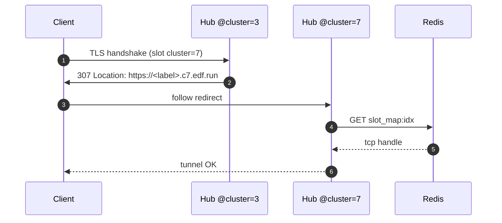
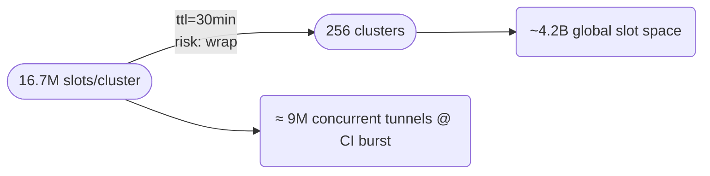

# 📘 E1f – Slot‑ID Sharding & `cluster_id` Bits (Design v0.1)

## 1 ▪ WHY

| Motivation                                            | Pain if ignored                                                                                                                  |
| ----------------------------------------------------- | -------------------------------------------------------------------------------------------------------------------------------- |
| **Global uniqueness** across multi‑region edge fleets | Two clusters could independently allocate slot `42`; stateless label resolves, but wrong hub/port receives traffic ⟶ tunnel 502. |
| **Fast routing hint**                                 | Hub must currently hit Redis to map `slot → TCP`. Embedding cluster hint lets front‑door LB choose nearest PoP in O(1).          |
| **Scalable counter**                                  | 32‑bit flat `INCR` in Redis tops out or hits contention beyond 100k QPS allocation. Sharding lowers write hotspots.             |

Goal: **encode a cluster prefix inside the 32‑bit `slot` field** so that slots are *unique & locality‑aware* without extending label length.

---

## 2 ▪ WHAT – Bit budget proposal

```text
[ 8 bits ]   [       24 bits           ]
+----------+---------------------------+
| cluster  |   per‑cluster slot index  |
+----------+---------------------------+
 0..255          0 .. 16777215
```

* 256 logical clusters (could map 1:1 to cloud region, PoP, or Kubernetes namespace).
* 16.7M concurrent tunnels per cluster ≫ CI demand.
* Preserves 32‑bit field used in stateless DNS payload; no label growth.

If future scale needs >256 clusters, a 10‑bit prefix (1024 clusters, 22‑bit index) is fallback; keep size paramised in config.

---

## 3 ▪ HOW

### 3.1 Slot allocation algorithm (API service)

```rust
fn allocate_slot(cluster_id: u8, redis: &Pool) -> u32 {
    // per‑cluster counter key
    let key = format!("slot_counter:{}", cluster_id);
    // wrap at 24‑bit max
    let idx: u32 = redis.incr(key, 1) % (1 << 24);
    (u32::from(cluster_id) << 24) | idx
}
```

*Each cluster maintains its own 24‑bit counter in local Redis shard ⇒ no cross‑region contention.*
*On wrap (\~16M allocations) we rely on 30‑min TTL to ensure old slots freed.*

### 3.2 Decode path (hub)

```rust
let cluster  = slot >> 24;
let index24  = slot & 0x00FF_FFFF;
// Quick reject: if cluster != self.cluster_id { NXDOMAIN/redirect }
// else look‑up index24 in Redis hash 'slot_map'
```

### 3.3 Cross‑cluster label handling

* In stateless label: `slot` field already contains these 32 bits.
* Edge node that receives connection first checks if `cluster` matches its identity; if **mismatch** it can:

    1. **Redirect** (HTTP307) client to cluster‑specific hostname (cost = extra RTT).
    2. **Proxy** upstream to correct cluster via gRPC hop (double latency).
       We pick **HTTP 307 redirect** for v0: simplest & keeps hub stateless.

Sequence:



DNS option: advertise region‑specific CNAME (`c7.edf.run`) but keep MVP simple.

---

## 4 ▪ Graph – slot supply vs concurrency



*Even if a single cluster issues 50k new tunnels/s continuously, wrap takes >5min; by then first slots have expired & freed.*

---

## 5 ▪ Edge Cases & Mitigations

| Edge case                         | Handling                                                                                                              |
| --------------------------------- | --------------------------------------------------------------------------------------------------------------------- |
| Counter wrap **before** TTL drain | Bump cluster‑specific wrap threshold alarm; temporarily reject new slots with 503 “capacity”.                         |
| Mis‑configured node cluster\_id   | Health‑check fails (all queries redirect) ⇒ pod marked `NotReady`.                                                    |
| Need to add new cluster id >255   | Config flag `SLOT_PREFIX_BITS`; redeploy all nodes with 10‑bit prefix (label decoder tolerant via env version field). |

---

## 6 ▪ Rust test snippet

```rust
#[test]
fn encode_decode_roundtrip() {
    let cid = 42u8;
    let slot = allocate_slot(cid, &fake_redis());
    assert_eq!(slot >> 24, cid);
    // roundtrip label payload (encode→decode) must retain slot bits
    let label = encode_label(slot, flags, exp, secret);
    let meta = decode_label(&label, secret).unwrap();
    assert_eq!(meta.slot, slot);
}
```

---

## 7 ▪ Deliverables

* [ ] `slot_allocator.rs` with per‑cluster counter + wrap logic.
* [ ] Config flag `CLUSTER_ID` injected at pod startup.
* [ ] Redirect strategy middleware for cross‑cluster hits.
* [ ] Prom‑metric `slot_allocations_total{cluster}`.
* [ ] Alert if counter > 15M (90%).

---

©2025 Ephemeral DNS Forwarder — Slot Sharding
