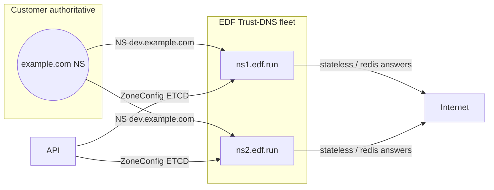
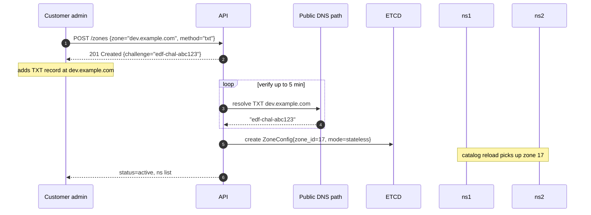
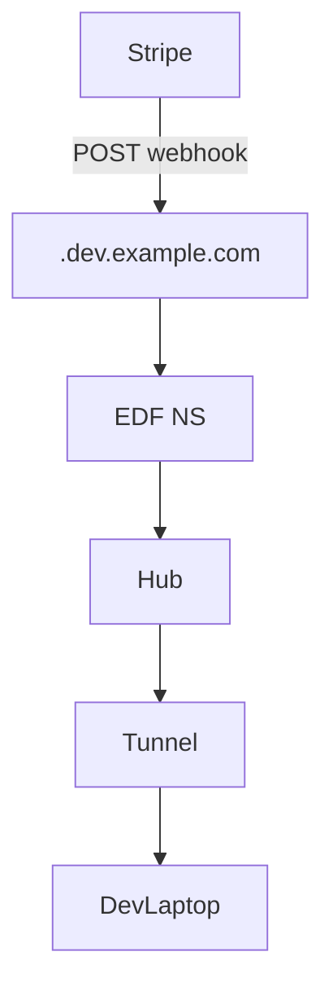

# 📘 **E1g – Hosted Sub‑Domain NS for Customers (Design v0.1)**

> *Epic‑level spec enabling customers to delegate `dev.<mydomain>` (or any sub‑zone) to EDF’s authoritative Trust‑DNS edge, gaining the same **ephemeral, signed, sub‑second labels** under their own brand.*
>
> **Differentiator:** Neither inlets, ngrok, nor Cloudflare Tunnel (developer tier) combines customer‑owned DNS with per‑tunnel disposable hostnames + policy bits.

---

## 1 ▪ WHY

| Problem                                                               | Pain Today                                       | Hosted‑NS Outcome                                                       |
| --------------------------------------------------------------------- | ------------------------------------------------ | ----------------------------------------------------------------------- |
| Enterprise firewalls / allow‑lists refuse external `*.saastunnel.com` | Webhooks & OAuth restricted to corporate domains | Traffic appears under `dev.acme.com` → passes allow‑lists automatically |
| Users must manually CNAME each tunnel name to vendor                  | Operational toil; stale records accumulate       | One‑time NS delegation; EDF mints labels on demand                      |
| Security scanners flag unknown third‑party domains                    | False positives & risk assessments               | Brand‑consistent FQDN; DNSSEC chain of trust retained                   |

**Metrics of success**: <5 min self‑serve onboarding; <1 s TTL propagation; zero manual CNAMEs going forward.

---

## 2 ▪ WHAT (functional requirements)

1. **Zone onboarding API** (`POST /v1/zones`): customer submits sub‑domain, chooses verification method.
2. Support two verification modes: **TXT‑challenge** or **NS‐delegation pre‑set**.
3. Deterministic **per‑zone ZSK** derived from root secret; optional customer‑supplied KSK.
4. Label encoder embeds **8‑bit `zone_id` prefix** inside slot to guarantee global uniqueness.
5. Trust‑DNS catalog hot‑reloads zone configs without restart.
6. CLI enhancements: `edf zone add`, `edf forward --zone <subzone>`.
7. Billing hooks: zone counted as paid add‑on (Team/Org tier).

---

## 3 ▪ HOW – Component graph



---

## 4 ▪ Onboarding flow (TXT‑challenge)



### Verification mode B – NS pre‑delegation

*Customer first delegates NS → API verifies NS set, skipping TXT step.*

---

## 5 ▪ Data model

```json
// etcd key: /zones/17
{
  "zone": "dev.example.com.",
  "zone_id": 17,
  "mode": "stateless",              // or "redis"
  "zsk_deriv_salt": "h2s934",        // 64‑bit random per zone
  "created_at": "2025-07-04T12:00Z",
  "dnssec": {
     "ds": "3 13 2 abcd…"            // optional published by customer
  },
  "billing_plan": "team-extra-zone"
}
```

---

## 6 ▪ Label format update

```
slot32 = (zone_id << 24) | local_slot24
```

* `zone_id` 0−255; 0 reserved for edf.run root.\*

Encoder math unchanged; decoder extracts `zone_id` to pick Authority.

---

## 7 ▪ Trust‑DNS catalog logic

```rust
match zone_id {
   0 => self.base_stateless.lookup(qname, …),
   n => self.zones[n as usize].lookup(qname, …),
}
```

Each Zone has its own `StatelessAuthority` with ZSK signer derived:

```rust
let salt = config.zsk_deriv_salt;
let key = hmac::Key::new(HMAC_SHA256, &concat(root_secret, salt));
let zsk = derive_rsa(key);
```

---

## 8 ▪ Call‑flow graph (runtime)



*Same low‑latency path as edf.run but under customer FQDN.*

---

## 9 ▪ Edge cases

| Case                                    | Handling                                                                          |
| --------------------------------------- | --------------------------------------------------------------------------------- |
| Zone TXT removed after onboarding       | Periodic re‑verify; mark zone `suspended` if proof lost.                          |
| Customer rotates NS to different vendor | Health‑check shows our NS not delegated; we suspend answers to avoid split‑brain. |
| zone\_id exhaustion (>255)              | Compile‑time constant; bump to 10‑bit prefix, migrate encoder (E1f plan).         |
| Customer mis‑signs DS                   | Our RRSIG fine, but validators fail chain; dashboard surface error.               |

---

## 10 ▪ Rust snippet – zone hot‑reload

```rust
watch_etcd("/zones", |event| {
   match event {
      Put(zkey, zcfg) => catalog.upsert(zcfg.zone, build_authority(zcfg)),
      Delete(zkey)    => catalog.remove(zone_name(zkey)),
   }
});
```

Hot‑swaps Signer and Authority without dropping in‑flight UDP queries.

---

## 11 ▪ Deliverables & Timeline

| Sprint | Item                                      |
| ------ | ----------------------------------------- |
| 1      | `/zones` API + CLI (`edf zone add/ls/rm`) |
| 2      | ZoneConfig watcher + catalog hot‑reload   |
| 2      | ZSK derivation & DNSSEC RRSIG per zone    |
| 3      | Docs: delegation guide, Terraform snippet |
| 3      | Billing flag integration                  |
| 4      | Alerting: NS mismatch, DS mismatch        |

---

## 12 ▪ Future enhancements

* Per‑zone **rate‑limit buckets** (tenant isolation).
* Vanity **ACME automation**: auto‑issue cert for `*.dev.example.com` so customers can host production preview sites via EDF.
* Delegated **private zones** for internal developers with split‑horizon DNS.

---

© 2025 Ephemeral DNS Forwarder – Customer Hosted Sub‑Domain NS
