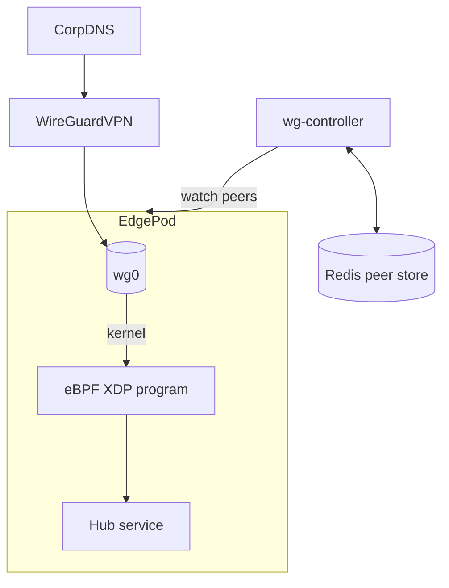
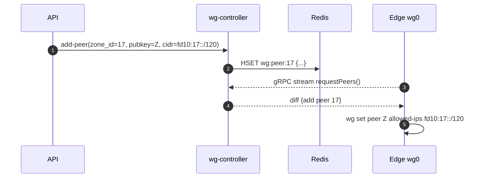
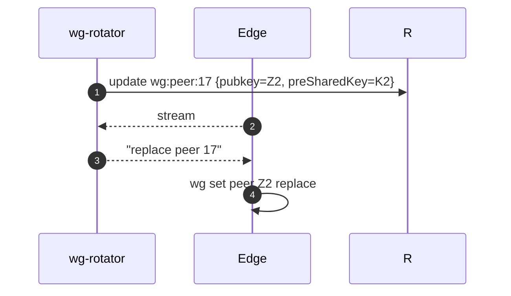

# 📘 **E1j – WireGuard & eBPF Orchestration (Design v0.1)**

> *Extends private‐zone Epic (E1i) by specifying a control‑plane for dynamic **WireGuard tunnel provisioning** and exploring an alternative **eBPF dataplane** for per‑tenant traffic isolation and metering.*

---

## 1 ▪ WHY

| Requirement                                                         | Today                                                | Gap                                                                      |
| ------------------------------------------------------------------- | ---------------------------------------------------- | ------------------------------------------------------------------------ |
| **Automated peer lifecycle** when customers create private zones    | Manual delivery of PSK/pubkey, static config on edge | Need zero‑touch add/remove peers, rotation, HA across N edge pods        |
| Fine‑grained **per‑tenant network policies** without iptables bloat | iptables rules per zone → >10k rules                 | **eBPF** allows in‑kernel maps & per‑socket/label filtering at line‑rate |
| **Metrics / accounting** (MB/s per zone) for billing & alerting     | Redis counters at L7 only                            | eBPF XDP counters at L3 save CPU & are tamper‑proof                      |

Goal: orchestrate WireGuard peers via a Rust control service (**wg‑controller**) and optionally enable an **eBPF dataplane** path (Cilium‑like) for high‑scale clusters.

---

## 2 ▪ WHAT (feature breakdown)

1. `wg-controller` micro‑service (Rust, grpc):

    * Manages **WireGuard device** on each edge pod via **wgctrl** userspace API.
    * Stores peer configs in Redis (`wg:peer:{zone_id}`) with pubkey, allowed‑IPs.
    * Handles **key rotation** every 24 h per tenant.
    * Emits Prom metrics: handshakes, rx/tx bytes.
2. **gRPC watch**: Edge pods stream peer diff from controller, patch `wg set` via `nix::execvp`.
3. **CIDR allocation**: Each private zone gets `/120` (IPv6) or `/30` (IPv4) internal subnet for tunnel addresses.
4. **eBPF dataplane (opt‑in)**

    * Attach XDP program on WireGuard interface.
    * Map `zone_id → rate_limit` (BPF hash map) — fed by Redis.
    * Count bytes per zone and enforce 1 Gbit cap (drop or ECN mark when exceeded).
    * Export counters via **BPF perf events** → Prometheus exporter.

---

## 3 ▪ Architecture graph



*Edge pods pull peer diffs → `wg set` without pod restart.  eBPF enforces per‑zone bandwidth.*

---

## 4 ▪ Sequence diagrams

### 4.1 Peer onboarding



### 4.2 Key rotation (daily)



---

## 5 ▪ eBPF program sketch (redbpf)

```rust
// XDP context
pub fn xdp_firewall(ctx: XdpContext) -> XdpResult {
    let pkt = ctx.packet();
    let zone = pkt.src_ipv6().segments()[4]; // embed zone_id in /120 subnet
    if let Some(limit) = LIMIT_MAP.get(&zone) {
        let cnt = BYTE_CNT_MAP.get_mut(&zone).unwrap_or(0);
        *cnt += pkt.len() as u64;
        if *cnt > limit.bytes_per_sec {
            return Ok(xdp_action::XDP_DROP);
        }
    }
    Ok(xdp_action::XDP_PASS)
}
```

*The userspace `wg-controller` updates `LIMIT_MAP` via bpffs.*

---

## 6 ▪ Rust crate choices

| Function          | Crate                                                       |
| ----------------- | ----------------------------------------------------------- |
| WireGuard control | `boringtun` (userspace WG) **or** `wgctrl-rs` for kernel WG |
| gRPC watch        | `tonic`                                                     |
| eBPF              | `aya` or `redbpf`                                           |

---

## 7 ▪ Deliverables & Timeline (2 sprints)

| Sprint | Item                                                                         |
| ------ | ---------------------------------------------------------------------------- |
| 1      | `wg-controller` + Redis schema; Edge watcher; unit tests                     |
| 1      | API integration: zone create => peer add                                     |
| 2      | eBPF prototype path; perf test 10 Gbit; fallback to iptables if kernel <5.10 |
| 2      | Prom exporter for byte counters & drops                                      |

---

## 8 ▪ Risks

| Risk                                            | Mitigation                                                                                      |
| ----------------------------------------------- | ----------------------------------------------------------------------------------------------- |
| Kernel WG not available on alpine images        | Vendor statically‑linked `boringtun` option                                                     |
| eBPF program verifier rejects complex map loops | Keep XDP code minimal; precompile & test on target kernels                                      |
| Stateful firewall requirements (TCP handshake)  | Use **tc egress** programs for connection‑tracking if needed; XDP drop only on bandwidth exceed |

---

© 2025 Ephemeral DNS Forwarder – WireGuard / eBPF Orchestration
