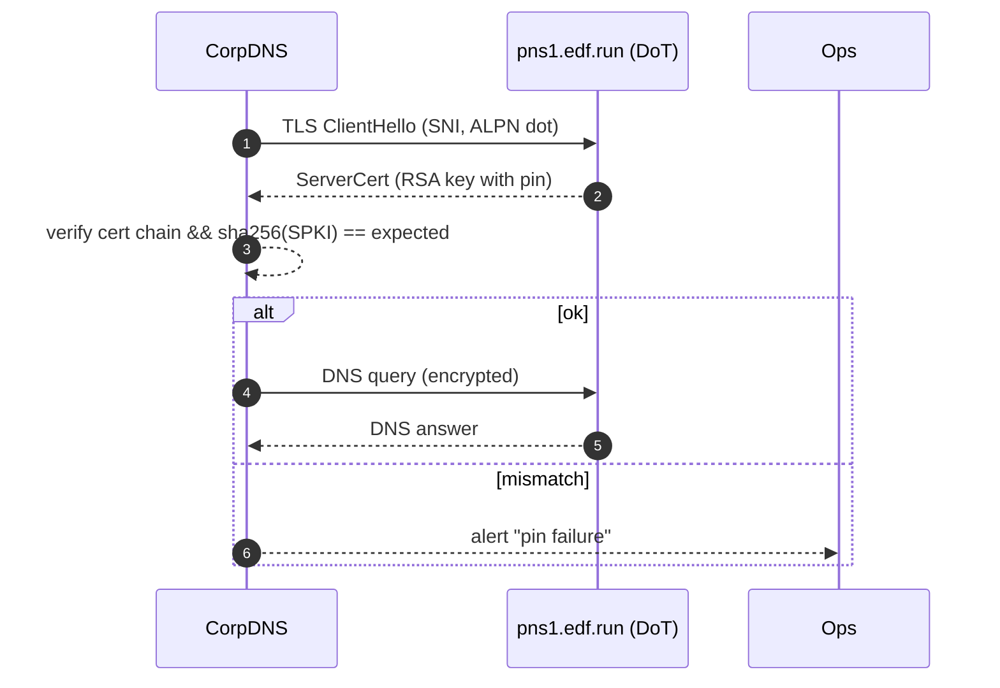

# 📘 **E1k – DNS‑over‑TLS Certificate Pinning (Design v0.1)**

> Part of the private delegated zones initiative (E1i). We secure DNS‑over‑TLS (DoT, RFC 7858) sessions between **corporate resolvers** and EDF’s private name servers by **pinning the server’s SPKI fingerprint**, protecting against on‑path TLS MITM and rogue CAs.

---

## 1 ▪ WHY

| Threat                                                                           | Impact if no pinning                                                          | Pinning benefit                                                                          |
| -------------------------------------------------------------------------------- | ----------------------------------------------------------------------------- | ---------------------------------------------------------------------------------------- |
| Compromised public CA issues rogue cert for `pns1.edf.run`, attacker hijacks DoT | Corporate resolver trusts fake NS → answers poisoned, dev traffic exfiltrated | Resolver validates **expected SHA‑256 SPKI**, rogue cert rejected regardless of CA chain |
| Internal proxy re‑signs TLS to inspect traffic                                   | Breaks DNS privacy goals                                                      | Pinning forces true E2E encryption; inspection attempts fail & alert ops                 |
| Downgrade to plaintext port 53                                                   | Attack intercepts queries                                                     | Resolver locked to DoT + pin ⇒ plaintext refused                                         |

Success metric: *zero* successful TLS MITM in red‑team test; disconnection rather than silent downgrade.

---

## 2 ▪ WHAT (requirements)

1. Publish **SPKI fingerprints** (base64 SHA‑256) for each private NS (`pns*.edf.run`) via HTTPS API & dashboard.
2. Provide **resolver config snippets** for: BIND 9.18+, Unbound, CoreDNS, Windows Server 2022 AD.
3. Automate pin rollover when EDF rotates ACME wildcard cert (E1h) — notifying customers N‑days prior.
4. Optional: **mTLS** mode where corporate resolver presents client cert signed by customer CA.

---

## 3 ▪ HOW

### 3.1 Generate pin

```bash
openssl x509 -in pns1.edf.run.pem -noout -pubkey | \
  openssl pkey -pubin -outform der | sha256sum | awk '{print $1}'
# -> 7e051aa0f7c8c2... (hex)
```

Expose via API:

```json
GET /v1/zones/17/dot-pin
{ "spki_sha256": "7e051aa0f7..." }
```

### 3.2 Resolver configuration examples

**Unbound:**

```unbound.conf
server:
  tls-cert-bundle: "/etc/ssl/certs/ca-certificates.crt"
forward-zone:
  name: "int.dev.acme.com."
  forward-tls-upstream: yes
  forward-addr: 10.192.10.2@853#pns1.edf.run,7e051aa0f7...
  forward-addr: 10.192.10.3@853#pns2.edf.run,4af0c99d5e...
```

**BIND 9.18+ (with `tls pin-sha256`):**

```bind
server 10.192.10.2 tls "pns1" {
    pin-sha256 "7e051aa0f7...";
};
```

### 3.3 Renewal & rollover

* 30 days before cert expiry, `acme-renewer` issues new cert (E1h) but **keeps old SPKI** by re‑using RSA keypair (ACME allows certificate reuse  – only signature updated).
* If key compromise detected → generate new keypair → new SPKI; publish **`pins.next`** field plus `Valid‑From` date.
* Grace period: 7 days where both pins accepted. Unbound & BIND allow multiple pins.

### 3.4 Pin distribution

* Dashboard card per zone with current `pin` and optional `next_pin`.
* Webhook `zone.pin.changed` for API users.

### 3.5 Optional mTLS

* Customers upload client cert via `/zones/{id}/dot-client-cert`.
* `rustls::ServerConfig` on pns\* adds `ClientCertVerifier` requiring that cert.
* Prevents open recursion misuse.

---

## 4 ▪ Sequence diagram (query with pin)



---

## 5 ▪ Failure modes

| Scenario                                    | Resolver behaviour                                    | EDF guidance                     |
| ------------------------------------------- | ----------------------------------------------------- | -------------------------------- |
| Pin mismatch                                | TLS terminated, query fails; fallback nameserver used | Alert SRE, check cert compromise |
| Cert reused but pin unchanged               | Connection ok (pin stable)                            | No action needed                 |
| Certificate near expiry but renewer crashed | Prometheus alert `edf_tls_cert_expiry_days{zone}<7`   | PagerDuty                        |

---

## 6 ▪ Deliverables

* [ ] API endpoint & dashboard displaying `pin` and `next_pin`.
* [ ] rustls config retaining key across cert renew.
* [ ] Examples for Unbound/BIND/CoreDNS/WinAD.
* [ ] Doc: key compromise rota & pin‑roll procedure.

---

© 2025 Ephemeral DNS Forwarder — DoT Certificate Pinning
