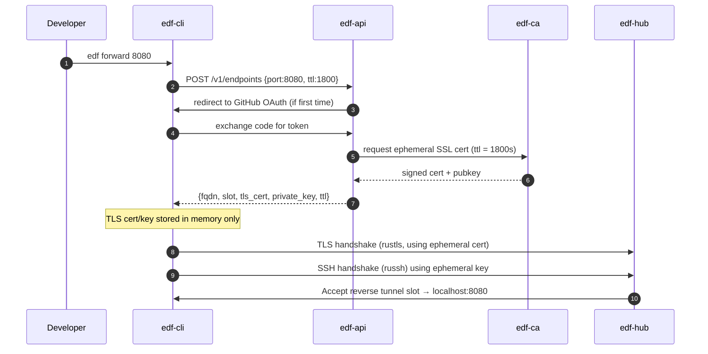

# 📘 E2 – Tunnel Server & CLI (Design v0.2)

## 🧭 Overview

This document defines the design of the **Tunnel Server and CLI** for Ephemeral DNS Forwarder. It establishes the secure reverse tunnel layer between the developer’s local machine or CI job and the cloud edge infrastructure, using **TLS-wrapped SSH with compression**, entirely implemented in **Rust** using `russh`, `tokio`, and `rustls`.

The tunnel allows ephemeral subdomains (e.g. `abc123.edf.run`) to route back to a developer’s local port, for integration testing of external webhooks, OAuth, or multi-tenant logic.

---

## 🎯 Objectives

* Create secure, ephemeral reverse tunnels from user machine to FDF hub
* TLS-wrap SSH sessions for strong encryption and ingress defense
* Support SSH-level compression to reduce cloud traffic
* Enforce client identity verification via GitHub authentication
* Use session-scoped ephemeral SSL client certificates for authorization

---

## 🔒 Security Principles

* **TLS outer layer** wraps all SSH traffic to make it indistinguishable from HTTPS
* **SSH inner layer** uses Ed25519 keypair per session (issued via API)
* **Compression** negotiated at SSH level (e.g., `zlib@openssh.com`)
* **Client authentication** tied to GitHub OAuth login with signed token
* **Ephemeral SSL certificate** is issued for the tunnel session (not written to disk)
* **PKI infrastructure** signs ephemeral certs per session
* **Ephemeral system user** used for SSH tunnel; no shell access or login capability

---

## 🔧 Architecture Summary

| Component  | Role                                                         |
| ---------- | ------------------------------------------------------------ |
| `edf-cli`  | CLI binary initiating the reverse tunnel from user’s machine |
| `edf-hub`  | SSH-over-TLS listener accepting reverse tunnels on port 443  |
| `edf-edge` | HTTP router speaking to hub over HTTP2 multiplexed stream    |
| `edf-api`  | Authenticates client via GitHub, generates cert + SSH keys   |
| `edf-ca`   | Rust PKI component signing ephemeral client certificates     |

---

## 🔄 Sequence – CLI Startup Flow



---

## 📦 Data Structures

```rust
struct TunnelSession {
  pub fqdn: String,
  pub slot: u16,
  pub pubkey: Vec<u8>,
  pub cert: Vec<u8>,
  pub private_key: EphemeralKey, // memory-only keypair
  pub expires_at: DateTime<Utc>,
  pub github_id: String,
}
```

---

## 🔐 TLS + SSH Wrapping Design

* CLI uses `rustls::ClientConnection` and connects to `edf-hub` on port 443
* The TLS handshake uses the **ephemeral client certificate** (valid for 30 mins)
* The certificate is signed by our internal **edf-ca** PKI
* SSH handshake occurs inside the TLS stream, authenticated via ephemeral Ed25519 key
* SSH is run as an **ephemeral non-login user**, restricted to reverse port-forward only

### Benefits

* TLS-wrapped SSH traffic hides protocol and enables fine-grained cert control
* Short-lived cert + key reduces risk if intercepted
* Prevents CLI from ever gaining shell access to `edf-hub` host

---

## 🗜️ SSH Compression

* SSH layer uses `zlib@openssh.com`
* `russh` negotiates compression during key exchange
* CLI activates compression for all reverse forwarded channels
* Saves bandwidth for webhook-heavy or API-testing tunnels

---

## 🔁 Keep-Alive & Expiry

* Keep-alive: CLI sends `SSH_MSG_GLOBAL_REQUEST keepalive@edf`
* Expiry:

    * TLS cert expires at `expires_at`
    * SSH session is closed by hub once `now() >= expires_at`
    * CLI logs expiration, exits cleanly

---

## 🧾 Logging and Cert Transparency

* Cert metadata is logged (subject, issuer, fingerprint) to local CLI log file
* Private key is held in memory only (heap-backed `EphemeralKey` wrapper)
* No cert, key, or sensitive token is ever written to disk

---

## 📁 Code Responsibilities

| Crate     | Module              | Responsibility                                         |
| --------- | ------------------- | ------------------------------------------------------ |
| `edf-cli` | `cli::tunnel`       | Memory-only TLS+SSH session init, key mgmt, port proxy |
| `edf-api` | `api::auth`         | GitHub OAuth handshake, session token issuance         |
| `edf-ca`  | `ca::signer`        | Issue TLS cert signed for `edf-hub` CN + expiry        |
| `edf-hub` | `hub::tls_acceptor` | TLS termination, cert fingerprint verification         |

---

## 🧪 Testing Plan

* [ ] CLI startup flow including GitHub login and cert request
* [ ] Validate TLS handshake with cert fingerprint enforcement
* [ ] Simulate expiry and verify auto shutdown
* [ ] Ensure key/cert never touch disk (memory inspection)

---

## ✅ Deliverables for E2 Completion (Expanded)

* [ ] GitHub auth via CLI + API + OAuth redirect
* [ ] Ephemeral SSL cert issuance and verification
* [ ] TLS-wrapped SSH reverse tunnel with compression
* [ ] No login access granted to any system user
* [ ] Integration test verifying SNI route ⇄ local port

---

## 🔐 Summary Security Guarantees

* One-time-use TLS cert per session
* GitHub identity gating via OAuth
* No shell / user login possible
* In-memory-only private key handling

---

© 2025 Ephemeral DNS Forwarder
