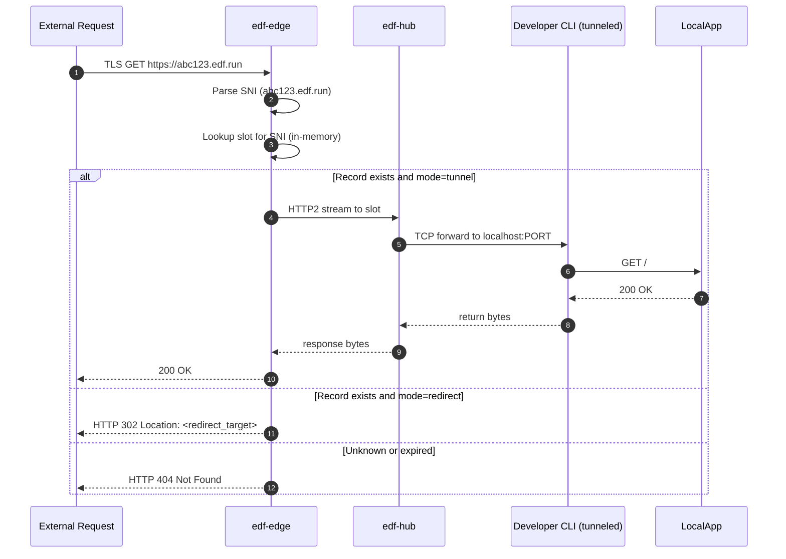

# 📘 E3 – Edge Proxy (Design v0.1)

## 🧭 Overview

The **Edge Proxy** (`edf-edge`) is responsible for accepting incoming traffic from the public internet over HTTPS and routing it to the correct tunnel slot within the `edf-hub`. It is designed to operate securely, efficiently, and with zero configuration for end users.

### Key Responsibilities

* Terminate TLS for ephemeral subdomains (e.g. `abc123.edf.run`)
* Inspect SNI / Host header to determine the associated slot
* Forward TCP/HTTP traffic to the correct active tunnel in the hub
* Optionally perform HTTP 302/308 redirect if the endpoint is configured in `redirect` mode
* Rate-limit and reject unknown or expired endpoints

---

## 🎯 Objectives

* Provide reliable and low-latency HTTPS termination
* Route to correct reverse tunnel session
* Ensure security with SNI validation and denial of invalid endpoints
* Avoid overhead: never hit disk, never spawn subprocesses

---

## 🌐 Components Involved

| Component  | Role                                                |
| ---------- | --------------------------------------------------- |
| `edf-edge` | Accepts TLS connections, routes to hub via stream   |
| `edf-hub`  | Maintains active tunnel slots and TCP channels      |
| `etcd`     | Optional fallback for slot lookup (edge cache miss) |
| `edf-api`  | Controls TTL expiry, issues/tears down slots        |

---

## 🔄 Sequence – Incoming Request Flow



---

## 🔐 TLS Termination (rustls)

* Uses wildcard TLS cert for `*.edf.run`
* TLS implemented in-process via `rustls`
* Supports ALPN negotiation and modern cipher suites only (TLS 1.3)
* SNI extracted directly from TLS stream for routing

### Session Reuse

* TLS sessions are stored in ephemeral in-memory cache for improved performance
* No session state written to disk

---

## 🗃️ Slot Resolution & Routing

* `edf-edge` maintains a cache: `{fqdn → slot}` with expiration
* On cache miss:

    * Queries `etcd` for `/dns/{fqdn}`
    * Parses slot and TTL
    * Caches result until expiry
* Resolved slot is used to multiplex into hub over HTTP2

---

## 🧭 Routing Modes

| Mode       | Behavior                                    |
| ---------- | ------------------------------------------- |
| `tunnel`   | Forward raw TCP stream to hub → tunnel slot |
| `redirect` | Respond with HTTP 302/308 to `redirect_url` |

---

## 📁 Data Structures

```rust
struct ResolvedEndpoint {
  pub fqdn: String,
  pub mode: EndpointMode,  // Tunnel or Redirect
  pub slot: Option<u16>,
  pub redirect_to: Option<String>,
  pub expires_at: DateTime<Utc>
}
```

---

## 🛡️ Security Features

* TLS enforced (port 80 optionally closed or redirected to 443)
* No fallback to HTTP; no plaintext option
* Rejects all requests without valid tunnel or expired endpoint
* Requests per IP rate-limited (e.g., 100 RPM default)
* Logs structured trace with `tracing::info_span`

---

## 📊 Observability & Metrics

* Histogram: request duration (by SNI)
* Counter: 2xx / 3xx / 4xx / 5xx responses
* Gauge: active slots
* Log: SNI, slot, method, response time, status

---

## ✅ Deliverables for E3 Completion

* [ ] TLS listener with SNI routing and HTTP2 tunnel support
* [ ] Per-SNI slot cache with TTL logic
* [ ] Functional 302 redirect mode with CLI option to enable
* [ ] Connection stream between edge and hub, routed by slot
* [ ] Edge test harness simulating incoming HTTPS traffic

---

## 🔮 Future Enhancements

* Static asset fallback (serve HTML page for known endpoints)
* Wildcard sub-subdomain routing (e.g., `tenant1.abc123.edf.run`)
* Country-based firewall rules

---

© 2025 Ephemeral DNS Forwarder
