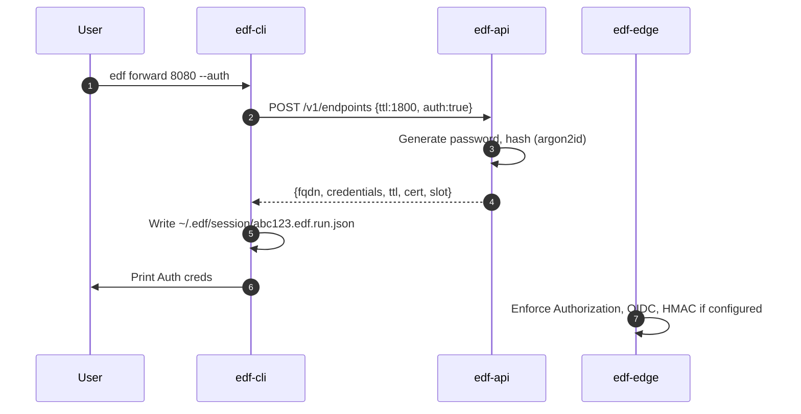

# 📘 E4 – Basic Auth, Redirect, and Auth Modes (Design v0.2)

## 🧭 Overview

This design document defines the behavior and implementation of optional **Basic Authentication**, **HTTP Redirect Mode**, **HMAC Signature Verification**, and **OIDC-based token validation** for (Ephemeral) Fleeting DNS Forwarder (FDF) endpoints. These features enable fine-grained control over who can access ephemeral endpoints and how the identity of callers is verified.

---

## 🎯 Objectives

* Allow users to optionally protect their endpoint using Basic Auth
* Support HTTP redirect mode with authentication
* Add webhook HMAC validation support
* Allow users to configure OIDC token validation from a provider they control
* Ensure CLI-generated credentials can be programmatically consumed

---

## 🔐 Basic Auth

### Behavior

* On endpoint creation, the backend API issues a unique Basic Auth `username:password` pair per session if requested
* Passwords are hashed with Argon2id and stored in etcd
* `edf-edge` enforces validation of HTTP `Authorization: Basic` headers
* On failure, returns `401 Unauthorized` with `WWW-Authenticate`

### CLI Integration

* When the user runs `edf forward`, the CLI:

    * Requests endpoint with `--auth` or default flag
    * Receives `{username, password}` in the response JSON
    * Writes the auth pair to disk (e.g. `~/.edf/session/<fqdn>.json`)
    * Displays one-time copy-paste credentials to stdout
* Fully automated CI jobs can parse this JSON for test setup

### Response Output

```json
{
  "fqdn": "abc123.edf.run",
  "ttl": 1800,
  "auth": {
    "username": "u7x82q",
    "password": "dkT9!qH0"
  }
}
```

---

## 🔁 Redirect Mode

See original E4. Still supports Basic Auth on redirect endpoints. Authentication is enforced before issuing 302/308.

---

## 🧾 HMAC Signature Validation

### Use Case

Some webhook providers (e.g., GitHub, Stripe) sign webhook requests using a shared secret and HMAC. We allow FDF users to define a `shared_secret` and an expected header name.

### Behavior

* User defines:

```json
{
  "hmac": {
    "secret": "my_shared_secret",
    "header": "X-Hub-Signature-256",
    "algo": "sha256"
  }
}
```

* `edf-edge` inspects inbound requests for matching header
* Computes HMAC using body and compares with constant-time equality
* On mismatch → `403 Forbidden`

---

## 🔓 OIDC Token Validation (Advanced)

### Use Case

A user running a secure test environment may wish to enforce OAuth2/OIDC token validation using their existing identity provider (e.g., Auth0, Google Workspace).

### Behavior

* User provides:

```json
{
  "oidc": {
    "issuer": "https://auth.mycompany.com",
    "audience": "edf",
    "alg": "RS256"
  }
}
```

* `edf-api` stores OIDC config under the endpoint metadata
* `edf-edge` fetches the provider’s JWKS and caches public keys
* For every request:

    * Validates `Authorization: Bearer <JWT>` header
    * Checks `iss`, `aud`, `exp`, and `sub` claims
    * Fails with `401` if token invalid or missing

### Configuration UI (Web Dashboard / API)

* A secure user dashboard allows users to configure accepted issuers, audiences, and toggle JWT enforcement per endpoint
* Endpoints can combine OIDC with Basic Auth and HMAC (all must pass)

---

## 🔄 Sequence – Tunnel Request with Auth Outputs



---

## ✅ Deliverables for E4 Completion (Expanded)

* [ ] Auth output via CLI and JSON file
* [ ] Argon2id credential hashing
* [ ] HMAC validation handler in edge router
* [ ] OIDC middleware in edge: JWKS cache, bearer token verification
* [ ] Web UI and API fields to configure OIDC and HMAC options per endpoint

---

## 🔐 Summary

| Auth Type   | Config Source               | Enforced By |
| ----------- | --------------------------- | ----------- |
| Basic Auth  | Auto-issued or user-defined | `edf-edge`  |
| HMAC Header | Shared secret + hash algo   | `edf-edge`  |
| OIDC JWT    | Issuer / audience config    | `edf-edge`  |

---

© 2025 (Ephemeral) Fleeting DNS Forwarder
