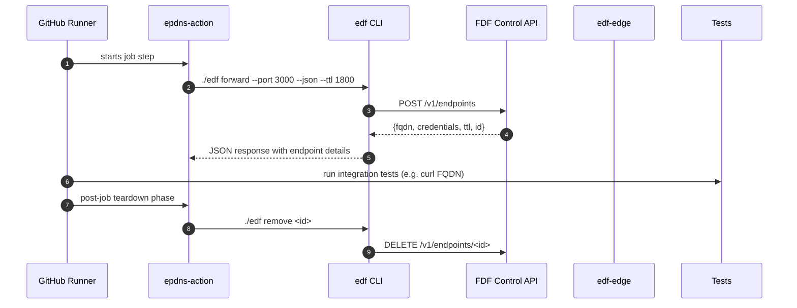

# 📘 E6 – CI Integration: GitHub Action (Design v0.1)

## 🧭 Overview

This document details the implementation and behavior of the official **GitHub Action for Ephemeral DNS Forwarder** (`epdns-action`) that allows automated test pipelines to create ephemeral DNS endpoints using the FDF CLI. This ensures full lifecycle automation and guaranteed teardown of reverse tunnels when the CI job exits.

---

## 🎯 Objectives

* Seamlessly integrate FDF into CI workflows (GitHub Actions first)
* Provision and teardown ephemeral DNS + tunnel endpoints during a job
* Ensure teardown occurs on success or failure
* Support JSON output for further automated use (e.g., test scripts)

---

## 🧱 Components

| Component       | Role                                             |
| --------------- | ------------------------------------------------ |
| GitHub Action   | Wrapper around the `edf` CLI with inputs/outputs |
| `edf` CLI       | Provision DNS + tunnel session                   |
| `entrypoint.sh` | Internal action script for lifecycle control     |

---

## 🔁 Sequence – CI Tunnel Lifecycle



---

## 🔧 Action Inputs

```yaml
inputs:
  port:
    description: "Local port to forward"
    required: true
  ttl:
    description: "TTL in seconds (default: 1800)"
    required: false
  output:
    description: "File path to write JSON output"
    required: false
  auth:
    description: "Enable basic auth"
    default: true
```

---

## 📦 Action Output

```json
{
  "fqdn": "abc123.edf.run",
  "auth": {
    "username": "uabc",
    "password": "abc!123"
  },
  "expires_at": "2025-07-02T14:30:00Z",
  "id": "ep-f1a3b"
}
```

Written to `GITHUB_WORKSPACE/endpoint.json` or a user-specified path.

---

## 🛡️ Cleanup & Teardown

* Action implements a `post` hook using `post-entrypoint.sh`
* Uses stored `endpoint_id` to call `edf remove` upon job exit
* This ensures ephemeral tunnels never linger past job duration

---

## 📁 Project Layout (Dist)

```text
/.github/actions/epdns-action/
├── action.yml
├── entrypoint.sh
├── post-entrypoint.sh
├── Dockerfile
└── edf (CLI binary included)
```

---

## 🧪 Example Usage

```yaml
jobs:
  test:
    runs-on: ubuntu-latest
    steps:
      - uses: actions/checkout@v3
      - name: Setup FDF Tunnel
        uses: epdns/epdns-action@v1
        with:
          port: 3000
          ttl: 1200
          output: endpoint.json
      - name: Run Integration Tests
        run: |
          FQDN=$(jq -r .fqdn endpoint.json)
          curl https://$FQDN/healthz
```

---

## ✅ Deliverables for E6 Completion

* [ ] GitHub Action published to `epdns/epdns-action`
* [ ] Dockerfile with embedded CLI binary
* [ ] Lifecycle hook for teardown (post)
* [ ] Full usage example with GitHub Actions + `jq` + test script
* [ ] README + badges + action.yml metadata

---

## 🔮 Future Enhancements

* Support matrix testing with multiple endpoints
* Auto-detect port from `dev.yml` or `docker-compose.yml`
* Add optional Slack notification on teardown

---

© 2025 Ephemeral DNS Forwarder
