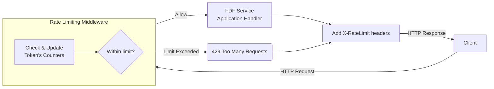

# E7 – Rate Limiting Design (v0.1)

## Overview and Goals

This document describes the **rate limiting** mechanisms for the FDF service, detailing how to throttle client requests to ensure fair usage and protect system resources. Rate limiting is crucial for preventing abuse, ensuring service stability, and providing all users with equitable access. We will implement a middleware that intercepts requests and enforces multiple rate-limit policies before they reach core service logic. The design uses Rust’s Tower framework and a concurrent DashMap to manage per-user (or per-token) quotas, aligning with industry best practices for API rate throttling. The key goals are to:

* Limit request rates on several dimensions (general API calls, tunnel session attempts, DNS provisioning) to prevent overload.
* Isolate rate limits per *user token* so that one client cannot exhaust quotas of another (a **key-level rate limit**).
* Provide informative response headers (`X-RateLimit-Remaining`, `Retry-After`, etc.) to help clients observe and respond to throttling.
* Allow certain authorized tokens to override or raise limits (for admin or premium use cases) without affecting the default enforcement for others.
* Keep the solution efficient (in-memory tracking via DashMap) and easily maintainable within the FDF codebase (leveraging Tower’s middleware abstractions).

## Rate Limiting Mechanisms in FDF

**Tower Middleware Layer:** The FDF service will introduce a Tower service **layer** dedicated to rate limiting. Tower’s `limit::RateLimit` utility can wrap an inner service and enforce a fixed number of requests per time window. This provides a foundation for throttling by automatically short-circuiting calls when the rate is exceeded. In our design, we will use a custom Tower layer that integrates with a shared state to support per-token limits (since `tower::limit` alone applies a static global rate across the whole service). Each incoming request will pass through this layer before hitting any application logic. The layer will perform a rate check and either allow the request to proceed or terminate it with an HTTP **429 – Too Many Requests** response if the limit for that client is exceeded.

**Concurrent DashMap for Per-Token State:** To maintain counters or tokens for each user/session, we will use a `DashMap` – a thread-safe hash map – keyed by a token or user identifier. This allows the rate-limiting middleware to record and update usage statistics concurrently across many tasks without heavy locking. Essentially, the design will associate each unique user/token with its own rate tracking object. As one reference illustrates, using a DashMap of rate limiters keyed by an identifier lets us enforce separate limits for separate users in parallel. By **associating particular keys with their own rate limiter**, users do not compete with each other’s quotas – ensuring fairness and preventing one client from consuming another’s share. The DashMap’s sharded concurrency model means updates for different keys can happen with minimal contention, which is important for a high-throughput service.

**Token Bucket / Fixed-Window Counters:** The specific algorithm for counting requests can be implemented either as a token bucket or a fixed-window counter with a reset interval. Tower’s built-in `RateLimit` layer essentially uses a fixed-window approach (e.g. “N requests per second”) and would drop excess calls until the next window. We may extend this with a token-bucket mechanism for smoother enforcement if needed (e.g. allowing bursts up to a point). For simplicity in v0.1, each rate limit dimension will likely use a fixed window or leaky bucket strategy configured with defined limits (described below). The DashMap will store the necessary counters/timestamps for each token’s usage. On each request, the middleware will perform roughly: *look up token -> check/update counter -> decide allow/deny*. These operations must be atomic and thread-safe, hence using DashMap (or internal locks) to avoid race conditions in updating counts across async requests.

**Multiple Limit Categories:** The middleware will enforce **multiple rate limit policies** depending on the type of request. Not all API actions are equal – for example, initiating a new tunnel session might be more expensive or sensitive than a read-only API call. Our design therefore implements separate **rate limit dimensions**, as detailed in the next section. The middleware will inspect each request (by endpoint or action type) and apply the relevant throttling logic. Some requests may increment multiple counters (for instance, *every* request counts against a global calls/sec limit, while a “create tunnel” request additionally counts against the tunnel-attempts/min limit). This layered approach is analogous to GitHub’s primary vs secondary rate limits, where certain expensive operations have their own stricter limits on top of general usage. For example, GitHub allows 5,000 API calls/hour generally, but also caps “content creation” actions to 80 per minute to prevent abuse. Similarly, our FDF service will globally throttle all requests, and also have targeted limits for specific actions.

## Rate Enforcement Dimensions

We will enforce rate limits on at least **three dimensions** as extracted from the PRD:

* **API Calls per Second:** A general request rate cap applied to all standard API calls. For instance, we might allow up to **X requests per second** per token. This prevents any single client from sending an overwhelming burst of requests in real-time. The limit value (X) will be determined based on system capacity and typical usage patterns. A per-second limit ensures immediate bursts are smoothed out; if a client exceeds this rate, subsequent calls within that second will be rejected. This is our broadest throttle, analogous to a global rate limit per user. (In a future iteration we might also have an overall global limit across all users to protect the service as a whole, but per-user is the focus for fairness.) We will use Tower’s `RateLimit` or an equivalent token bucket to implement this short-window limit.

* **Tunnel Session Attempts per Minute:** A more specific limit on how frequently a user can attempt to establish a tunnel session (an expensive operation) within a longer window. For example, no more than **Y tunnel-creation attempts per minute** for each user. This prevents rapid churn or abuse of the tunnel setup functionality. If a client tries to create more than Y tunnels in a rolling 60-second window, the extra attempts are rejected with a 429 error. The rationale is to protect backend resources and prevent misuse (e.g. clients programmatically spamming reconnections). A minute-based window suits this because tunnel attempts are not expected to be high-frequency in normal use. Implementing this may involve a separate counter in the DashMap for “tunnel\_attempts” per token, or a separate Tower `RateLimit` layer attached specifically to the tunnel endpoint route. We will likely integrate it in the same middleware by examining the request’s route/path. (For example, if the path is `/tunnel/connect`, check/update the tunnel counter in DashMap.)

* **DNS Provisioning Frequency:** A limit on how often a user can perform DNS provisioning actions (perhaps requesting a DNS record or certificate) in a given timeframe. This could be a per-minute or per-hour limit depending on how heavy the operation is. For instance, **Z DNS provisioning requests per hour** might be allowed. This ensures that even if the API allows automated DNS or domain setups, a single user cannot hammer that subsystem continuously. DNS changes often have external propagation costs, so throttling their frequency is prudent. Similar to the tunnel limit, the middleware will recognize DNS provisioning requests (e.g. hitting an endpoint like `/dns/provision`) and track those separately. If a user exceeds the allowed frequency, further DNS requests are denied until the time window resets. We will tune Z based on operational limits (for example, if each user is only supposed to provision at most one domain per minute, Z=1/min, etc.). This specialized rate limit is another example of a secondary limit on specific actions, akin to how some APIs set lower limits on certain endpoints.

Each of these dimensions will have its own counter and threshold. The values (X calls/sec, Y attempts/min, Z freq) will be configurable in the service (either via constants or config file) so they can be adjusted as we gather usage data. Initially, we will likely start with conservative defaults and adjust if needed (this follows best practice: start with safe limits and tune based on real-world data). If any one of these limits is exceeded, the request will be rejected – even if the others are under their thresholds. The system essentially takes the most restrictive applicable limit at any time for a given request.

The **per-token DashMap entry** for a user could store multiple counters/timestamps (one for each dimension). For example, a map value might look like:

```rust
struct RateCounters {
    last_call_ts: Instant,
    call_count_current_sec: u32,
    last_tunnel_attempts: Vec<Instant>,  // or count + window start
    last_dns_request: Instant,
    dns_count_current_hour: u32,
    // ... etc.
}
```

Alternatively, we might maintain separate DashMaps or sub-maps for each category. An initial simple implementation: use one DashMap from `Token -> (calls_count, last_call_window)` for calls/sec, and another from `Token -> (tunnel_count, last_tunnel_window)` for tunnel attempts, etc. Using multiple maps avoids any single value needing locks for all fields, at the cost of extra lookups. Since DashMap is quite efficient for concurrent lookups, this trade-off is acceptable. In v0.1, clarity and correctness are priority, so separate maps per dimension might be implemented, and we can refactor into one combined struct later if needed.

**Note:** We must carefully handle the time windows (e.g., resetting the per-second count each second, which can be done by storing the second timestamp; similarly, using timestamps or sliding windows for per-minute limits). We might leverage existing crates or simply use `Instant` checks. The Tower `RateLimit` layer, if used, will need to be re-created per request or per user which is not trivial – more likely we will implement our own logic as above for per-token limits. (There are also external crates like *Governor* or *axum-limit* that implement keyed rate limiting with DashMap, but here we outline a custom approach for learning and control.)

## Response Headers and Client Feedback

To make the rate limiting transparent and integratable for API clients, the service will include standard **rate-limit response headers** in HTTP responses:

* **`X-RateLimit-Remaining`** – Indicates how many requests remain in the current window for that particular limit category. For example, if a user is allowed 10 calls/sec and has just made 3, the response might include `X-RateLimit-Remaining: 7` (for the general calls limit). This header serves as a real-time counter for clients, helping them know how close they are to the limit. We will likely include this for the primary (calls/sec) limit in every response. If the request also counts against other limits (tunnel or DNS) and the client is nearing those, we might include separate headers or a combined indicator (for simplicity, v0.1 might expose only the main one). According to the HTTP RateLimit draft standard, a `RateLimit-Remaining` (or custom X-RateLimit-Remaining) value is an advisory, not a guarantee, but it’s useful for clients to avoid hitting the ceiling.

* **`X-RateLimit-Limit`** – (Possibly) the fixed quota of the current window. For instance, `X-RateLimit-Limit: 10` if at most 10 calls are allowed per second. This, along with “Remaining,” gives context to the client about the total allowed. We may include this for completeness, as many APIs do (GitHub sends `x-ratelimit-limit` to denote the max requests per hour). However, if we have multiple limits, we might need multiple headers or to document which limit the numbers refer to. One approach is to include different headers for different scopes, e.g. `X-RateLimit-Limit-Calls: 10`, `X-RateLimit-Remaining-Calls: 7`, `X-RateLimit-Limit-Tunnel: 5`, etc., but that can get verbose. In v0.1, we can at least expose the main one. The exact header naming can follow either the draft standard (`RateLimit-Limit` without X-) or the common convention; using “X-” prefix is fine for now since it’s a private API.

* **`X-RateLimit-Reset`** – (Optional in v0.1) A timestamp or countdown for when the current rate window resets. This is typically used for longer windows (e.g., minutes or hours). If we enforce per-second limits, this might not be very meaningful to include on every response (since it resets every second). But for the minute-based or hour-based limits, we could include a Unix timestamp or UTC epoch of the next reset, or a relative second count. For example, `X-RateLimit-Reset: 60` might indicate the window resets in 60 seconds. GitHub’s API uses a UNIX epoch for when the hourly window resets. The emerging standard suggests using a delta-seconds value for reset. We will consider including this for the minute/hour limits (tunnel and DNS) if it’s helpful. It’s not strictly required, since the `Retry-After` header (below) covers the wait time after a limit is hit.

In the event a request **is rejected** due to rate limiting (HTTP 429), the response will include a **`Retry-After`** header. This header tells the client how long to wait before retrying. We will set `Retry-After` either as a number of seconds or a HTTP date indicating when the user can attempt again. For simplicity, we’ll likely use seconds (e.g. `Retry-After: 30` meaning “wait 30 seconds”). Using `Retry-After` is a standard practice to improve client experience: it explicitly informs the user when they can make another request. Many clients and libraries respect this header to back off. In our design, if a user hits a limit, we can compute the retry-after based on the specific limit’s reset time. For instance, if the per-minute tunnel limit was hit at 10:35:00 and it allows 5/minute, and the user has done 5, then we know the next minute window starts at 10:36:00 – so we can send `Retry-After: 60` (seconds). If it’s a per-second limit, `Retry-After: 1` might suffice to indicate they should wait a second and try again. We will ensure that when multiple limits could apply, the **longest** relevant wait is communicated (e.g. if both a per-sec and per-min are exceeded, the retry-after might be a minute). According to standards, if both `Retry-After` and a reset header are sent, they should reference the same point in time.

By including these headers, we align with how other public APIs communicate rate limit status. The GitHub REST API, for example, sets `X-RateLimit-Remaining` and when it hits zero, the client knows no more requests are allowed until the reset time. Also, if a `Retry-After` is present, the client knows exactly how many seconds to wait. Our responses will mirror this behavior: when a 429 is returned, `X-RateLimit-Remaining` will typically be 0 for that category and `Retry-After` will tell the back-off time. We will also ensure to return a JSON error body or message indicating the limit was exceeded, for clarity (e.g. `{"error":"rate limit exceeded"}`), along with the headers.

In summary, these headers will **help API consumers self-regulate**. They can read how many calls remain and decide to slow down before hitting the limit, and if they do hit it, they know how long to pause. This proactive communication is recommended best practice.

## Token-Based Override Behavior

While the default rate limits apply to all clients uniformly, the design includes a provision for **token-based overrides**. This means certain API tokens can have custom rate limit rules or be exempt from some limits. Use cases include:

* **Internal or Admin Tokens:** Our own monitoring or admin tools might use the same endpoints but should not be throttled like normal users. We can tag these tokens (or user accounts) in a way that the rate limiting layer recognizes and bypasses or raises limits. For example, an internal health-check token might be allowed unlimited calls (or a very high threshold).

* **Premium Users / Tiered Plans:** In the future, if the service offers tiered usage plans (e.g. free vs paid), we may grant higher rate limits to premium tokens. For instance, a basic user may get 10 calls/sec, whereas a premium user gets 20/sec, and an enterprise token maybe 50/sec or effectively no cap. This encourages upgrades and ensures power users aren’t hindered by the same limits as free users. The tiers can be configured in a lookup table (e.g., a map of token->Plan, and a map of Plan->limit values). The middleware would then fetch the appropriate limits for the token instead of the default. This is analogous to how some APIs adjust limits based on the client’s subscription: e.g., *Basic tier: up to 10k requests/hour, Premium: 100k/hour, Enterprise: essentially unlimited*.

* **Burst Overrides:** There might be scenarios to temporarily override limits for a specific token – say we whitelist a partner for a higher burst during a particular operation. The design can accommodate this by updating the DashMap entry or a surrounding config at runtime. Since all rate check logic refers to the DashMap/limits config, any token marked as “override” can be handled accordingly (e.g., store a special value meaning “skip limit” or set their limit counters very high).

**Implementation approach:** The rate limiting middleware will have access to the authentication/identity info (likely a token ID or user ID extracted earlier in the request pipeline). We will incorporate a check like:

```rust
if overrides.contains(token) {
    // Either skip rate limiting or apply special limits
}
```

Where `overrides` might be a hash set or map loaded from configuration (could be as simple as an environment variable listing admin tokens, or a database flag for the user). In v0.1, a simple approach is to allow an environment-driven list of tokens that bypass limits entirely (for testing and internal use). For more granularity, we can map tokens to a struct of limit parameters (so an admin token maps to higher numeric thresholds rather than infinite). This structure would integrate with how we initialize the DashMap entries for that token. For example, an override token’s DashMap counters might be initialized with very high allowed values or a flag that the middleware interprets as “always allow”.

It’s important to document and communicate these overrides as they effectively break the assumptions of fair usage. Only trusted tokens should have them. We will ensure normal clients cannot accidentally obtain an override (the token generation and management system would control that).

One analogy in practice is how GitHub’s API allows higher rate limits when authenticated or for certain apps – e.g., **authenticated vs unauthenticated requests have different limits**, and enterprise accounts get higher limits. Our system is smaller scale, but similarly, we can say if a request has a special token (or a certain scope/role in the token claims), then use an alternate limit profile.

In summary, token-based overrides provide flexibility to accommodate different user needs and roles. They will be implemented in a configurable, maintainable way (likely a config file or environment for now). This ensures that as our user base grows (perhaps with paid tiers), we can adjust limits per tier easily without code changes – only configuration updates. It also means in emergencies, we can temporarily raise limits for a client by adding them to the override list, rather than disabling the entire rate limiter.

## Request Flow Through Rate-Limiting Middleware

The diagram below illustrates how a request moves through the system with the rate limiting layer in place:



**Figure: Request Flow with Rate Limiting.** The client’s HTTP request first enters the `RateLimitLayer`, which checks the DashMap for the user’s current usage counts and decides whether the request can proceed. If all relevant limits are within allowed range (**Decision: Within limit?** = Yes), the middleware forwards the request to the inner FDF service handler. The service then generates the normal response. Before sending the response back, the middleware (or a response layer) attaches the rate-limit headers (like `X-RateLimit-Remaining`) indicating the updated counts. The client receives the response with those headers.

If the request **exceeds** any limit (**Decision = No**), the rate limit layer short-circuits: it does not call the inner service at all. Instead, it immediately returns a **429 Too Many Requests** response. This response will include a `Retry-After` header telling the client how long to wait, and possibly a body or header indicating which limit was hit. The request is effectively dropped before reaching the main application logic, saving resources. (This is precisely how a middleware should behave to protect the service under high load.)

Behind the scenes, the **DashMap** is central during the “Check & Update” step: the middleware will do something like `entry = dashmap.entry(token).or_insert(DefaultCounters);` then update the relevant counters for the current timestamp and evaluate the result against thresholds. Because DashMap is used, multiple requests from different clients can perform this concurrently without blocking each other (except for brief shard locking on the same token). For a given token making many parallel requests, those will contend on that token’s entry – but by using atomic counters or small critical sections, we handle that safely. In the worst case, if two requests race and both see remaining quota and proceed, one might slip through exceeding by one, but we can design the check to be atomic (e.g., using a Tokio Mutex in each DashMap value for fine-grained atomicity). These implementation details will be refined in coding.

**Tower layer integration:** We implement `RateLimitLayer` as a Tower `Layer` that produces a `Service` wrapping our main service. Tower requires the service to be cloneable (for Axum/hyper to spawn per-connection), so our `RateLimitService` will hold the Arc/DashMap and any other state and implement the `Service` trait. Each call goes through our `poll_ready`/`call` where we perform the rate check logic (similar to the examples of custom rate-limit services). If a call is rejected, we return an error or a special response future that yields 429. Otherwise, we forward to inner service’s `call`. This approach follows the pattern demonstrated in Tower middleware tutorials, where the middleware can decide to short-circuit and not call the inner service, or do pre/post-processing around it.

## Conclusion

In this design, we have laid out a comprehensive strategy for **rate limiting in the FDF service** focusing on fairness (per-token limits), specificity (different limits for different operations), and transparency (communicating limits to clients). We leverage robust Rust libraries – Tower for structuring middleware and DashMap for efficient concurrent state – to implement a solution that is both performant and easy to maintain.

By enforcing caps on **API calls per second**, **tunnel attempts per minute**, and **DNS provisioning frequency**, the service will be protected from excessive load in each of these domains. The use of **standard headers** like `X-RateLimit-Remaining` and `Retry-After` will make it easier for users to handle rate limit responses properly (e.g., backing off when they receive a 429, as they are instructed to do when seeing those headers). Additionally, the ability to override or adjust limits per token gives us flexibility to accommodate special cases or future product plans (such as higher limits for premium tiers).

Going forward, we will implement this as **version 0.1** and gather data. We should monitor how often users hit the limits (and whether the limits need adjusting), ensure that the performance impact of the DashMap and checks is negligible (the overhead should be low compared to request processing), and watch out for any edge cases (like synchronization issues or memory growth of the DashMap if many tokens never expire – we might need a cleanup for old entries). Future enhancements could include persistent or distributed rate limiting (using Redis or similar) if we scale out the service, but for now an in-memory approach is sufficient for a single-instance or small cluster deployment.

Through this design, FDF service developers and contributors (especially those familiar with Rust and Tower) should have a clear blueprint for implementing rate limiting in the code. We have balanced technical precision with practical considerations, ensuring the design can be realized in code and serves the product requirements of controlling usage rates effectively.

**Sources:**

* Tower `RateLimit` documentation – confirms that a middleware can enforce a max request rate over time.
* Will Cygan’s Tokio rate-limiting article – demonstrates using DashMap to shard rate limiters by key (user), the strategy we adopt for per-token limits.
* Tyk API Management on rate limiting best practices – highlights the importance of communicating limits via headers like `Retry-After` and `X-RateLimit-Remaining` to improve UX.
* GitHub API rate limiting guidelines – real-world example of multi-dimensional limits (general vs. content-specific) and use of headers for remaining quota and retry timing. These inform our approach to multiple limit categories and header semantics.
* General knowledge of tiered API plans – justification for implementing token-based limit overrides for different user tiers or internal clients.
