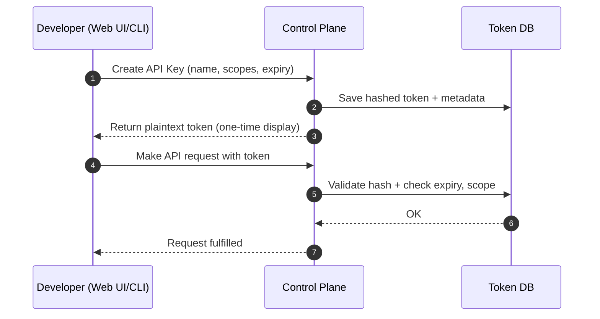

# 📘 E8 – API Key Strategy (Design v0.1)

## 🧭 Overview

This document defines the strategy and architecture for **API key issuance and management** in the Ephemeral DNS Forwarder (EDF) platform. It establishes how scoped, rate-limited, and expirable API tokens will be created, authenticated, and used to access both control-plane and operational endpoints.

---

## 🎯 Objectives

* Enable developers to generate and manage scoped API keys via CLI or Web UI
* Support fine-grained access controls with action-specific scopes
* Allow API keys to carry metadata (TTL, usage quotas, expiry)
* Ensure key lifecycle security: issuance, rotation, revocation

---

## 🔐 Token Format

### API Key Encoding

* 256-bit random secret (e.g., UUIDv4 + random salt) encoded as Base62
* Prefix: `epk_` + environment marker + HMAC signature
* Example: `epk_live_0ef83ac9b70d4b6a98a3f10c9d...`

### Storage

* Keys are hashed [Argon2id](https://docs.rs/argon2/latest/argon2/) and stored server-side 
* Only the one-time token preview is shown to the user (never retrievable again)
* Each token is linked to a user or team ID and embedded with policy metadata

---

## 🗝️ Schema

```json
{
  "token_id": "api-k-79d2c",
  "name": "github-ci-token",
  "user_id": "user-123",
  "scopes": ["endpoints:create", "endpoints:delete"],
  "max_tunnels": 3,
  "rate_limit": {
    "burst": 10,
    "sustained_rps": 1
  },
  "created_at": "2025-07-01T12:00:00Z",
  "expires_at": "2025-09-01T00:00:00Z",
  "revoked": false
}
```

---

## 🎛️ Scope Types

| Scope              | Description                                |
| ------------------ | ------------------------------------------ |
| `endpoints:create` | Allows issuing new endpoint or tunnel      |
| `endpoints:delete` | Allows deleting an active endpoint         |
| `tunnels:read`     | List current tunnels (optional)            |
| `metrics:read`     | Query usage metrics for billing/monitoring |
| `admin:*`          | Reserved for platform or team admins       |

Scopes are statically defined and checked in request middleware.

---

## 🔁 Token Flow



---

## 📡 CLI Integration

* Users can list, revoke, and create keys using:

```bash
edf token create --name "ci" --scopes endpoints:create --expires 30d
edf token list
edf token revoke <id>
```

* The token is saved to a local config store (\~/.edf/tokens.json)

---

## 🚫 Revocation & Expiry

* Tokens can be revoked manually via CLI or web
* Expired tokens are ignored by the API and marked as stale
* Revoked tokens are soft-deleted with audit trail

---

## 🔐 Security Practices

* Argon2id used for secure hash storage
* Tokens never stored in plaintext after issuance
* Rate limiting and audit logging per token
* Signed token ID prefix protects against enumeration or tampering

---

## ✅ Deliverables for E6C Completion

* [ ] API: create/list/revoke token endpoints
* [ ] CLI integration: `edf token` commands
* [ ] Dashboard token management UI (basic v1)
* [ ] Middleware for scope/rate checks on incoming token usage

---

## 🔮 Future Enhancements

* JWT-based tokens with internal claims (expiry, scopes)
* Personal vs team tokens (scoped to org or project)
* Time-boxed temporary session tokens (e.g., 1-hour test tokens)
* Service account keys with webhook-bound roles

---

© 2025 Ephemeral DNS Forwarder
