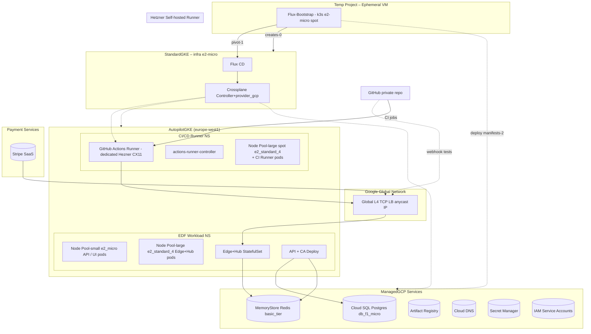
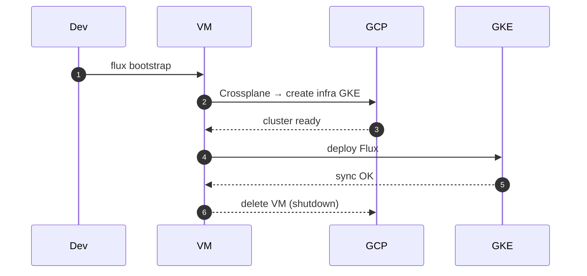
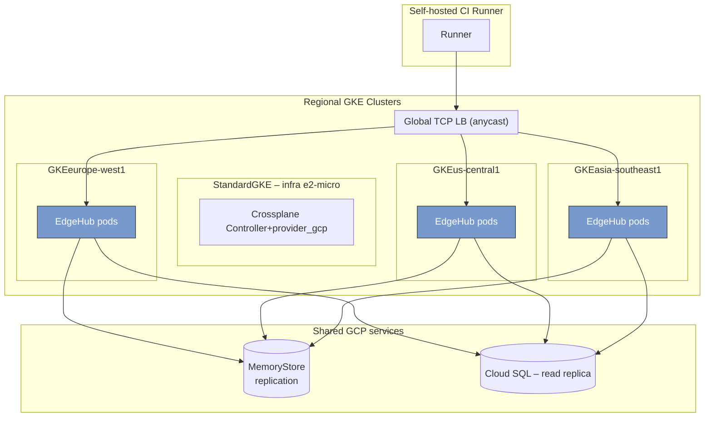

# 📘 **E0 – Infrastructure & GCP Deployment (Designv0.1)**

> *Foundation epic for all runtime and Ops work.  Replaces earlier Hetzner notes; assumes primary cloud = GoogleCloud Platform.*

---

## 1 ▪ WHY GCP?

| Factor                          | Rationale                                                                                                        |
|---------------------------------|------------------------------------------------------------------------------------------------------------------|
| **Global any‑cast L4 TCP LB**   | Single public IP close to every user; no DIY BGP / Keepalived.                                                   |
| **Generous free tier**          | CloudSQL `db‑f1‑micro`, GKE Autopilot free control plane, e2‑micro compute credits – perfect for MVP flush burn. |
| **Crossplane.io provider‑gcp**  | Provision clusters, node‑pools, CloudSQL, Redis **GitOps‑style** from YAML.                                      |
| **Rapid scale**                 | Autopilot auto‑adds nodes; can flip to committed‑use discounts or Spot pools as we grow.                         |
| **Managed Redis (MemoryStore)** | 0‑ops instead of self‑hosted Helm chart.                                                                         |

---

## 2 ▪ High‑level architecture graph ▪ High‑level architecture graph



> *`actions-runner-controller` monitors GitHub webhooks, provisions **runner Pods in spot node‑pool**; pods auto‑deregister on completion.*

> *`Hetzner Self-hosted Runner` Once we go beyond 10,000CI minutes, it becomes more economical to switch to a Hetzner.*

> *`Crossplane` & `FluxCD` run in a **dedicated Standard GKE infra cluster** (single e2‑micro node) to keep management isolated.  Compositions then provision the **Autopilot workload cluster**, node pools, CloudSQL, and Redis.  
> *\* compositions declare **GKE cluster**, **node pools**, **redis‑instance**, **sql‑instance**,**artifact-registry**, **secret-manager**, **cloud-dns**,; FluxCD applies them on each commit.\*

> *`Google Cloud Dns` will hold the top level SOA NS Delegations for our domains (`fleetingdns.com`, `fleetingdns.run`)*

---

## 3 ▪ Day0 Bootstrap Flow

On **Day0** a spot VM hosts k3s + Flux to create the long‑lived infra cluster, then self‑terminates.



Cost: \~€0.02 (included in OPEX).

---

## 4 ▪ Resource specification (Crossplane XR snippets)

### GKE workload (unchanged)

```yaml
apiVersion: container.gcp.crossplane.io/v1beta2
kind: GKECluster
metadata:
  name: edf-dev
spec:
  location: europe-west1
  autopilot: true
---
apiVersion: container.gcp.crossplane.io/v1alpha1
kind: NodePool
metadata:
  name: edge-large
spec:
  clusterRef:
    name: edf-dev
  config:
    machineType: e2-standard-4
    spot: true
  autoscaling:
    minNodeCount: 0
    maxNodeCount: 2
```

### Hetzner CI Runner (provider-hcloud)

```yaml
apiVersion: hcloud.crossplane.io/v1alpha1
kind: Server
metadata:
  name: ci-runner
spec:
  forProvider:
    serverType: cx11
    location: nbg1
    image: ubuntu-22.04
    sshKeys:
      - name: flux-bootstrap-key
    userData: |
      #cloud-config
      runcmd:
        - curl -s https://get.github.com/actions/runner.sh | bash
        - ./config.sh --unattended --url https://github.com/<org>/<repo> --token ${{ secrets.RUNNER_TOKEN }}
        - ./run.sh
  providerConfigRef:
    name: hetzner-hcloud
```

\*A `ProviderConfig` pointing to a secret with `HETZNER_API_TOKEN` lives in `infra/hetzner-provider.yaml`.\*yaml
```yaml
apiVersion: container.gcp.crossplane.io/v1beta2
kind: GKECluster
metadata: {name: edf-dev}
spec:
  location: europe-west1
  autopilot: true
---
apiVersion: container.gcp.crossplane.io/v1alpha1
kind: NodePool
metadata: {name: edge-large}
spec:
  clusterRef: {name: edf-dev}
  config:
    machineType: e2-standard-4
    spot: true
  autoscaling:
    minNodeCount: 0
    maxNodeCount: 2
```

(Full compositions in `/infra/` directory.)

---

## 4 ▪ MVP OPEX (August2025€)

| Service                                                                      | SKU / Node            | Qty / hrs | Unit€    | Est.€/mo           | Notes                           |
|------------------------------------------------------------------------------|-----------------------|-----------|----------|--------------------|---------------------------------|
| **Workload cluster (Autopilot)**                                             | control plane         | free      | —        | **0.00**           | Free tier.                      |
| Autopilot compute\*                                                          | 2 × e2‑micro          | 730h      | included | **0.00**           | Within free 744vCPU‑sec credit. |
| Spot pool (e2‑standard‑4)                                                    | avg10h                | 0.0104/h  | **0.10** | Load‑test only.    |
| **L4 TCP LB**                                                                | 1 rule                | 744h      | 0.0065/h | **4.70**           | Minor data cost extra.          |
| CloudSQL Postgres                                                            | db‑f1‑micro           | 744h      | free     | **0.00**           | 10GB disk.                      |
| MemoryStore Redis                                                            | basic1GB              | 744h      | 0.0267/h | **19.80**          | Smallest tier.                  |
| CloudLogging & Metrics                                                       | 5GB                   | 0.50/GB   | **2.50** | Sampled.           |
| CloudNAT egress                                                              | 1GB                   | 0.11/GB   | **0.11** | Webhook responses. |
| **Bootstrap VM (k3s + Flux)**                                                | e2‑micro spot         | 12h       | 0.002€/h | **0.02**           | Auto‑deletes Day1.              |
| **Infra cluster (Standard)**                                                 | control‑plane fee     | 744h      | 0.092€/h | **68.45**          | €0.10/hr ≈ \$72/mo.             |
| Infra node                                                                   | e2‑micro pre‑emptible | 744h      | 0.004€/h | **2.98**           | Runs Crossplane <200m CPU.      |
| (Standard)\*\*                                                               | control‑plane fee     | 744h      | 0.092€/h | **68.45**          | €0.10/hr ≈ \$72/mo.             |
| Infra node                                                                   | e2‑micro pre‑emptible | 744h      | 0.004€/h | **2.98**           | Runs Crossplane <200m CPU.      |
| **Estimated monthly OPEX**                                                   | —                     | —         | —        | **≈€100.64**       | ≈€4.9/day.                      |
| *Autopilot bills per‑pod; e2‑micro pods fit within the free quota.*\*\*      |                       |           |          | **≈€27.21**        | <€1/day.                        |
| **Hetzner CI Runner** </br> It's more economical to switch beyond 10,000mins | CX11 dedicated        | 720h      | 49.00/mo | **49.00**          | Unlimited private‑repo minutes. |
| **Total OPEX**                                                               | —                     | —         | —        | **≈€149.64**       | ≈€6.55/day.                     |
\*Autopilot charges vCPU/Memory per‑pod; e2‑micro pods fit free quota.

---

## 5 ▪ Roll‑out phases

1. **Day0** – Spin a temporary VM (`e2-micro spot`) in a bootstrap project; install k3s + Flux; apply Crossplane infra-cluster manifests.
2. **Day1** – Infra GKE (Standard) becomes ready; Flux installed in-cluster takes over; bootstrap VM self-deletes.
3. **Week1** – Crossplane provisions Autopilot workload cluster, CloudSQL, and Redis via compositions.
4. **Week2** – Deploy API & EdgeHub; validate with Hetzner CI runner.
5. **Week3** – Wire Workload Identity; secret injection tested end‑to‑end.
6. **Week4** – Enable global L4 LB, Managed Certificate, and live DNS.
7. **Week5** – Load-test 50k tunnels/day; monitor MemoryStore & LB.
8. **Week6** – Enable Spot autoscaling; cut over to production.

---

## 6 ▪ Risks & Mitigations

| Risk                                           | Mitigation                                                                 |
|------------------------------------------------|----------------------------------------------------------------------------|
| Redis basic tier caps at 1GB RAM / \~15k conns | Scale to standard‑tier when concurrent tunnels >5k.                        |
| GKE free‑tier Pod quotas exhausted in heavy CI | NodePool autoscaling to Spot restores headroom.                            |
| Global LB cold‑start 90s new back‑end health   | Pre‑warm by rolling update strategy `maxSurge=1`.                          |
| Burst of jobs waits for pod start (30‑60s)     | Pre‑warm 1 idle runner during work hours via `HorizontalRunnerAutoscaler`. |
| GitHub PAT rotation                            | Store in Secret Manager; Flux refresh every 90d.                           |
| Spot node eviction mid‑build                   | ARC checkpoint; or use regular e2-standard-2 pool for critical workflows.  |
---

## 7 ▪ Multi‑Region NEG Topology (future phase)



*Each region registers its NEG back‑end to the global LB. `cluster_id` bits (E1f) ensure the receiving Edge can redirect to correct region if cross‑hit.*

---

*Epic → User‑story breakdown (v0.1)*

---

## Epic Goal

> “Stand up a secure, multi‑project GCP landing zone with dual clusters (infra & workload EU) plus automated bootstrap, IAM federation, budget guard rails, and Flux‑managed Crossplane providers — all codified in GitOps.”

---

## 🗂️ Story List

| ID         | Story (As a…)       | Outcome (So that…)                                                                        |
|------------|---------------------|-------------------------------------------------------------------------------------------|
| **E0‑S1**  | *Org admin*         | Create **two GCP projects** (`infra`, `workload-eu`) under org & attach billing.          |
| **E0‑S2**  | *Platform engineer* | Have **VPCs + peering** between infra/workload projects to enable Flux push/pull.         |
| **E0‑S3**  | *Platform engineer* | Provision **Standard GKE infra-cluster** with single e2‑micro via Crossplane.             |
| **E0‑S4**  | *Dev lead*          | Bootstrap **Flux + Crossplane** on infra cluster auto‑matically (Day‑0 VM self‑destruct). |
| **E0‑S5**  | *Platform engineer* | Provision **Autopilot workload cluster** + spot node‑pool.                                |
| **E0‑S6**  | *SecOps*            | Enforce **Workload Identity Federation** (GitHub OIDC → GCP) — no SA keys.                |
| **E0‑S7**  | *Finance*           | **Budget alert** at €200, 50/90 % e‑mail + Slack webhook.                                 |
| **E0‑S8**  | *Infra Dev*         | Reserve **global anycast IP & DNS zone** (`*.fleetingdns.run`).                           |
| **E0‑S9**  | *DB admin*          | Stand up **Cloud SQL (db‑f1‑micro)** + initial DB & user.                                 |
| **E0‑S10** | *Ops*               | Deploy **MemoryStore Redis 1GB** instance.                                                |
| **E0‑S11** | *NetOps*            | Create **forwarding rules** (TCP 80/443 & UDP 51820) on the LB.                           |

---

### Story template below

---

## E0‑S1 — Org & Projects

**Tasks**

1. Authorize CLI account with org‑level owner.
2. Run Day‑0 shell script (`scripts/day0_bootstrap.sh`).
3. Commit project IDs to `infra/providers/providerconfig-gcp.yaml`.

**Functional Req**

* Two distinct projects exist: `fleetingdns-infra`, `fleetingdns-workload-eu`.
* Billing account linked; APIs enabled.

**Non‑Functional Req**

* Idempotent script rerun ≤ 60 s.
* CI lint job ensures project IDs are globally unique.

---

## E0‑S2 — VPC & Peering

**Tasks**

1. Author VPC manifests (`gcp-core/vpc-*.yaml`).
2. Apply via Flux; verify with `gcloud compute networks peerings list`.

**Functional**

* `infra-vpc` & `workload-vpc` auto‑peered.
* Private RFC1918 ranges do not overlap.

**Non‑Functional**

* RTT across peering ≤ 5ms.
* Terraform / manual edits blocked by policy label `managed-by=flux`.

---

## E0‑S3 — Infra Cluster

**Tasks**

1. Add `clusters/infra-cluster.yaml` XR.
2. NodePool spec (`infra-nodepool-default.yaml`).
3. Kustomize overlay.

**Functional**

* GKE Standard cluster up with node count =1.
* Private nodes enabled.

**Non‑Functional**

* Control‑plane SLA 99.5%.
* Monthly cost ≤ €70 credit.

---

## E0‑S4 — Flux + Crossplane Bootstrap

**Tasks**

1. Spot VM YAML in `bootstrap/` applied manually.
2. VM installs k3s + Flux; commits provider installs.
3. VM auto deletes after `BootstrapSucceeded` CR.

**Functional**

* Flux `Ready=True` within 10min.
* Provider‑gcp `Healthy=True`.

**Non‑Functional**

* Bootstrap log archived to GCS bucket.
* Spot VM cost ≈ €0.02.

---

## E0‑S5 — Workload Autopilot Cluster

**Tasks**

1. XR `workload-cluster-eu.yaml`.
2. Spot node‑pool YAML.
3. Verify Workload Identity enabled.

**Functional**

* Autopilot cluster ready; default namespace cost = free.
* Node pool scales 0→4.

**Non‑Functional**

* p95 API latency < 100ms from infra‑cluster.
* Control‑plane cost zero (credit covers).

---

## E0‑S6 — OIDC Workload Identity

**Tasks**

1. Create `iam-oidc/wi-pool-github.yaml`, provider, IAM bindings.
2. Annotate Flux SA + ARC SA.
3. Remove SA keys from secrets.

**Functional**

* GitHub workflow can `gcloud` into infra cluster w/ no key file.
* ARC runner pods pull/push images w/ GCR creds.

**Non‑Functional**

* Token lifetime 60min; rotation auto.
* IAM Policy Analyzer shows 0 keys.

---

## E0‑S7 — Budget Alerts

**Tasks**

1. Create `observability/alertpolicy-budget50.yaml`.
2. Sink to Slack webhook.

**Functional**

* Alert at 50% of €200.

**Non‑Functional**

* False‑positive rate < 1/mo.

---

## E0‑S8 — Anycast IP & DNS Zone

**Tasks**

1. `global-address-glb.yaml` reserves IP.
2. `dns-zone-edf.yaml` + wildcard record.

**Functional**

* `nslookup *.fleetingdns.run` returns reserved IP.
* Propagation within 5min via Cloud DNS.

**Non‑Functional**

* No manual edits in Cloud Console; IAM deny‑policy enforced.

---

## E0‑S9 — Cloud SQL

**Tasks**

1. Instance, DB, user manifests.
2. Secret Manager entry for password.

**Functional**

* db‑f1‑micro instance Ready.
* SSL required.

**Non‑Functional**

* Idle cost €0 (free tier).
* Connections max 50.

---

## E0‑S10 — MemoryStore Redis

**Tasks**

1. 1‑GB basic tier manifest.
2. IAM network config.

**Functional**

* Redis endpoint reachable from workload cluster.
* Redis AUTH enabled.

**Non‑Functional**

* Latency < 3ms from edge‑hub pod.

---

## E0‑S11 — LB Forwarding Rules

**Tasks**

1. TCP 80/443, UDP 51820 rules YAML.
2. Attach to global IP.

**Functional**

* healthChecks pass from three Google POPs.
* Tunnel handshake works via GLB.

**Non‑Functional**

* Cold‑start < 60s new back‑end.

---

© 2025 FleetingDNS – *E0 user stories & tasks*
