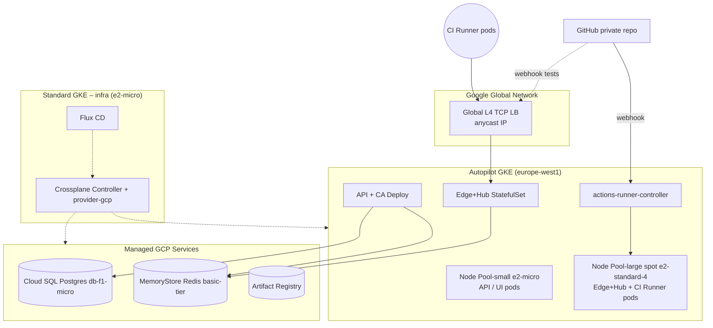

# 📘 **E0 – Infrastructure & GCP Deployment (Designv0.2)**

*This revision removes the Hetzner VM runner and replaces it with **ephemeral GitHub Actions runners on GKE Autopilot** using the community `actions-runner-controller`.*

---

## 1 ▪ Key Change

> Adopt **ephemeral self‑hosted runners**: each CI job spins a Spot pod in the workload cluster → zero idle cost, no external VM.

---

## 2 ▪ Updated Architecture Graph

*`actions-runner-controller` monitors GitHub webhooks, provisions **runner Pods in spot node‑pool**; pods auto‑deregister on completion.*

---

## 3 ▪ Resource Additions

| Kind                          | Name                        | Purpose                                                           |
| ----------------------------- | --------------------------- | ----------------------------------------------------------------- |
| `HelmRelease`                 | `actions-runner-controller` | Deploy controller in `flux-system` namespace of workload cluster. |
| `RunnerDeployment`            | `ci-runners`                | Template for 1‑job‑per‑pod, spot scheduling, CPU 2, memory 2Gi.  |
| `ServiceAccount` + WI Binding | `arc-controller`            | Pull images & write logs without keys.                            |
| `ProviderConfig` update       | add Artifact Registry auth  | Runner pods push images back to AR.                               |

---

## 4 ▪ Revised OPEX (August2025) – pay‑per‑use runners

| Service                 | Qty                | Unit€              | **Est. €/mo** | Basis                          |
| ----------------------- | ------------------ | ------------------- | ------------- | ------------------------------ |
| Runner pod vCPU‑seconds | 1000 min (2 vCPU) | €0.00024 / vCPU‑min | **€4.80**     | 2× vCPU per pod × 1000 min    |
| Runner pod RAM          | same               | €0.000026 /Gi‑min  | **€0.31**     | 2Gi × 1000 min               |
| Spot node overhead      | incidental         | —                   | included      | NodePool scales to 0 when idle |
| (Removed) Hetzner CX11  | —                  | —                   | **–€49.00**   | n/a                            |
| **New total OPEX**      |                   |                    | **≈€103**    | Saves \~€45/mo at 1000 CI min |

*If CI minutes exceed \~10k/month, a reserved CX11 becomes cheaper again.*

---

## 5 ▪ Roll‑out Impact

1. **Week2** – Flux deploys `HelmRelease arc`.
2. GitHub App registered; PAT secret stored in Secret Manager.
3. Crossplane removes Hetzner `Server` manifest.
4. Spot node‑pool autoscaler policy: scale 0→1 on pending runner pod.
5. CI workflow yaml uses `runs-on: [self-hosted, linux, gke]` label.

---

## 6 ▪ Risks & Mitigations

| Risk                                        | Mitigation                                                                 |
| ------------------------------------------- | -------------------------------------------------------------------------- |
| Burst of jobs waits for pod start (30‑60s) | Pre‑warm 1 idle runner during work hours via `HorizontalRunnerAutoscaler`. |
| GitHub PAT rotation                         | Store in Secret Manager; Flux refresh every 90d.                          |
| Spot node eviction mid‑build                | ARC checkpoint; or use regular e2-standard-2 pool for critical workflows.  |

---

©2025 FleetingDNS — Infrastructure Epic v0.2
