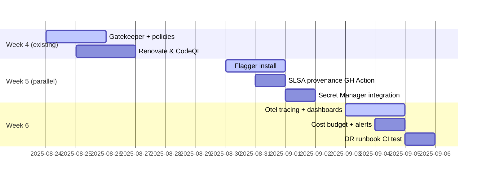

# 📘 **E0a – Process & Ops Enhancements (Designv0.1)**

*Companion epic to E0 – Infrastructure.  Focuses on security, CI/CD hygiene, observability, and cost-control upgrades.*

---

## 1 ▪ Scope Overview

We lock down the supply chain, add automated rollouts with **Flagger** (Flux-native), integrate observability, and enforce org‑wide guard rails — all incremental to the existing six‑week plan.

| Area                 | Tool                                   | Outcome                                                                            |
| -------------------- | -------------------------------------- | ---------------------------------------------------------------------------------- |
| Policy-as-Code       | Gatekeeper (OPA)                       | Blocks bad Kubernetes manifests (e.g., `runAsRoot`, wrong namespace) at admission. |
| Dependency hygiene   | Renovate + CodeQL                      | Auto‑bump crates & scan for CVEs; GH Actions fails if scan critical.               |
| Build provenance     | SLSA‑level 2 (GitHub generator)        | Signed attestations on each container image in GHCR.                               |
| Progressive delivery | **Flagger + Contour** (uses LB weight) | Canary/blue‑green for Edge pods; auto‑rollback on 5xx or latency SLO.              |
| Tracing & metrics    | OpenTelemetry → Cloud Trace + Prom     | End‑to‑end request latency, pod metrics exported.                                  |
| Secrets management   | GCP Secret Manager + SealedSecrets     | Zero plaintext tokens in git; Crossplane ProviderConfigs reference SM.             |
| Cost governance      | GCP Budget alerts + Grafana Cloud      | Daily burn dashboard + 50/90% email webhooks.                                      |
| DR runbook           | k3s + Flux bootstrap script            | One‑command infra‑cluster rebuild test nightly.                                    |

---

## 2 ▪ Implementation Timeline



---

## 3 ▪ Key Design Details

### 3.1 Flagger rollouts (Edge pods)

* Meshless → uses **GCP TCP LB NEG weight** via Contour HTTPProxy CR.
* Canary SLO: <2% 5xx and p95 latency <200ms over 30s window.
* Automates `kubectl rollout undo` if SLO fails.

### 3.2 Gatekeeper policy examples

```rego
package edf.policies
violation[msg] {
  input.review.kind.kind == "Deployment"
  container := input.review.object.spec.template.spec.containers[_]
  container.securityContext.runAsNonRoot == false
  msg := "Containers must not run as root"
}
```

### 3.3 SLSA workflow step

```yaml
- name: Generate SLSA provenance
  uses: slsa-framework/slsa-github-generator@v2
  with:
    base-image-digest: ${{ steps.build.outputs.digest }}
```

Artifact uploaded to GHCR alongside image.

---

## 4 ▪ Risks & Mitigations

| Risk                                       | Mitigation                                             |
| ------------------------------------------ | ------------------------------------------------------ |
| Gatekeeper blocks urgent hotfix            | Provide `breakglass` label + monitor audit violations. |
| Flagger mis‑config rolls back good release | Start with 1% traffic canary, expand after confidence. |
| Extra CI minutes cost                      | Self‑hosted Hetzner runner absorbs overhead.           |

---

## 5 ▪ Deliverables

* [ ] Flux `kustomization` overlays for Gatekeeper, Flagger, Otel Collector.
* [ ] Sample Gatekeeper constraint library.
* [ ] Grafana Cloud public dashboard link.
* [ ] Runbook markdown in `/docs/ops/dr.md` executed nightly by CI.

---


*Epic → User‑story breakdown (v0.1)*

---

## Epic Goal

> “Harden the supply‑chain, automate safe rollouts, instrument observability, and cap runaway costs — all via GitOps tooling so three engineers can run prod without pager‑fatigue.”

---

## 🗂️ Story List

| ID         | Story                                                                                      | Outcome                                           |
|------------|--------------------------------------------------------------------------------------------|---------------------------------------------------|
| **E0a‑S1** | As a *SecOps*, block insecure pods with **Gatekeeper**.                                    | No `runAsRoot` or privileged pod reaches cluster. |
| **E0a‑S2** | As a *Platform engineer*, auto‑update dependencies via **Renovate** & **CodeQL**.          | Supply‑chain CVEs remediated within 24h.          |
| **E0a‑S3** | As a *Build engineer*, publish **SLSA‑signed provenance** for every container.             | Images traceable; auditors sign‑off.              |
| **E0a‑S4** | As a *DevOps*, execute **progressive delivery** with **Flagger**.                          | Canary rolls back if p95latency >200ms.           |
| **E0a‑S5** | As an *SRE*, gain **OpenTelemetry traces** from tunnel ingress to local.                   | Root‑cause latency spikes <5min.                  |
| **E0a‑S6** | As a *Compliance officer*, remove plaintext secrets via **SecretManager + SealedSecrets**. | No secrets in Git; SOC2 ready.                    |
| **E0a‑S7** | As *Finance*, receive **budget alerts** at 50%/90% of €200.                                | Prevent bill‑shock.                               |
| **E0a‑S8** | As *On‑call*, drill **disaster‑recovery runbook** nightly.                                 | RTO <30min validated.                             |

---

### Story template below

---

## E0a‑S1 — Gatekeeper Guard Rails

**Tasks**

1. HelmRelease `gatekeeper` chart into workload cluster.
2. Add ConstraintTemplate `k8spspNoPrivilege` & Constraint enforcing `runAsNonRoot`.

**Functional Requirements**

* All new Deployments with `securityContext.runAsNonRoot:false` are refused by admission.

**Non‑Functional**

* Evaluation latency <50ms per pod create.
* Audit mode dashboard shows ≤5 legacy violations.

---

## E0a‑S2 — Renovate + CodeQL

**Tasks**

1. Enable Renovate bot in GitHub repo.
2. Add CodeQL analysis job to GH Actions matrix.

**Functional**

* New PRs auto‑update Cargo crates & npm deps weekly.
* CodeQL scan must pass before merge.

**Non‑Functional**

* Renovate PR noise <10 per week via grouping rules.
* Scan completes in <5min on self‑hosted runner.

---

## E0a‑S3 — SLSA Provenance

**Tasks**

1. Add `slsa-github-generator` step post‑build.
2. Upload `.intoto.jsonl` to GHCR alongside image.

**Functional**

* Each container tag has a corresponding SLSA attestation.
* Provenance lists commit SHA & builder ID.

**Non‑Functional**

* Build time increase <30s.
* Attestation size <50KB.

---

## E0a‑S4 — Flagger Canary

**Tasks**

1. HelmRelease `flagger` & `contour`.
2. Canary CR for `edgehub` Deployment.

**Functional**

* 1% → 50% traffic if p95<200ms & <2% 5xx.
* Auto‑rollback on failure.

**Non‑Functional**

* No more than 1 extra LB rule per canary.
* Rollout completes in ≤3min if healthy.

---

## E0a‑S5 — OpenTelemetry Tracing

**Tasks**

1. Add `tracing-opentelemetry` crate to Rust services.
2. Deploy Otel Collector → CloudTrace exporter.

**Functional**

* Spans for `tunnel.handle_request` populate Cloud Trace.
* Latency histogram exported to Cloud Monitoring.

**Non‑Functional**

* Overhead <2µs per span.
* Sampling @ 10% keeps cost <€2/mo.

---

## E0a‑S6 — Secret Management

**Tasks**

1. Store Stripe key in Secret Manager.
2. Use KSOPS to encrypt Helm values.
3. Crossplane ProviderConfig refs secret.

**Functional**

* No plaintext secrets in git.
* Pods mount secrets via CSI.

**Non‑Functional**

* Rotation <5min propagate time.
* Kustomize build still deterministic.

---

## E0a‑S7 — Budget Alerts

**Tasks**

1. Create Budget via `gcp-core/budget-alert.yaml`.
2. NotificationChannel Slack webhook.

**Functional**

* Alerts fire at 50%, 90% spend.
* Slack message contains project and service top‑spenders.

**Non‑Functional**

* Alert latency <2min.
* False positives ≤1/quarter.

---

## E0a‑S8 — DR Runbook Validation

**Tasks**

1. Add GitHub Action nightly: run `scripts/bootstrap_day0.sh` in temp project.
2. Validate Flux sync, then delete project.

**Functional**

* Bootstrap completes without manual steps.
* Log artifact stored for audit.

**Non‑Functional**

* Nightly job cost <€0.05.
* Failure page on‑call pager within 5min.

---

©2025 FleetingDNS— *E0a user stories & tasks*
