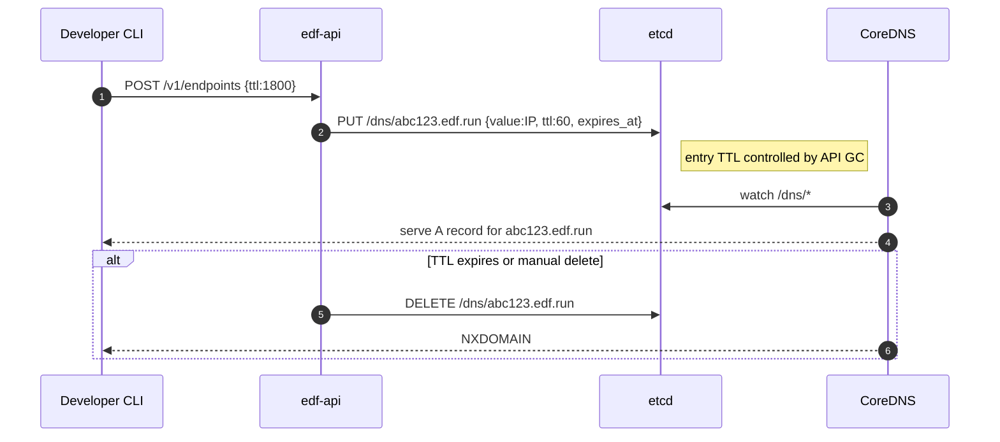

# 📘 E1 – Core DNS Service (Design v0.1)

Status: **Superseded** 

See: E1b_DNS_Architecture_(Stateless_+_Redis)_Design_(v0.1).md

## 🧭 Overview

This document details the design of the **Core DNS Service** component for FleetingDNS. It defines how DNS records are provisioned dynamically for short-lived endpoints via CoreDNS and `etcd`. This is the authoritative DNS zone backing the `*.edf.run` domain.

FDF uses CoreDNS + `etcd` as the authoritative resolver for ephemeral endpoint domains. Endpoints are created via the control API, stored in `etcd`, and served in real-time without requiring DNS server restarts. Each endpoint lives for a fixed TTL and is auto-cleaned.

---

## 🎯 Objectives

* Dynamically create/delete DNS A/AAAA records
* TTL-controlled ephemeral lifecycle per endpoint
* Serve DNS records with low latency from CoreDNS
* Isolate records by user/session ID if needed

---

## 📦 Components Involved

| Component  | Role                                                   |
| ---------- | ------------------------------------------------------ |
| `edf-api`  | Calls etcd to write/delete records based on API usage  |
| `etcd`     | Key-value store holding DNS mappings                   |
| `coredns`  | Reads from etcd using `etcd` plugin and serves records |
| `api::dns` | Rust module handling DNS key generation logic          |

---

## 📁 Key/Value Schema in etcd

```text
/dns/{subdomain}.{zone} = {
  "type": "A",     # or AAAA or CNAME
  "value": "192.0.2.50",
  "ttl": 60,
  "expires_at": "2025-07-02T12:34:56Z",
  "mode": "tunnel",
  "slot": 60312,
  "owner": "user_abc",
  "redirect_to": null
}
```

Stored under prefix `/dns/`. The TTL field is used by CoreDNS `etcd` plugin if supported, otherwise CoreDNS is configured to default all records to 60s TTL.

---

## 🔄 Sequence Diagram – DNS Record Lifecycle



---

## ⚙️ CoreDNS Configuration Example

```hcl
edf.run:53 {
  etcd {
    path /dns
    endpoint http://127.0.0.1:2379
  }
  cache 30
  log
  errors
}
```

We configure CoreDNS to serve from `/dns` prefix. A-side TTL is handled by the API lifecycle logic.

---

## 🔐 Security Notes

* No user data is stored in the DNS values.
* Records include an `owner` field in etcd (not in DNS response) for traceability.
* Subdomain collision is avoided via random 16–20 character slug.

---

## 📆 API GC Behavior

* TTL enforced at control plane level, not via DNS protocol expiry alone.
* Every 30s, a GC job checks etcd for records with `expires_at < now()` and deletes them.
* Any attempt to resolve after expiry results in NXDOMAIN.

---

## 📌 Future Extensions

* DNSSEC zone signing support (v2)
* Multi-region etcd mirroring (HA)
* SRV record support for custom port routes

---

## ✅ Deliverables for E1 Completion

* [ ] CoreDNS running on Hetzner VM, integrated with etcd
* [ ] API functions for `create_dns_record`, `delete_dns_record`
* [ ] TTL expiry GC job scheduled every 30s
* [ ] Manual CLI test confirms record appears/disappears via `dig`

---

*Epic → User-story breakdown (v0.1)*

This epic covers the Rust DNS authority (`stateless_dns` crate) that encodes tunnel metadata into the label, answers without a persistent DB, signs with DNSSEC, and scales horizontally.

---

## Epic Goal

> “Deliver a Trust‑DNS–based authoritative server that resolves `*.fleetingdns.run` in <2ms, uses HMAC‑shell labels for verification, supports DNSSEC on the fly, and scales to >4b slot space with cluster sharding.”

---

## 🗂️ Story List

| ID        | Story (As a…)       | Outcome                                                                                |
|-----------|---------------------|----------------------------------------------------------------------------------------|
| **E1-S1** | *EdgeHub dev*       | Encode tunnel slot + timestamp into **HMAC label** (Base32) so no DB lookup is needed. |
| **E1-S2** | *DNS operator*      | Authoritative server **parses** label, validates HMAC, and replies with A/AAAA.        |
| **E1-S3** | *Security engineer* | **DNSSEC sign** each stateless answer on-the-fly, embed RRSIG using same HMAC key.     |
| **E1-S4** | *Developer user*    | Query `_edfmeta.<label>` TXT and get JSON‑encoded debug info (expiry, cluster).        |
| **E1-S5** | *Perf engineer*     | Use **Domain crate zero‑copy encode** to drop allocations per query below 5.           |
| **E1-S6** | *SRE*               | Shard slot space into `<cluster_id>` bits so each EdgeHub only owns its slice.         |

---

## E1-S1 — HMAC Label Encoder

**Tasks**

1. Implement `encode(label_data) -> String` in `stateless_dns::hmac_label`.
2. Unit-test 128‑bit combos.
3. Expose CLI `edf-cli hmac-encode` for debug.

**Functional Reqs**

* Output ≤ 52 chars, Base32 RFC4648, no padding.
* Verify(self\_decode(encode(x)) == x).

**Non‑Functional**

* Encode+decode < 50ns on e2-standard‑4.
* Secret key read from env only at startup.

---

## E1-S2 — Authoritative Resolver

**Tasks**

1. Build Trust‑DNS Server instance listening UDP/TCP 53.
2. Parse incoming label, validate HMAC, TTL = remaining seconds.
3. Return NXDOMAIN if invalid or expired.

**Functional**

* p99 response time < 2ms for hot cache.
* TTL never exceeds 30min.

**Non‑Functional**

* Memory footprint < 20MiB.
* 10k QPS sustained on e2-micro.

---

## E1-S3 — DNSSEC On‑the‑Fly

**Tasks**

1. Generate ZSK/DSK at boot, publish DS separately.
2. Sign A record into RRSIG set using rust‑dnssec.
3. Add `--dnssec=enabled` flag to EdgeHub args.

**Functional**

* `dig +dnssec +multi` returns `ad` flag.
* Sign fails closed (NXDOMAIN) if key missing.

**Non‑Functional**

* Sign add ≤ 150µs.
* Keys rotate daily, grace overlap 1 day.

---

## E1-S4 — TXT Debug Record

**Tasks**

1. Add pattern `_edfmeta.<label>` → returns JSON string.
2. Fields: slot, expires, cluster\_id, ip.

**Functional**

* `dig txt _edfmeta.<label>.fleetingdns.run` prints JSON.
* Fails with NXDOMAIN for invalid label.

**Non‑Functional**

* Response size ≤ 255B.

---

## E1-S5 — Zero‑Copy Encode (Domain Crate)

**Tasks**

1. Replace Trust‑DNS byte‐vec serialization with `domain::bits::Composer`.
2. Benchmark allocations via `criterion`.

**Functional**

* API unchanged.
* Allocations ≤ 5 per query.

**Non‑Functional**

* p50 latency improves ≥ 20%.
* No unsafe code without justification.

---

## E1-S6 — Slot Sharding (>4B slots)

**Tasks**

1. Reserve high‑order 6 bits of slot for `cluster_id`.
2. EdgeHub config `--cluster-id`.
3. Update HMAC encode/decode to pack/unpack id.

**Functional**

* Cluster with id=5 responds only for labels with id 5.
* Cross‑label query returns REFUSED.

**Non‑Functional**

* Collision probability < 1e‑12.
* Rollout plan: migrate from v0 label to v1 without downtime.

---

©2025 FleetingDNS — Stateless DNS Engine stories
