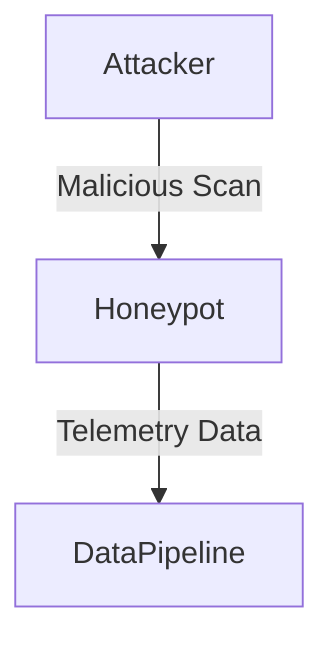
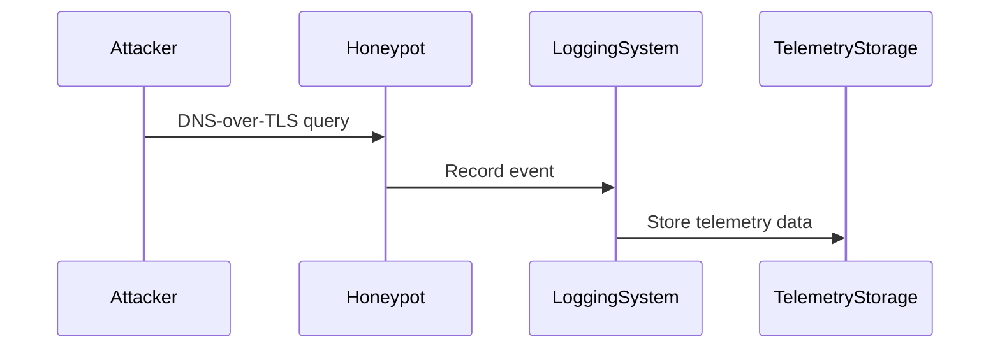

# E11 – Global Honeypot Network Deployment

### Summary

Deploy and maintain DNS-over-TLS honeypots globally to capture detailed attacker telemetry.

### What

* Deploy DNS-over-TLS honeypots across strategic global locations.
* Capture telemetry such as source IP, TLS fingerprints, domains queried, and timestamps.

### Why

To gather early-warning intelligence on potential cyber threats, providing proactive threat blocking capabilities.

### How

* Deploy honeypot infrastructure in cloud providers globally.
* Utilize automation tools (Terraform, Ansible) for rapid deployment and maintenance.
* Implement logging and monitoring solutions for capturing telemetry data.

### Design Details

### Functional Requirements

* Real-time data capture
* Global coverage
* High availability and redundancy

### Non-Functional Requirements

* Security compliance
* Minimal operational overhead
* Data integrity assurance

### Stories and Tasks

* **S1:** Honeypot global deployment (Terraform)
* **S2:** Telemetry data capture implementation
* **S3:** Infrastructure monitoring setup
