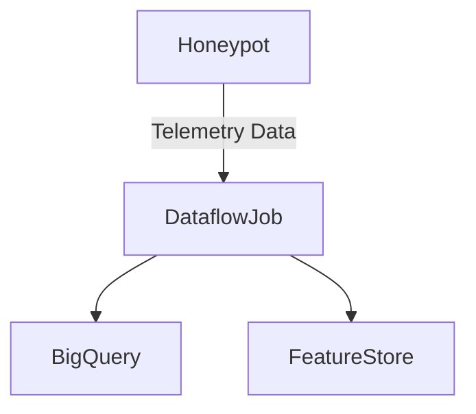
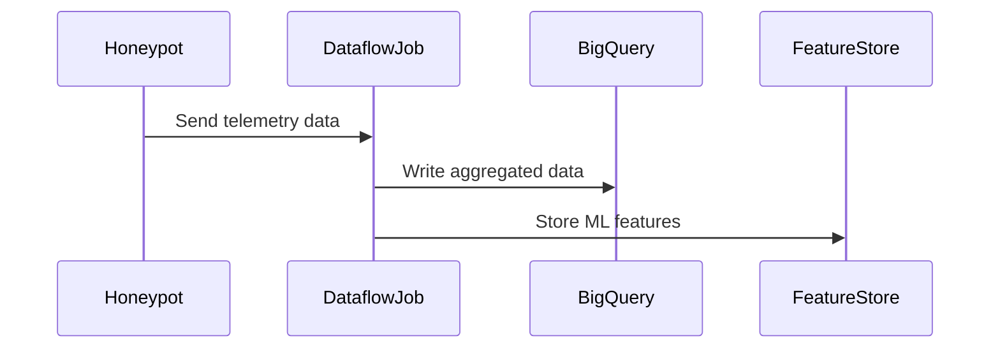

# E12 – Data Ingestion & Pipeline Setup

### Summary

Set up the data ingestion pipeline for processing and analyzing telemetry.

### What

* Build Dataflow aggregation pipeline
* Store aggregated data in BigQuery
* Setup Vertex AI FeatureStore

### Why

To efficiently process telemetry data and prepare it for ML-based threat analysis.

### How

* Implement Google Cloud Dataflow for data aggregation
* Configure BigQuery for long-term storage and analytics
* Setup Vertex AI for ML feature management

### Design Details

### Functional Requirements

* Efficient data processing
* Real-time data aggregation

### Non-Functional Requirements

* Low latency (<60 seconds)
* High scalability

### Stories and Tasks

* **S1:** Dataflow pipeline creation
* **S2:** BigQuery setup
* **S3:** FeatureStore integration

---
