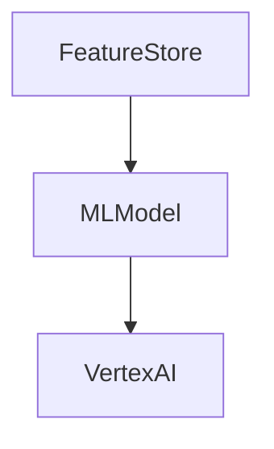
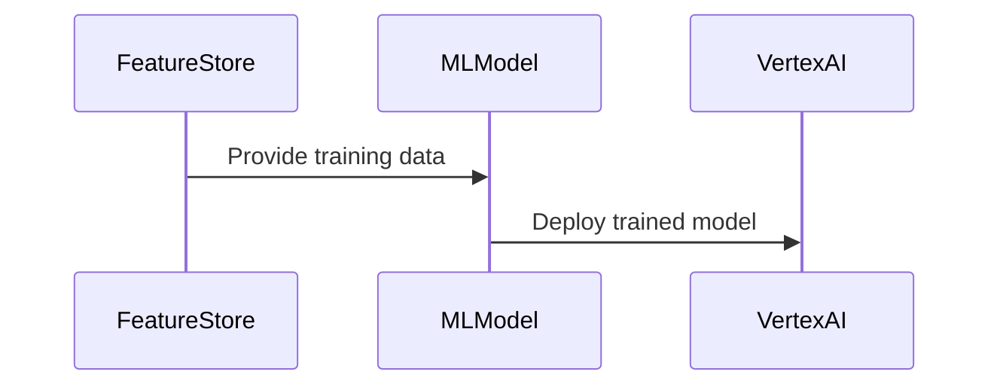

# E13 – Machine Learning Scoring Engine

### Summary

Develop and deploy an ML engine to score incoming IP telemetry for threat assessment.

### What

* ML model training using LightGBM
* Automated retraining and deployment pipeline

### Why

To accurately identify and prioritize threats, minimizing false positives.

### How

* Train models using historical data labeled with threat outcomes
* Deploy models using Vertex AI

### Design Details

### Functional Requirements

* High accuracy and recall
* Real-time prediction (<20ms latency)

### Non-Functional Requirements

* Automated training pipeline
* Weekly retraining

### Stories and Tasks

* **S1:** ML model training pipeline setup
* **S2:** Vertex AI deployment and integration
