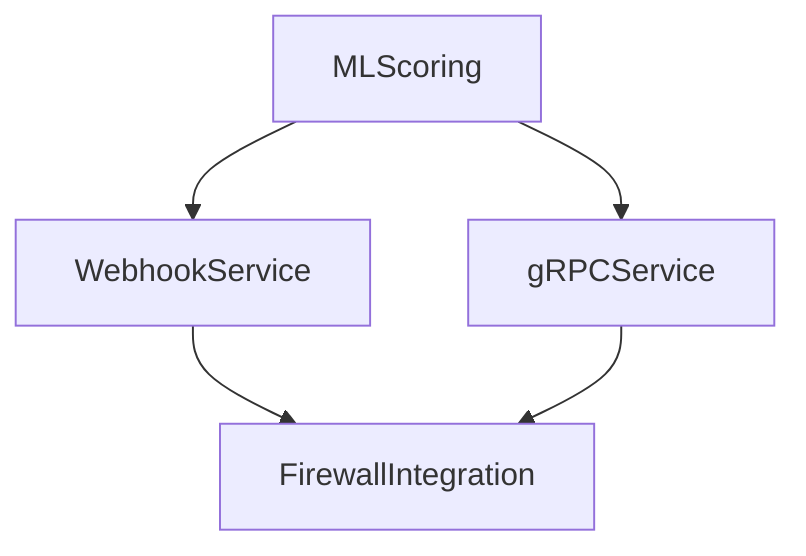
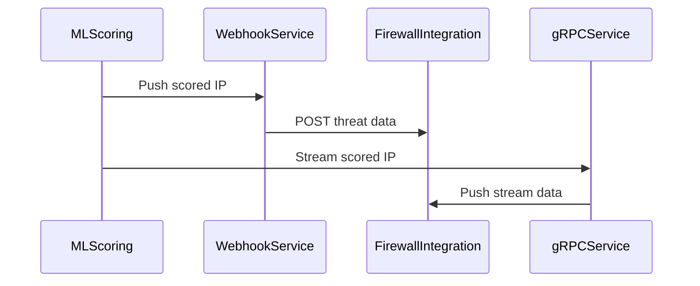

## E14 – Threat Intelligence Feed Service

### Summary

Build robust threat intelligence feed services to deliver real-time, machine-scored malicious IP indicators to customer security systems.

### What

* Develop HTTPS Webhook and gRPC Streaming services.
* Secure client authentication and authorization mechanisms.
* Support reliable, real-time streaming with historical replay capability.

### Why

To ensure rapid propagation of threat intelligence to customer security infrastructures, enabling proactive threat mitigation.

### How

* Implement the HTTPS Webhook with HMAC signing for integrity.
* Build gRPC streaming services using the Rust-based `tokio-tonic` framework.
* Authenticate clients using JWT tokens and mutual TLS (mTLS).

### Design Details

**Architecture Diagram:**

**Sequence Diagram:**

### Functional Requirements

* Real-time threat intelligence propagation (under 60 seconds).
* Secure and robust communication channels.
* Historical replay feature.

### Non-Functional Requirements

* High throughput capacity (2,000 records/sec).
* Secure authentication and encryption.
* Fault-tolerance and reliability.

### Stories and Tasks

* **S1:** HTTPS Webhook service implementation.
* **S2:** gRPC streaming service setup.
* **S3:** Authentication and security configurations.
