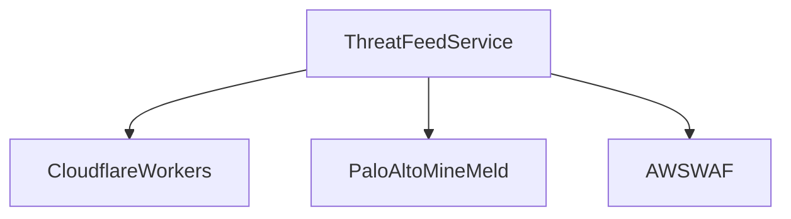
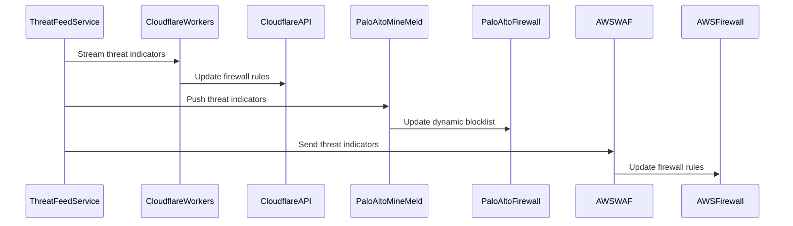

## E15 – Customer Integration Adapters

### Summary

Develop seamless integration adapters for popular firewall and security platforms to consume real-time threat intelligence feeds.

### What

* Integration scripts for Cloudflare Workers.
* Palo Alto MineMeld prototype node integration.
* AWS WAF integration.
* Terraform modules for simplified deployment.

### Why

To ensure customers can rapidly integrate and benefit from FDNS Shield threat intelligence with minimal friction.

### How

* Develop JavaScript-based Cloudflare Workers to consume and act on threat feed data.
* Create custom integration nodes for Palo Alto’s MineMeld.
* Implement webhooks compatible with AWS WAF for dynamic rule updates.
* Provide Terraform modules for automated deployment and configuration.

### Design Details

**Architecture Diagram:**

**Sequence Diagram:**

### Functional Requirements

* Real-time firewall rule updates.
* Broad platform compatibility.
* Plug-and-play customer experience.

### Non-Functional Requirements

* Integration performance (under 30 seconds rule propagation).
* Open-source licensed adapters (Apache-2.0).
* Minimal resource overhead for customers.

### Stories and Tasks

* **S1:** Cloudflare Workers integration script development.
* **S2:** Palo Alto MineMeld node prototype creation.
* **S3:** AWS WAF webhook integration development.
* **S4:** Terraform module creation for deployment automation.
