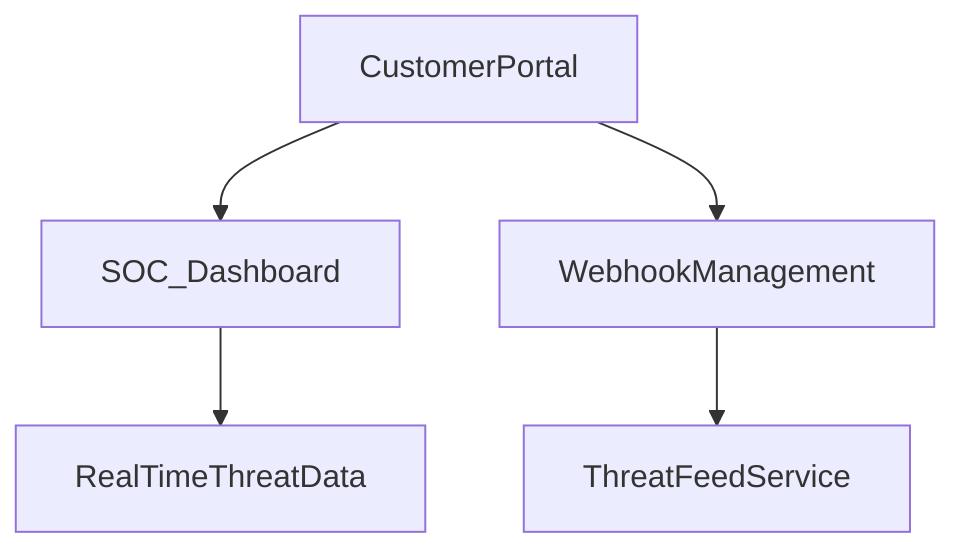
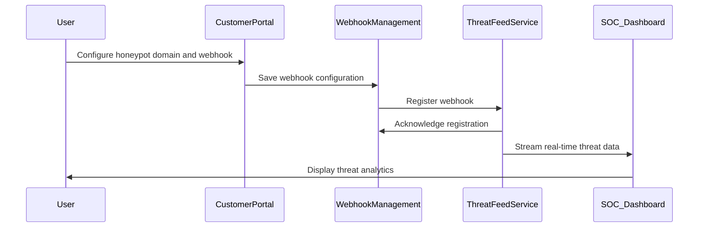

## E16 – Customer Portal & SOC Dashboard

### Summary

Develop an intuitive portal for customer management of honeypot domains, threat intelligence subscriptions, and an integrated SOC dashboard for real-time monitoring and analytics.

### What

* User-friendly portal for managing honeypot domain configurations and feed settings.
* SOC dashboard providing real-time visibility into threats and detailed analytics.
* Tools for easy webhook setup, management, and subscription monitoring.

### Why

To empower security teams to proactively manage and utilize threat intelligence effectively, enhancing operational security decision-making.

### How

* Develop a customer-facing portal application using modern web technologies (SolidJS).
* Implement secure authentication and authorization methods.
* Integrate real-time analytics and visualization tools for threat activity monitoring.

### Design Details

**Architecture Diagram:**

**Sequence Diagram:**

### Functional Requirements

* Intuitive user interface for domain and feed management.
* Real-time analytics and data visualization.
* Secure access and user management capabilities.

### Non-Functional Requirements

* High responsiveness and low latency for real-time data updates.
* Robust security measures (authentication, encryption).
* High availability and scalability.

### Stories and Tasks

* **S1:** Customer portal front-end development.
* **S2:** SOC dashboard analytics integration.
* **S3:** Webhook configuration management module.
* **S4:** Secure user authentication implementation.
