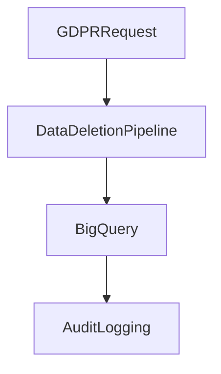
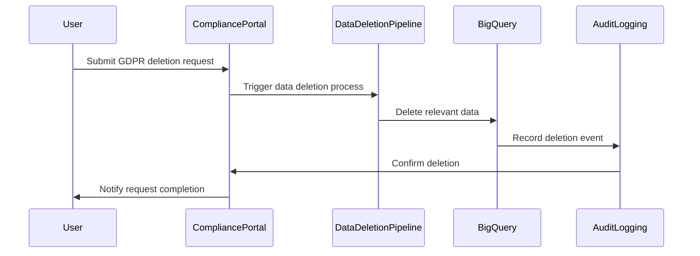

## E17 – Compliance and Privacy Management

### Summary

Ensure comprehensive compliance with data protection regulations (GDPR) and establish robust privacy management practices for FDNS Shield.

### What

* Implement GDPR-compliant data retention and deletion policies.
* Automate data deletion processes in response to GDPR requests.
* Provide auditing and logging mechanisms to demonstrate compliance.

### Why

To maintain customer trust and comply with regulatory requirements, minimizing legal and operational risks.

### How

* Configure BigQuery and storage systems to enforce retention policies.
* Develop automated pipelines for data anonymization and deletion.
* Implement logging and audit trails to track data access and deletion actions.

### Design Details

**Architecture Diagram:**

**Sequence Diagram:**

### Functional Requirements

* Compliance with GDPR deletion requests within SLA (30 days).
* Accurate and automated data anonymization and deletion.
* Comprehensive audit trails and logging.

### Non-Functional Requirements

* High security and access control.
* Scalable and efficient data management processes.
* Transparency and traceability of compliance actions.

### Stories and Tasks

* **S1:** Data retention policy configuration.
* **S2:** Automated GDPR data deletion pipeline.
* **S3:** Audit logging implementation.
* **S4:** Compliance verification and reporting mechanisms.
