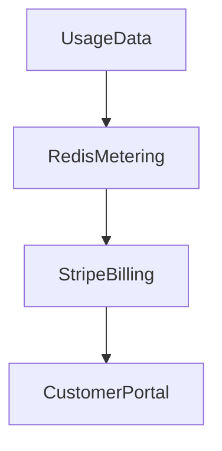
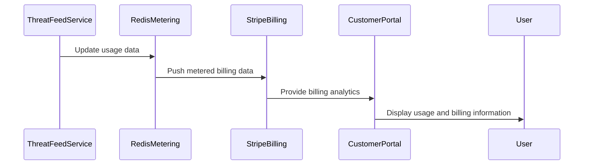

## E18 – Monetization & Billing System Integration

### Summary

Integrate FDNS Shield's monetization strategy through tiered SaaS billing, enabling accurate usage tracking and streamlined customer billing.

### What

* Implement tiered subscription models (Insight, Hunt, Enterprise).
* Develop automated usage tracking and billing through Stripe.
* Provide customer-facing analytics dashboards for monitoring usage.

### Why

To ensure a sustainable revenue model, providing transparency to customers and efficient billing management.

### How

* Integrate with Stripe for automated billing.
* Implement accurate, automated usage metering in Redis.
* Develop a customer analytics dashboard to display real-time usage and billing data.

### Design Details

**Architecture Diagram:**

**Sequence Diagram:**

### Functional Requirements

* Real-time, accurate usage tracking.
* Automated and scalable billing system.
* Clear analytics and reporting for customers.

### Non-Functional Requirements

* Billing accuracy within ±1%.
* Minimal latency in usage data processing.
* High security and data privacy.

### Stories and Tasks

* **S1:** Stripe billing integration development.
* **S2:** Usage metering implementation with Redis.
* **S3:** Customer analytics and billing dashboard creation.
