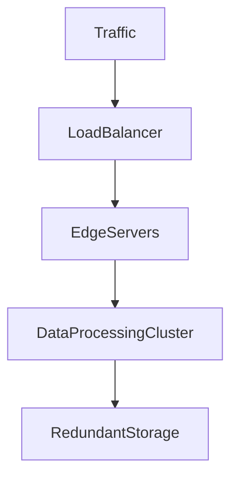
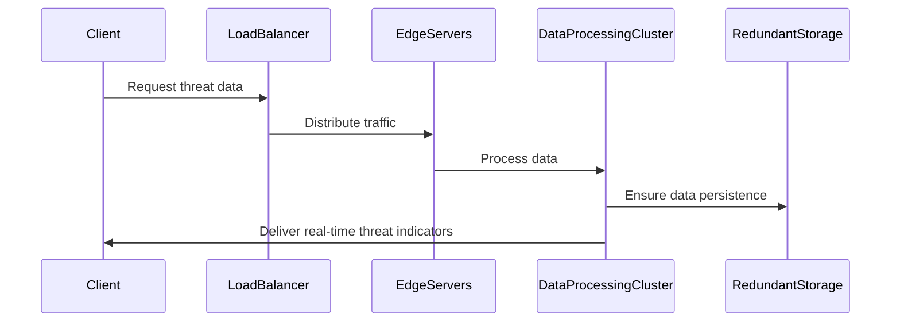

## E19 – Scalability and Reliability Engineering

### Summary

Ensure FDNS Shield services are scalable, reliable, and able to meet demanding performance requirements as user load increases.

### What

* Optimize services to handle high throughput (2,000+ records/sec).
* Ensure real-time threat indicator distribution with SLA under 60 seconds.
* Implement redundancy and reliability strategies.

### Why

To provide consistent, uninterrupted service that meets enterprise-grade expectations and delivers reliable real-time threat intelligence.

### How

* Scale infrastructure using cloud auto-scaling and load balancing.
* Implement redundancy strategies, including multi-region deployments and failover mechanisms.
* Employ continuous monitoring, alerting, and automated recovery processes.

### Design Details

**Architecture Diagram:**

**Sequence Diagram:**

### Functional Requirements

* Ability to scale horizontally and vertically on-demand.
* Consistent sub-60-second SLA for data delivery.
* Effective load balancing and traffic management.

### Non-Functional Requirements

* System uptime of at least 99.99%.
* Efficient use of infrastructure resources.
* Robust disaster recovery and data redundancy.

### Stories and Tasks

* **S1:** Infrastructure auto-scaling and load balancing configuration.
* **S2:** Multi-region redundancy and failover setup.
* **S3:** Continuous monitoring and alerting systems implementation.
