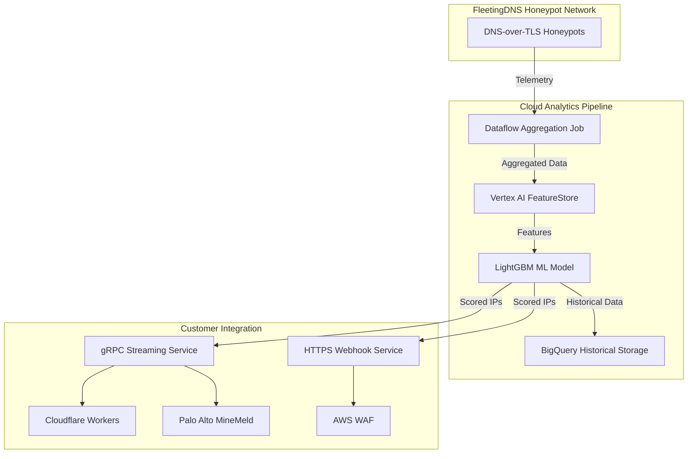
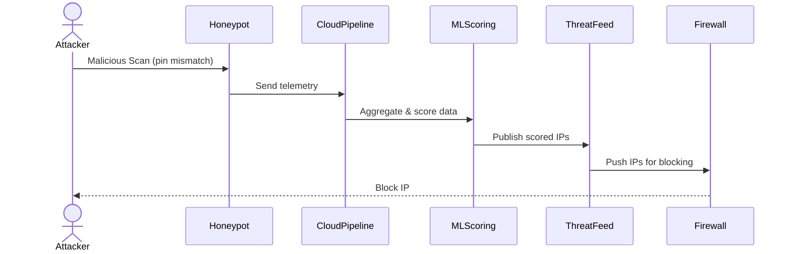

# 📗 **E1m – Honeypot Threat‑Intel Streaming SKU**

*Epic → User‑story breakdown (v0.2)*

Commercial spin‑off of E1l: operate FleetingDNS DoT‑pin honeypots as a stand‑alone, paid security‑intel product. Collect source IPs & handshake fingerprints, enrich with ML‑based attacker profiling, and stream real‑time block‑lists to customer firewalls (Cloudflare / Palo Alto / AWS WAF, etc.).

---

## Epic Goal

> “Monetise pin‑mismatch telemetry by offering a SaaS feed (‘FDNS Shield’) that delivers real‑time, ML‑scored bad‑actor IPs to enterprise firewalls, with SLA‑backed <60‑second propagation and evidence detail for SOC triage.”

---

## 📊 High-Level System Architecture

---

## 🔄 Sequence Diagram: Telemetry Collection to Firewall Blocking

---

## 🗂️ Story List

| ID         | Story                                                                                                                              | Outcome |
| ---------- | ---------------------------------------------------------------------------------------------------------------------------------- | ------- |
| **E1m‑S1** | As *Sales*, list SKU tiers (Insight / Hunt / Enterprise) and entitlement flags in billing DB.                                      |         |
| **E1m‑S2** | As *Customer*, create honeypot domain in portal and start receiving **streamed block‑list** via HTTPS webhook.                     |         |
| **E1m‑S3** | As *Pipeline*, write honeypot events to **BigQuery + FeatureStore** and train LightGBM model that scores IP risk (0‑100).          |         |
| **E1m‑S4** | As *Threat‑Intel*, publish **gRPC bidirectional stream** `ThreatFeed` with signed JWT + protobuf messages.                         |         |
| **E1m‑S5** | As *Firewall‑admin*, install pre‑built **Cloudflare Workers / Palo Alto MineMeld** transformer that ingests feed and writes rules. |         |
| **E1m‑S6** | As *Finance*, meter **billable events** = (# IPs × score≥80 delivered) and push usage to Stripe.                                   |         |
| **E1m‑S7** | As *Compliance*, store raw honeypot data 30days, aggregated intel 365days, GDPR‑delete on request.                                 |         |

---

## 📈 Monetization & Pricing Tiers

| Tier       | Monthly Cost | Features                                                              |
| ---------- | ------------ | --------------------------------------------------------------------- |
| Insight    | €500         | Limited alerts, basic analytics                                       |
| Hunt       | €1,500       | Advanced analytics, multi-endpoint integration, ML scoring insights   |
| Enterprise | €5,000+      | Unlimited endpoints, full ML scores, premium SLA, custom integrations |

---

## 📅 Revenue Projection

| Year | Customers | ARR (€)  |
| ---- | --------- | -------- |
| 1    | 50        | 1M - 2M  |
| 2-3  | 200       | 5M - 10M |
| 5+   | 1000+     | 20M+     |

---

©2025 FleetingDNS — Honeypot Threat‑Intel Streaming SKU stories
