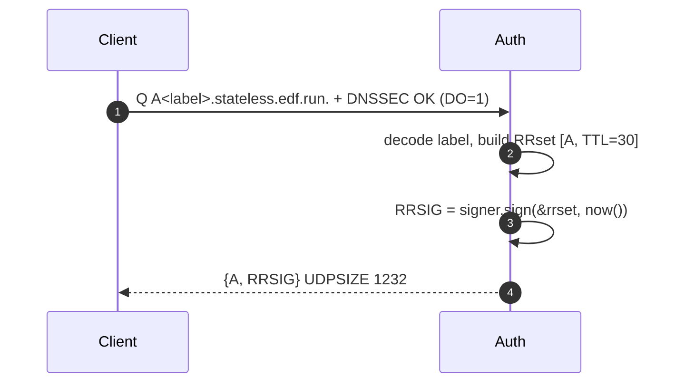
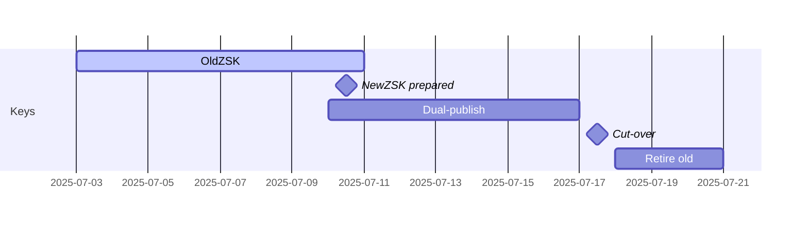

# 📘 E1c– DNSSEC for Stateless Authority (Designv0.1)

## 0 ▪ TL;DR

*We will extend the **StatelessAuthority** to emit fully‐valid DNSSEC signatures (RRSIG) for every on‑the‑fly answer, without persisting any zone keys.*
Approach: **derive a deterministic ZSK from the HMAC secret** and sign A/AAAA RRsets at query time.No key‑files, no state.

---

## 1 ▪WHY

| Threat                              | Impact without DNSSEC                                                      | Benefit with on‑the‑fly RRSIG                                    |
| ----------------------------------- | -------------------------------------------------------------------------- | ---------------------------------------------------------------- |
| Resolver spoofing / cache‑poisoning | Attacker injects forged `A` → hijacks webhook traffic before TLS handshake | Validating resolvers will reject forged answers (RRSIG fails)    |
| Anycast node mismatch (race)        | Different PoP answers for same label during propagation window             | RRSIG ensures consistency; mismatched secret ⇒ signature invalid |

DNSSEC is optional for consumers, but many corporate resolvers (and GooglePublicDNS) validate by default. Shipping signed answers improves trust with enterprise users.

---

## 2 ▪ WHAT (requirements)

1. **Algorithm13RSA‑SHA256** for broad validator compatibility (Trust‑DNS has mature impl).
2. **Single ZSK per secret‑era** (e.g., `PRIMARY_SECRET`).
3. RRSIG TTL == RR TTL (30s).
4. KSK / DS remains static, published once in a real zonefile at registrar.
5. Roll secrets ⇒ derive new ZSK, publish as second DNSKEY a week ahead, then retire old.

---

## 3 ▪ HOW

### 3.1 Key derivation

```
K_ZSK = HMAC_SHA256(PRIMARY_SECRET, "zsk")  -> 256‑bit
Take first 2048bits via HKDF → RSA private key
```

*Deterministic*: every node holding `PRIMARY_SECRET` regenerates identical RSA key in memory on boot.

### 3.2 Trust‑DNS glue

```rust
use trust_dns_server::rr::dnssec::*;
let zsk = Rsa::from_der(&derive_rsa_der(secret))?;
let signer = Signer::dnssec(RRKeyPair::new(zsk, Algo::RSASHA256)?,
                            Name::from_ascii("stateless.edf.run")?,
                            true /* is_zsk */, 0);
// Cache Signer in Authority struct
```

### 3.3 Answer path



*Signing cost*: RSA‑2048 ≈0.2ms; with 30s TTL and typical QPS, one CPU core can still manage >5k req/s.We will micro‑bench and optionally cache `(label → RRSIG)` in an LRU for the 30s window.

### 3.4 Key‑roll schedule

```
T‑14d: Generate new PRIMARY_SECRET' (offline)
T‑7d : Deploy SECONDARY_SECRET=PRIMARY', PRIMARY=old
       => two DNSKEY (old ZSK, new ZSK) signed by KSK
T0    : Flip env: PRIMARY=PRIMARY', SECONDARY=old
T+30m: All outstanding labels w/ old secret expired
T+1d : Drop SECONDARY + remove old DNSKEY
```

Diagram:



---

## 4 ▪ Edge‑cases

| Case                                         | Handling                                                                                 |
| -------------------------------------------- | ---------------------------------------------------------------------------------------- |
| Client does **not** set DO bit               | Return unsigned response (size < 512B) for perf; controlled by `dnssec_opt_in` flag.    |
| UDPsize > 1232                              | Truncate → TC=1, client retries over TCP; fine for validating resolvers.                 |
| Node missing SECONDARY secret after rotation | Label signed w/ old key fails ⟶ NXDOMAIN; mitigated by deploy automation validating env. |

---

## 5 ▪ Deliverables

* [ ] `derive_rsa_der(secret)` util + unit tests cross‑verifying deterministic key.
* [ ] `Signer` cached in `StatelessAuthority`.
* [ ] RRSIG attached when EDNSDO flag set.
* [ ] Bench p99<0.4ms signing or 100µs from LRU.
* [ ] Integration test with `delv +dnssec` and GooglePublicDNS.

---

*Sub‑Epic → User-story breakdown (v0.1)*

This covers on‑the‑fly RRSIG generation for every A/AAAA answer, daily ZSK rotation backed by CloudKMS, and DS record automation for the public zone.

---

## Epic Goal
> “Provide authenticated denial‑of‑modification for stateless DNS answers by attaching RRSIGs in <150µs, rotating keys safely, and automating DS publishing—all without adding persistent state.”

---

## 🗂️ Story List
| ID | Story | Outcome |
|----|-------|---------|
| **E1c-S1** | As a *DNS engineer*, sign A/AAAA answers with **ZSK‑RSA‑256** generated at pod start. |
| **E1c-S2** | As *Security*, store signing key material in **CloudKMS (CMEK)**; EdgeHub loads via K8sSecret. |
| **E1c-S3** | As *Zone admin*, publish/rotate **DS record** for new KSK without manual action. |
| **E1c-S4** | As *Perf engineer*, ensure RRSIG generation adds **<150µs** to query path. |
| **E1c-S5** | As *SRE*, monitor **dnssec_sign_failures_total** metric and alert if >0.01%. |

---

## E1c-S1 — On‑the‑Fly RRSIG
**Tasks**
1. Integrate `trust_dns::rr::dnssec::Signer` in `stateless_dns` resolver.
2. Build signer from in‑memory ZSK at pod boot.
3. Attach RRSIG for each answer; TTL = original.

**Functional Reqs**
* `dig +dnssec a <label>.fleetingdns.run` returns `ad` flag when upstream validates.
* RRSIG `exp` = query TTL.

**Non‑Functional**
* Extra latency per query ≤150µs p95.
* Signature cache 1000 entries, LRU.

---

## E1c-S2 — KMS‑Backed Key Storage
**Tasks**
1. Create KMS key‑ring `dnssec` and RSA‑2048 key.
2. Job `scripts/push_zsk.sh` decrypts, writes Secret via SealedSecrets.
3. EdgeHub loads key on startup; reload on Secret update.

**Functional**
* Private key never stored unencrypted on disk.
* Decrypt call requires WorkloadIdentity SA.

**Non‑Functional**
* Decrypt latency ≤40ms at pod start.
* Key material resident in memory only.

---

## E1c-S3 — Automated DS Update
**Tasks**
1. Weekly GitHub Action runs `dnssec-ksk-rotate`.
2. Creates new KSK, generates DS, opens PR to `gcp-core/dns-zone-edf.yaml`.
3. Flux applies; CloudDNS publishes DS.

**Functional**
* DS rollover uses double‑signature (RFC6781).
* Old DS removed after 72h.

**Non‑Functional**
* Zero downtime validation (no SERVFAIL windows).
* Manual approval step for DS push.

---

## E1c-S4 — Performance Guardrail
**Tasks**
1. Criterion benchmark before/after signing.
2. Optimize with pre‑computed SHA256 digest of RRset.
3. Add CI perf gate: fail if >150µs p95.

**Functional**
* Bench output archived artifact.
* Optimisations documented.

**Non‑Functional**
* CPU overhead ≤20% at 10k QPS.
* No unsafe code without audit comment.

---

## E1c-S5 — Sign Failure Metrics & Alert
**Tasks**
1. Increment `dnssec_sign_failures_total` on any signing error.
2. Prometheus alert if >1/min for 5min.
3. Grafana panel.

**Functional**
* Alert fires to Slack `#alerts-dns`.
* Runbook link attached.

**Non‑Functional**
* False positives <1/quarter.
* Alert latency <2min.

---

©2025FleetingDNS — DNSSEC Signing stories

