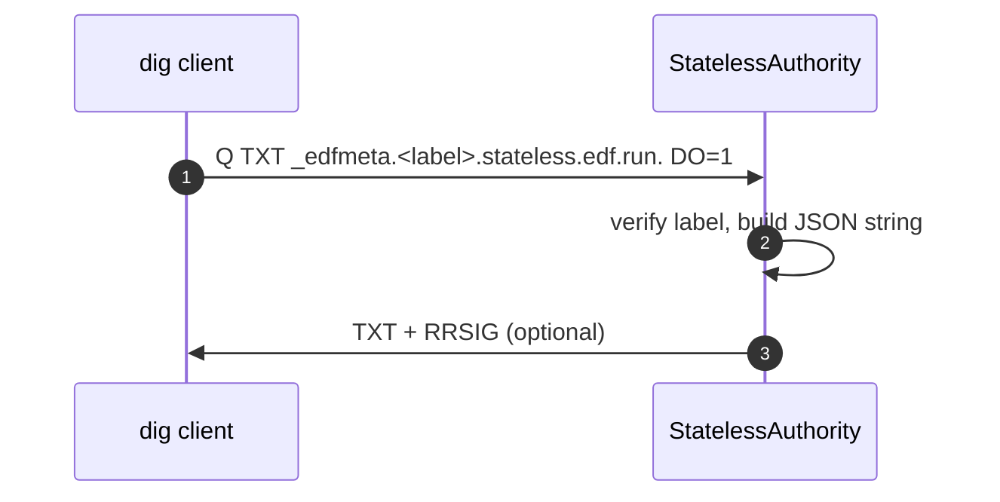

# 📘 E1d– Debug TXT Records for Stateless Labels (Designv0.1)

> **Goal:** expose ephemeral, signed TXT records that let SDKs or operators introspect
> tunnel metadata (slot, flags, expiry) via DNS queries without hitting Redis or the
> REST API.
>
> Pattern: ask for `_edfmeta.<label>.stateless.edf.run.` and receive a single‑line TXT
> with JSON payload. Works from any dig/delv client; requires no auth.

---

## 1 ▪ WHY

| Need                                                                     | Current gap                                         | Benefit                                 |
| ------------------------------------------------------------------------ | --------------------------------------------------- | --------------------------------------- |
| Quick field check (“which slot did this label map to?”)                  | Only API/CLI prints it; third‑party debuggers can’t | Self‑service debugging for users & SREs |
| SDK wants to *optimistically* compute redirect target before opening TLS | Must call API again                                 | TXT gives lightweight cache hint        |

TXT lookup is read‑only and signed by the same DNSSEC key (E1c), so data authenticity is preserved.

---

## 2 ▪ WHAT (payload spec)

```
{"slot":123456,"flags":5,"exp":1720818127}
```

* `slot`– u32 hub port.
* `flags`– 8‑bit bitmap (as in E1).
* `exp` – unix epoch seconds.

Record TTL= **30s** (same as A/AAAA). One TXT string ≤255B, fits comfortably.

---

## 3 ▪ HOW – Authority logic

### 3‑step match

```rust
if qtype == TXT && name.starts_with("_edfmeta.") {
    let label = name.trim_prefix("_edfmeta.");
    if let Some(meta) = self.verify(label) {
        answer_txt(meta)
    }
}
```

```rust
fn answer_txt(meta: Meta) -> Record {
   let json = format!("{{\"slot\":{},\"flags\":{},\"exp\":{}}}",
                      meta.slot, meta.flags, meta.exp);
   Record::from_rdata(name.clone(), self.ttl,
                      RData::TXT(TXT::new(vec![json])))
}
```

*Hook lives inside `StatelessAuthority::lookup()`; share decode path with A/AAAA.*

---

## 4 ▪ Sequence diagram



---

## 5 ▪ Security considerations

* No sensitive info—slot # alone is harmless.
* Record is signed (DNSSEC) so cannot be spoofed.
* Expires alongside A record; replay risk negligible.
* Do **not** include Basic‑Auth credentials or IP.

---

## 6 ▪ Limitations

* Only available for stateless labels; vanity/Redis entries must still query API if needed.
* Resolvers that strip the leading underscore label for policy (rare) could break; underscore is RFC‑compliant for TXT service meta records.

---

## 7 ▪ Deliverables

* [ ] Extend `StatelessAuthority` to match `_edfmeta.*` + TXT
* [ ] Unit tests: valid, tampered, expired label
* [ ] Update docs & README dig examples:

  ```bash
  dig +dnssec TXT _edfmeta.abcd…stateless.edf.run.
  ```

---

*Sub‑Epic → User‑story breakdown (v0.1)*

Adds a human‑and‑machine readable TXT record that exposes tunnel metadata for troubleshooting without requiring API calls.

---

## Epic Goal
> “Enable developers, support staff, and monitoring tools to query `dig txt _edfmeta.<label>.fleetingdns.run` and instantly get JSON of slot metadata (expires, plan, cluster), while ensuring no sensitive data is leaked.”

---

## 🗂️ Story List
| ID | Story | Outcome |
|----|-------|---------|
| **E1d-S1** | As a *Developer*, run `dig txt _edfmeta.<label>` and see expiry time & cluster. |
| **E1d-S2** | As *Support*, query without API token (public) but redacted sensitive fields. |
| **E1d-S3** | As *SRE*, ensure TXT response size ≤255B and signed with DNSSEC. |
| **E1d-S4** | As *Security*, block lookup after tunnel expiry (NXDOMAIN). |
| **E1d-S5** | As *Perf engineer*, keep TXT answer time ≤2ms same as Arecord.

---

## E1d-S1 — Generate JSON Payload
**Tasks**
1. Extend `stateless_dns` to recognise `_edfmeta` prefix.
2. Fetch slot hash from Redis; build JSON `{exp, cluster, plan, ttl}`.
3. Encode as single TXT string.

**Functional**
* Example output: `"{\"exp\":\"2025-07-07T14:32:00Z\",\"cluster\":5,\"plan\":\"team\"}"`.
* TTL mirrors remaining seconds.

**Non‑Functional**
* Payload length ≤200B.
* JSON stable schema (snake_case).

---

## E1d-S2 — Redact Sensitive Fields
**Tasks**
1. Do **not** include user email, token, or IP addresses.
2. Unit‑test redaction stays after future field additions.

**Functional**
* Only `exp`, `cluster`, `plan`, optional `trace_id` allowed.
* Compliance review passes.

**Non‑Functional**
* Security scan no secrets present.
* Lint rule in CI blocks new sensitive keys.

---

## E1d-S3 — DNSSEC Signing & Size Guard
**Tasks**
1. Re‑use E1c signer to sign TXT RRset.
2. Hard‑truncate JSON if >230B to keep packet under 512B UDP.
3. Add unit test for max size.

**Functional**
* `dig +dnssec +multi txt` shows `ad` flag.
* Packet fits single UDP response (< 512B).

**Non‑Functional**
* Added sign time ≤50µs (uses cached hash).
* Truncation sets `truncated:true` field.

---

## E1d-S4 — Expiry Behaviour
**Tasks**
1. Return `NXDOMAIN` once Redis key expired.
2. Unit test TTL edge cases (1s remaining).
3. Update runbook.

**Functional**
* No stale TXT after expiry.
* `dig` sees status `NXDOMAIN`.

**Non‑Functional**
* Transition within 2s post-expiry.
* No negative caching in resolvers (TTL 0).

---

## E1d-S5 — Performance Budget
**Tasks**
1. Benchmark TXT path vs A path.
2. Optimise by reusing slot lookup.

**Functional**
* p95 TXT latency ≤2ms.
* Jitter ±10%.

**Non‑Functional**
* CPU overhead <5%.
* No additional allocations beyond A handler.

---

©2025FleetingDNS— `_edfmeta` TXT Debug Record stories

