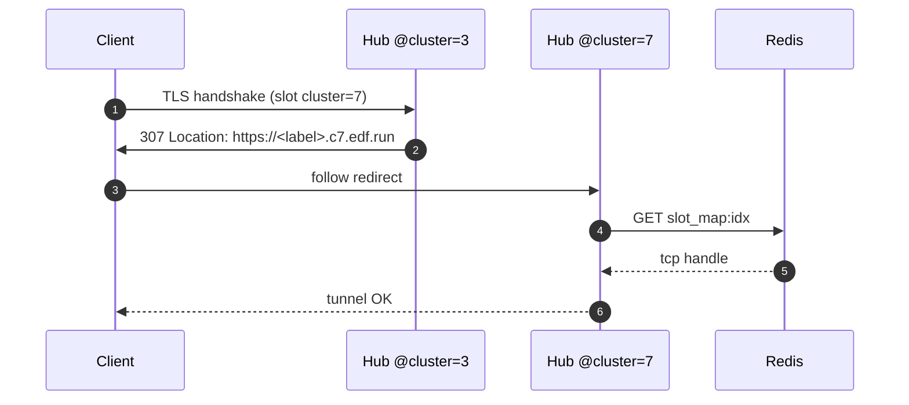
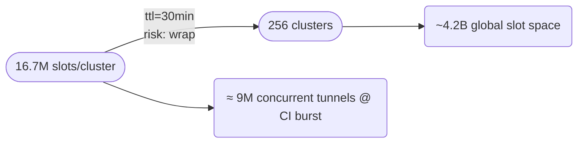

# 📘 E1f – Slot‑ID Sharding & `cluster_id` Bits (Design v0.1)

## 1 ▪ WHY

| Motivation                                            | Pain if ignored                                                                                                                  |
| ----------------------------------------------------- | -------------------------------------------------------------------------------------------------------------------------------- |
| **Global uniqueness** across multi‑region edge fleets | Two clusters could independently allocate slot `42`; stateless label resolves, but wrong hub/port receives traffic ⟶ tunnel 502. |
| **Fast routing hint**                                 | Hub must currently hit Redis to map `slot → TCP`. Embedding cluster hint lets front‑door LB choose nearest PoP in O(1).          |
| **Scalable counter**                                  | 32‑bit flat `INCR` in Redis tops out or hits contention beyond 100k QPS allocation. Sharding lowers write hotspots.             |

Goal: **encode a cluster prefix inside the 32‑bit `slot` field** so that slots are *unique & locality‑aware* without extending label length.

---

## 2 ▪ WHAT – Bit budget proposal

```text
[ 8 bits ]   [       24 bits           ]
+----------+---------------------------+
| cluster  |   per‑cluster slot index  |
+----------+---------------------------+
 0..255          0 .. 16777215
```

* 256 logical clusters (could map 1:1 to cloud region, PoP, or Kubernetes namespace).
* 16.7M concurrent tunnels per cluster ≫ CI demand.
* Preserves 32‑bit field used in stateless DNS payload; no label growth.

If future scale needs >256 clusters, a 10‑bit prefix (1024 clusters, 22‑bit index) is fallback; keep size paramised in config.

---

## 3 ▪ HOW

### 3.1 Slot allocation algorithm (API service)

```rust
fn allocate_slot(cluster_id: u8, redis: &Pool) -> u32 {
    // per‑cluster counter key
    let key = format!("slot_counter:{}", cluster_id);
    // wrap at 24‑bit max
    let idx: u32 = redis.incr(key, 1) % (1 << 24);
    (u32::from(cluster_id) << 24) | idx
}
```

*Each cluster maintains its own 24‑bit counter in local Redis shard ⇒ no cross‑region contention.*
*On wrap (\~16M allocations) we rely on 30‑min TTL to ensure old slots freed.*

### 3.2 Decode path (hub)

```rust
let cluster  = slot >> 24;
let index24  = slot & 0x00FF_FFFF;
// Quick reject: if cluster != self.cluster_id { NXDOMAIN/redirect }
// else look‑up index24 in Redis hash 'slot_map'
```

### 3.3 Cross‑cluster label handling

* In stateless label: `slot` field already contains these 32 bits.
* Edge node that receives connection first checks if `cluster` matches its identity; if **mismatch** it can:

    1. **Redirect** (HTTP307) client to cluster‑specific hostname (cost = extra RTT).
    2. **Proxy** upstream to correct cluster via gRPC hop (double latency).
       We pick **HTTP 307 redirect** for v0: simplest & keeps hub stateless.

Sequence:



DNS option: advertise region‑specific CNAME (`c7.edf.run`) but keep MVP simple.

---

## 4 ▪ Graph – slot supply vs concurrency



*Even if a single cluster issues 50k new tunnels/s continuously, wrap takes >5min; by then first slots have expired & freed.*

---

## 5 ▪ Edge Cases & Mitigations

| Edge case                         | Handling                                                                                                              |
| --------------------------------- | --------------------------------------------------------------------------------------------------------------------- |
| Counter wrap **before** TTL drain | Bump cluster‑specific wrap threshold alarm; temporarily reject new slots with 503 “capacity”.                         |
| Mis‑configured node cluster\_id   | Health‑check fails (all queries redirect) ⇒ pod marked `NotReady`.                                                    |
| Need to add new cluster id >255   | Config flag `SLOT_PREFIX_BITS`; redeploy all nodes with 10‑bit prefix (label decoder tolerant via env version field). |

---

## 6 ▪ Rust test snippet

```rust
#[test]
fn encode_decode_roundtrip() {
    let cid = 42u8;
    let slot = allocate_slot(cid, &fake_redis());
    assert_eq!(slot >> 24, cid);
    // roundtrip label payload (encode→decode) must retain slot bits
    let label = encode_label(slot, flags, exp, secret);
    let meta = decode_label(&label, secret).unwrap();
    assert_eq!(meta.slot, slot);
}
```

---

## 7 ▪ Deliverables

* [ ] `slot_allocator.rs` with per‑cluster counter + wrap logic.
* [ ] Config flag `CLUSTER_ID` injected at pod startup.
* [ ] Redirect strategy middleware for cross‑cluster hits.
* [ ] Prom‑metric `slot_allocations_total{cluster}`.
* [ ] Alert if counter > 15M (90%).

---
# 📗 **E1f – Slot‑Space Sharding (>4B Slots)**
*Sub‑Epic → User‑story breakdown (v0.1)*

Implements high‑order `cluster_id` bits in the HMAC label so each EdgeHub is authoritative for only its slice, enabling horizontal scaling to billions of concurrent tunnels.

---

## Epic Goal
> “Horizontally scale the stateless label system by reserving 6 high‑order bits as `cluster_id`, allowing up to 64 independent clusters worldwide while keeping backward compatibility and supporting a live migration path.”

---

## 🗂️ Story List
| ID | Story | Outcome |
|----|-------|---------|
| **E1f‑S1** | As an *Architect*, define **label v1 format**`<cluster_id><slot_bits>` and publish spec. |
| **E1f‑S2** | As *EdgeHub*, respond only to labels with my **`--cluster-id`** else REFUSED. |
| **E1f‑S3** | As *API*, encode labels with correct `cluster_id` based on workload region. |
| **E1f‑S4** | As *SRE*, run **dual‑stack migration**: accept both v0 & v1 labels during cut‑over. |
| **E1f‑S5** | As *Analytics*, expose **metric** `labels_by_cluster_total` for capacity planning. |
| **E1f‑S6** | As *Security*, ensure HMAC collision probability unchanged after bit shuffle. |

---

## E1f‑S1 — Label v1 Spec
**Tasks**
1. Reserve top 6 bits of 32‑bit slot.
2. Update `docs/label_spec_v1.md` with bit diagram.
3. Add version byte prefix for future.

**Functional Reqs**
* Supports 64 clusters, 4294967296 slots total.
* Encoded Base32 length ≤52 chars.

**Non‑Functional**
* Backward comp: v0 labels still decode.
* Spec reviewed by Edge, API teams.

---

## E1f‑S2 — EdgeHub Cluster Filter
**Tasks**
1. Add CLI flag `--cluster-id 5`.
2. On query, decode label, compare id; REFUSED if mismatch.
3. Unit tests for IDs 0..63.

**Functional**
* Correct cluster answers; wrong cluster returns `REFUSED`.
* Metric `refused_wrong_cluster_total` increments.

**Non‑Functional**
* ID comparison cost negligible (<0.5 µs).
* Memory overhead none.

---

## E1f‑S3 — API Encoder Update
**Tasks**
1. Map GKE region → cluster_id table in config.
2. `encode_label` packs id bits.
3. Return new label in `fqdn`.

**Functional**
* EU cluster encodes id 3, US id 7 etc.
* SDKs unchanged (label opaque).

**Non‑Functional**
* Mis‑mapping alert if EdgeHub 404 rate >1 %.
* Config hot‑reload.

---

## E1f‑S4 — Dual‑Stack Migration
**Tasks**
1. EdgeHub temp flag `--legacy-labels true`.
2. Serve both v0 & v1; respond to TXT meta accordingly.
3. After 30 days, disable legacy.

**Functional**
* No downtime; clients auto upgrade via new API label.
* Migration progress dashboard.

**Non‑Functional**
* Legacy path removed within 60 days.
* Alert if v0 share >5 % after 4 weeks.

---

## E1f‑S5 — Metrics
**Tasks**
1. Counter `labels_by_cluster_total{id}` increment on successful answer.
2. Grafana heatmap.
3. Alert if any id >80 % capacity (slots used >3.4B).

**Functional**
* Metric scrape every 30 s.
* Dashboard shows regional load.

**Non‑Functional**
* Metric overhead <1 %.
* Heatmap resolution hourly.

---

## E1f‑S6 — Security Analysis
**Tasks**
1. Confirm HMAC preimage space unchanged (bits merely re‑purposed).
2. Update cryptography ADR.
3. Fuzz test collisions 1e8 trials.

**Functional**
* Collision rate matches theoretical 1/2³².
* ADR merged.

**Non‑Functional**
* Fuzz test runtime <2 h CI nightly.
* No new unsafe code.

---

©2025 FleetingDNS — Slot‑Space Sharding stories

