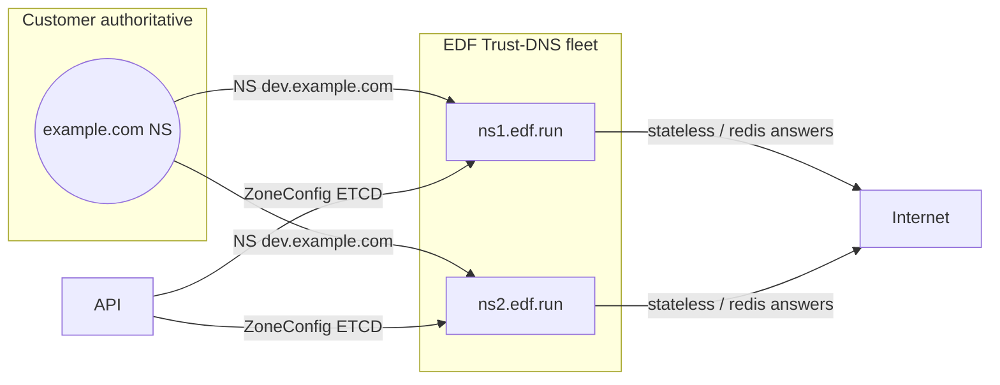
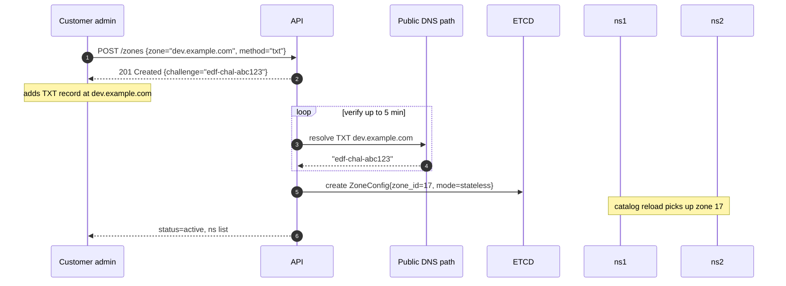
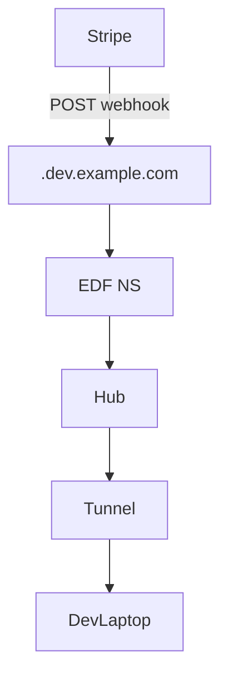

# 📘 **E1g – Hosted Sub‑Domain NS for Customers (Designv0.1)**

> *Epic‑level spec enabling customers to delegate `dev.<mydomain>` (or any sub‑zone) to EDF’s authoritative Trust‑DNS edge, gaining the same **ephemeral, signed, sub‑second labels** under their own brand.*
>
> **Differentiator:** Neither inlets, ngrok, nor Cloudflare Tunnel (developer tier) combines customer‑owned DNS with per‑tunnel disposable hostnames + policy bits.

---

## 1 ▪ WHY

| Problem                                                               | Pain Today                                       | Hosted‑NS Outcome                                                       |
| --------------------------------------------------------------------- | ------------------------------------------------ | ----------------------------------------------------------------------- |
| Enterprise firewalls / allow‑lists refuse external `*.saastunnel.com` | Webhooks & OAuth restricted to corporate domains | Traffic appears under `dev.acme.com` → passes allow‑lists automatically |
| Users must manually CNAME each tunnel name to vendor                  | Operational toil; stale records accumulate       | One‑time NS delegation; EDF mints labels on demand                      |
| Security scanners flag unknown third‑party domains                    | False positives & risk assessments               | Brand‑consistent FQDN; DNSSEC chain of trust retained                   |

**Metrics of success**: <5min self‑serve onboarding; <1s TTL propagation; zero manual CNAMEs going forward.

---

## 2 ▪ WHAT (functional requirements)

1. **Zone onboarding API** (`POST /v1/zones`): customer submits sub‑domain, chooses verification method.
2. Support two verification modes: **TXT‑challenge** or **NS‐delegation pre‑set**.
3. Deterministic **per‑zone ZSK** derived from root secret; optional customer‑supplied KSK.
4. Label encoder embeds **8‑bit `zone_id` prefix** inside slot to guarantee global uniqueness.
5. Trust‑DNS catalog hot‑reloads zone configs without restart.
6. CLI enhancements: `edf zone add`, `edf forward --zone <subzone>`.
7. Billing hooks: zone counted as paid add‑on (Team/Org tier).

---

## 3 ▪ HOW – Component graph



---

## 4 ▪ Onboarding flow (TXT‑challenge)



### Verification mode B – NS pre‑delegation

*Customer first delegates NS → API verifies NS set, skipping TXT step.*

---

## 5 ▪ Data model

```json
// etcd key: /zones/17
{
  "zone": "dev.example.com.",
  "zone_id": 17,
  "mode": "stateless",              // or "redis"
  "zsk_deriv_salt": "h2s934",        // 64‑bit random per zone
  "created_at": "2025-07-04T12:00Z",
  "dnssec": {
     "ds": "3 13 2 abcd…"            // optional published by customer
  },
  "billing_plan": "team-extra-zone"
}
```

---

## 6 ▪ Label format update

```
slot32 = (zone_id << 24) | local_slot24
```

* `zone_id` 0−255; 0 reserved for edf.run root.\*

Encoder math unchanged; decoder extracts `zone_id` to pick Authority.

---

## 7 ▪ Trust‑DNS catalog logic

```rust
match zone_id {
   0 => self.base_stateless.lookup(qname, …),
   n => self.zones[n as usize].lookup(qname, …),
}
```

Each Zone has its own `StatelessAuthority` with ZSK signer derived:

```rust
let salt = config.zsk_deriv_salt;
let key = hmac::Key::new(HMAC_SHA256, &concat(root_secret, salt));
let zsk = derive_rsa(key);
```

---

## 8 ▪ Call‑flow graph (runtime)



*Same low‑latency path as edf.run but under customer FQDN.*

---

## 9 ▪ Edge cases

| Case                                    | Handling                                                                          |
| --------------------------------------- | --------------------------------------------------------------------------------- |
| Zone TXT removed after onboarding       | Periodic re‑verify; mark zone `suspended` if proof lost.                          |
| Customer rotates NS to different vendor | Health‑check shows our NS not delegated; we suspend answers to avoid split‑brain. |
| zone\_id exhaustion (>255)              | Compile‑time constant; bump to 10‑bit prefix, migrate encoder (E1f plan).         |
| Customer mis‑signs DS                   | Our RRSIG fine, but validators fail chain; dashboard surface error.               |

---

## 10 ▪ Rust snippet – zone hot‑reload

```rust
watch_etcd("/zones", |event| {
   match event {
      Put(zkey, zcfg) => catalog.upsert(zcfg.zone, build_authority(zcfg)),
      Delete(zkey)    => catalog.remove(zone_name(zkey)),
   }
});
```

Hot‑swaps Signer and Authority without dropping in‑flight UDP queries.

---

## 11 ▪ Deliverables & Timeline

| Sprint | Item                                      |
| ------ | ----------------------------------------- |
| 1      | `/zones` API + CLI (`edf zone add/ls/rm`) |
| 2      | ZoneConfig watcher + catalog hot‑reload   |
| 2      | ZSK derivation & DNSSEC RRSIG per zone    |
| 3      | Docs: delegation guide, Terraform snippet |
| 3      | Billing flag integration                  |
| 4      | Alerting: NS mismatch, DS mismatch        |

---

## 12 ▪ Future enhancements

* Per‑zone **rate‑limit buckets** (tenant isolation).
* Vanity **ACME automation**: auto‑issue cert for `*.dev.example.com` so customers can host production preview sites via EDF.
* Delegated **private zones** for internal developers with split‑horizon DNS.

---

# 📗 **E1g – Hosted Sub‑Domain NS for Customers**
*Sub‑Epic → User‑story breakdown (v0.1)*

Enables enterprise & Team plans to delegate a sub‑domain (e.g., `ci.acme.com`) via NS records to FleetingDNS so tunnels resolve beneath customer‑controlled zones while preserving stateless label scheme, DNSSEC, and billing.

---

## Epic Goal
> “Provide turnkey name‑server hosting for delegated customer sub‑domains that automatically provisions DNSSEC, ACME TLS certificates, and plan‑aware quotas—letting teams expose tunnels under their brand with zero manual operations.”

---

## 🗂️ Story List
| ID | Story | Outcome |
|----|-------|---------|
| **E1g‑S1** | As a *Team admin*, create **Custom Domain** in portal and receive NS targets to add at registrar. |
| **E1g‑S2** | As *Platform*, provision **per‑tenant Trust‑DNS authority** that answers `*.ci.acme.com` using same stateless label logic. |
| **E1g‑S3** | As *Security*, issue **Wildcard ACME cert** via DNS‑01 using customer NS delegation. |
| **E1g‑S4** | As *DNSSEC operator*, sign sub‑zone with our KSK and provide DS record for customer to publish. |
| **E1g‑S5** | As *Billing*, enforce plan limit `max_custom_domains` and extra €99/yr add‑on. |
| **E1g‑S6** | As *SRE*, expose metrics (`custom_domain_queries_total`) and alert if QPS > plan quota. |

---

## E1g‑S1 — Portal Domain Registration Flow
**Tasks**
1. UI form `Add custom domain` → validate FQDN regex.
2. Generate four NS targets `<hash0>.ns.fdns.run` … `<hash3>.ns`.
3. Display DNSSEC DS & ACME TXT hints.

**Functional Reqs**
* Domain status = `pending_ns`.
* Poll every 5 min using `dig +ns +trace` until delegation detected.

**Non‑Functional**
* Max setup wizard < 2 steps.
* Support up to 50 domains per org.

---

## E1g‑S2 — Per‑Tenant Authority Instance
**Tasks**
1. `dnsd` supports multi‑zone map at runtime (hashmap <domain, label_parser>).
2. On domain activation, configmap hot‑reloaded via SIGHUP.
3. Zone apex SOA served with `hostmaster@fleetingdns.run`.

**Functional**
* Query `abc.ci.acme.com` resolves to tunnel IP.
* TTL mirrors main zone rules.

**Non‑Functional**
* Added heap per domain ≤64 KiB.
* 1000 custom domains per cluster OK.

---

## E1g‑S3 — ACME Wildcard Cert Automation
**Tasks**
1. On activation, create ACME order `*.ci.acme.com`.
2. Present TXT `_acme‑challenge.ci.acme.com` via same authority.
3. Use RFC8555; store cert in Secret Manager.

**Functional**
* Cert issued within 2 min (DV).
* Cert auto‑renews 30 days before expiry.

**Non‑Functional**
* Failure retries exponential back‑off.
* No more than 50 failed orders/day (Let’s Encrypt rate‑limit).

---

## E1g‑S4 — DNSSEC Chain
**Tasks**
1. Generate per‑domain KSK & ZSK; sign zone.
2. Provide DS SHA‑256 digests in portal.
3. Remind admin weekly until DS inserted at parent.

**Functional**
* `dig +dnssec abc.ci.acme.com` returns `ad` once DS live.
* Portal shows status `secure`.

**Non‑Functional**
* Key rotation 90‑day cycle.
* DS reminder emails max 4.

---

## E1g‑S5 — Plan Enforcement & Billing
**Tasks**
1. Column `custom_domains_used` in users/org table.
2. Free/Supporter = 0, Team = 3, Org = 20, add‑on increments.
3. Stripe webhook `invoice.paid` increases entitlement.

**Functional**
* API returns 402 if limit exceeded.
* Add‑on price €99/yr per domain.

**Non‑Functional**
* Over‑usage block latency <10 s.
* Audit trail records domain count changes.

---

## E1g‑S6 — Metrics & Alerts
**Tasks**
1. Counter `custom_domain_queries_total{domain}`.
2. Alert if QPS > 100 for Free domains (abuse).
3. Dashboard per‑domain query/latency.

**Functional**
* Metric scraped by Mimir; shown in customer portal if plan≥Team.
* Alert routes to Abuse response team.

**Non‑Functional**
* Label cardinality bounded (#domains).
* Alert false positive <1/mo.

---

© 2025 FleetingDNS — Hosted Sub‑Domain NS stories

