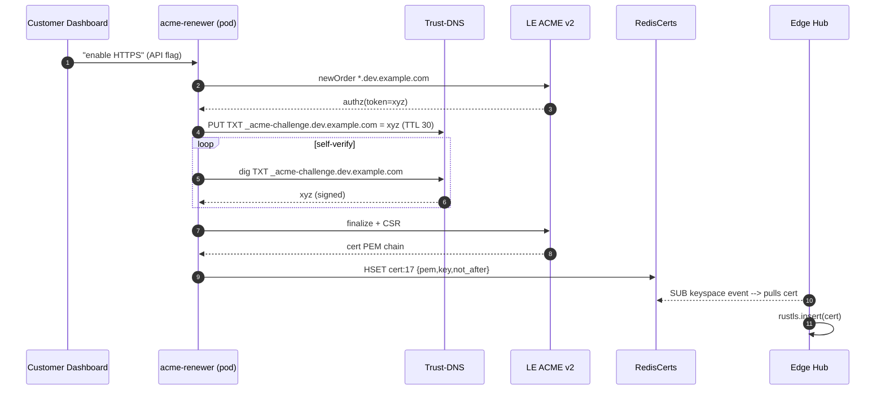
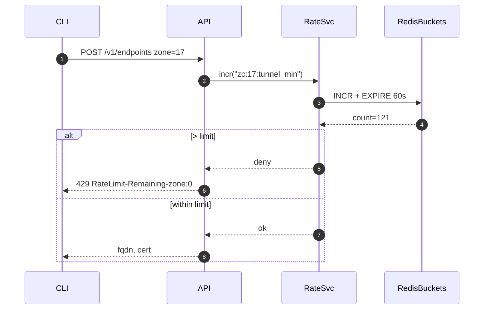
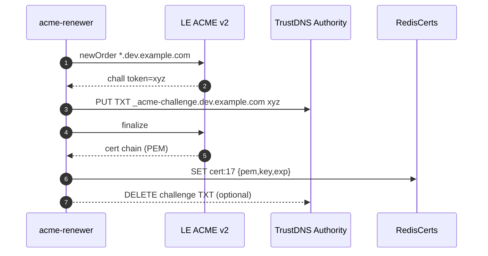

# 📘 **E1h – Per‑Zone Rate‑Limit Buckets & Vanity ACME Automation (Design v0.1)**

## 0 ▪ Executive summary

This epic layers two tenant‑isolation and polish features onto the hosted‑zone capability (E1g):

1. **Per‑Zone rate‑limit buckets** – stop noisy customers from exhausting Redis, hub threads, or DNS QPS.  Each delegated sub‑zone (`dev.acme.com`) gets its own configurable ceilings for: tunnel creations/min, active tunnels, DNS queries/s, and inbound request bandwidth.
2. **Vanity ACME automation** – automatically obtain and renew wildcard certificates (e.g. `*.dev.acme.com`) via Let’s Encrypt DNS‑01 so customers can serve HTTPS through EDF under **their** hostnames without manual cert management.

Both live entirely in Rust micro‑services, leaning on existing Redis + Trust‑DNS.

---

## 1 ▪ WHY

| Need                                                                     | Pain if absent                                            | Feature payoff                                                           |
|--------------------------------------------------------------------------|-----------------------------------------------------------|--------------------------------------------------------------------------|
| Tenant A’s CI loop spams 5k tunnels/min → degrades global Redis latency  | No per‑zone isolation; all users suffer (noisy‑neighbour) | **Bucketed counters** throttle only that zone, preserving SLO for others |
| Customers want public demos on `preview.dev.acme.com` with green padlock | Must bring own cert and rotate; error‑prone               | EDF auto‑issues & renews via ACME DNS‑01; zero ops toil                  |
| Security teams require **mTLS** between EDF and browser viewers          | Wildcard cert allows SNI‑based vhosts under customer TLD  | We can optionally issue client‑auth sub‑CA per zone later                |

---

## 2 ▪ WHAT (requirements)

### 2.1 Rate‑limit buckets

* Config per `zone_id` stored in etcd:

```json
{
  "rl": {
    "tunnel_create_min": 120,
    "tunnel_concurrent": 2000,
    "dns_qps": 500,
    "ingress_mbps": 100
  }
}
```

* Enforcement points:

    * **API** -> create‑endpoint path → checks `tunnel_create_min` & `concurrent`.
    * **Edge Hub** ingress pipeline → token‑bucket for request per zone.
    * **Trust‑DNS** Authority → QPS bucket per zone for DNS queries.
* 429 / TC responses include `RateLimit-Remaining-zone` header.
* Default limits derived from plan tier; overridable via admin panel.

### 2.2 Vanity ACME automation— **deep-dive**

> **Goal:** Customer points `dev.example.com` at EDF once, clicks "Enable HTTPS", and within 60seconds a valid wildcard certificate `*.dev.example.com` is live across **all edge nodes** — no further action required.
>
> **ACME flavor:** Let’s Encrypt v2 (production) with optional staging toggle (`?dry-run`). Fallback CA: ZeroSSL for rate‑limit mitigation.

#### 2.2.1Workflow in detail

1. **ACME Account per zone**

    * `acme-renewer` maintains an **account keypair** derived from `HMAC(root, zone)`. \*Deterministic\* — no DB storage.
    * Registration is idempotent; JWS signed with derived key.
2. **Order ➜ Challenge**

    * `POST /acme/newOrder` for `*.ZONE` plus optional `ZONE` bare.
    * ACME replies with `authorization` objects containing **DNS‑01** token `t`.
3. **Challenge provisioning**

    * Internal Trust‑DNS adds TXT `_acme-challenge.ZONE` → `<base64(t)>`, TTL=30s.
    * Authority uses **zone‑specific ZSK** so signature is valid.
4. **Self‑validate before notify CA** (avoid Err‘unauthorized’ RTT):
   \*`dig TXT +dnssec` via 8.8.8.8 from same pod until record resolvable *and* RRSIG verifies.
5. **Finalize**

    * `POST finalize` with CSR (wildcard + SAN zone apex).
6. **Cert storage & distribution**

    * Store PEM chain + RSA private key in `cert:{zone_id}` Redis hash.
    * EdgePods subscribe to Redis keyspace events; on change they pull cert and **insert into rustlsResolver**.
7. **Renewal scheduler**

    * Cron every 12h scans keys expiring <45days.
    * Each run is staggered via `redis.lock("acme:renew:{zone_id}")` to prevent thundering‑herd.
8. **Planet‑scale propagation**

    * New cert TTL 30days in edge LRU.
    * Old cert kept until 24h after new deployment to handle client session resumption.

#### 2.2.2Sequence diagram (issuance)



#### 2.2.3Error handling matrix

| Phase         | ACME error code | EDF response                                               | Retried?                    |
| ------------- | --------------- | ---------------------------------------------------------- | --------------------------- |
| newOrder      | `rateLimited`   | Switch to ZeroSSL endpoint                                 | ✅ exponential backoff ×6h |
| dns‑01 verify | `unauthorized`  | Check TXT present; if yes open SRE alert (likely firewall) | ⚠️ manual                   |
| finalize      | `badCSR`        | Re‑generate CSR with RSA‑4096 fallback                     | once                        |
| cert download | network timeout | Retry with jitter 5–30s                                   | 5×                          |

#### 2.2.4Securitynotes

* Private key never leaves renewer pod; stored **encrypted in Redis** (AES‑GCM using zone‑derived KEK).
* Edge pods request key via mutual mTLS over cluster network.
* In worst‑case Redis breach, key is ciphertext; attacker still needs KEK.

#### 2.2.5Rustcrate choices

* ACME client: `acme-client` (latest, pure Rust)
* JWK/JWS: `josekit`
* CSR build: `rcgen`
* DNS self‑resolve: use `trust-dns-resolver` with `ResolverConfig::google()`

#### 2.2.6Prometheus metrics

| Metric                     | Labels             | Purpose                  |
| -------------------------- | ------------------ | ------------------------ |
| `edf_acme_issue_seconds`   | zone, result       | Latency distribution     |
| `edf_acme_fail_total`      | zone, phase, error | Alert on high error rate |
| `edf_tls_cert_expiry_days` | zone               | Alert at 30, 7, 1 days   |

#### 2.2.7Deliverables checklist

* [ ] ACME renewer micro‑service (`edf-acme`) with deterministic account keys.
* [ ] Redis key schema + encryption helpers.
* [ ] Edge rustls dynamic resolver hooking.
* [ ] Dashboard status card (green/yellow/red) per zone.
* [ ] End‑to‑end integration test using Let’sEncrypt staging.

---

## 3 ▪ Architecture graph

```mermaid
flowchart TD
  API --|create endpoint| RateSvc((Zone RL service))
  RateSvc --> RedisBuckets[(Redis buckets)]
  EdgeHub --|check bucket on tunnel msg| RedisBuckets
  TrustDNS --|QPS token| RedisBuckets

  subgraph ACME_Flow
    ACMEJob[acme-renewer] --> LE[Let's Encrypt API]
    ACMEJob --> TrustDNS
    ACMEJob --> RedisCerts[(Redis cert store)]
    EdgeHub --> RedisCerts
  end
```

---

## 4 ▪ Sequence diagrams

### 4.1 Zone‑scoped tunnel create with throttling



### 4.2 ACME issuance (DNS‑01)



---

## 5 ▪ Implementation details

### 5.1 Rate‑limit engine

* Re‑use `tower::limit` + `dashmap` but **bucket key = zone\_id**.
* Choose leaky‑bucket (`governor` crate) with burst = ½ limit.
* For DNS QPS: build `DomainRateGuard` implementing `trust_dns_server::RequestHandler` wrapper.

### 5.2 Redis schema

```
zc:{zone_id}:tunnel_min    ->  INTEGER expire=60
zc:{zone_id}:concurrent    ->  INTEGER expire=30m
cert:{zone_id}             ->  Hash {pem,key,not_after}
```

### 5.3 Edge rustls cert lookup

```rust
fn resolve_cert(sni: &str) -> Option<CertifiedKey> {
   let zone_id = zone_of_sni(sni)?;
   if let Some(bytes) = redis.hget("cert:"+zone_id, "pem")? {
        parse_cert(bytes)
   } else {
        default_edf_cert()
   }
}
```

Caching in-memory for 10 min per zone.

---

## 6 ▪ Risks & mitigations

| Risk                                                      | Mitigation                                                                         |
| --------------------------------------------------------- | ---------------------------------------------------------------------------------- |
| DNS‑01 TXT might not propagate (<10s) before validation   | Add 5‑retry backoff × 5s; provisioning UI shows spinner                            |
| Customer misconfigures firewall blocking 443 to LE        | Provide alt CA (ZeroSSL) toggle                                                    |
| RL buckets cause false positives on bursty but legit load | Burst factor = 50% + Prometheus alerts for near‑limit; customers can request bump |

---

## 7 ▪ Deliverables & timeline (3 sprints)

| Sprint | Feature                                                              |
| ------ | -------------------------------------------------------------------- |
| 1      | Redis bucket schema + RateSvc crate; API + Hub integration           |
| 2      | DNS QPS guard + Prom metrics; docs on limits & tiers                 |
| 2      | ACME job skeleton with `acme-client`; one zone e2e cert issuance     |
| 3      | Rustls hot‑reload; renewal scheduler; customer dashboard cert status |

---

# 📗 **E1h – Per‑Zone Rate‑Limit Buckets & Vanity ACME Automation**
*Sub-Epic → User-story breakdown (v0.1)*

Introduces fine‑grained QPS buckets per custom domain (zone) to prevent abuse, plus automated ACME issuance for vanity domains (`*.my‑product.dev`) that are CNAME’d to FleetingDNS rather than NS‑delegated.

---

## Epic Goal
> “Protect shared DNS/edge resources by capping QPS per zone according to plan tier and automatically mint wildcard TLS certificates for vanity domains pointed at our anycast IP via CNAME records.”

---

## 🗂️ Story List
| ID | Story | Outcome |
|----|-------|---------|
| **E1h-S1** | As a *Team admin*, add **vanity CNAME domain** (`preview.acme.dev`) in portal and get HTTPS working automatically. |
| **E1h-S2** | As *Platform*, detect CNAME ownership via **HTTP‑01 challenge** and issue ACME cert (Let’s Encrypt). |
| **E1h-S3** | As *Security*, enforce **rate‑limit bucket** of 100 QPS for Free plan domains, 500 for Org, with 429 on excess. |
| **E1h-S4** | As *SRE*, view **prom metric** `zone_qps_limit_exceeded_total{zone}` and alert if sustained >1%. |
| **E1h-S5** | As *Customer*, receive email warning if my domain exceeds 80% of limit for 3 consecutive hours. |
| **E1h-S6** | As *Billing*, upsell **additional QPS add‑on** purchasable in portal, reflected instantly in bucket size. |

---

## E1h-S1 — Vanity Domain Registration Flow
**Tasks**
1. Portal form “Add CNAME domain”; validate apex not already used.
2. Show instruction: `CNAME preview.acme.dev → cname.fleetingdns.run`.
3. Poll DNS every 2min until CNAME detected.

**Functional**
* Domain status transitions `pending_cname` → `pending_tls` → `active`.
* Limit: 5 vanity domains per plan (configurable).

**Non‑Functional**
* Polling job cost <€0.05/mo per 100 domains.
* False positives <0.5%.

---

## E1h-S2 — ACME HTTP‑01 Automation
**Tasks**
1. On `pending_tls`, allocate random token, store in Redis `acme:token`.
2. EdgeHub serves `/.well-known/acme-challenge/{token}` returning key‑auth.
3. Call Let’s Encrypt API; store cert in SecretManager.

**Functional**
* Cert issued in ≤2min after CNAME appears.
* Auto‑renew 20days before expiry.

**Non‑Functional**
* Retry back‑off up to 5 times.
* Rate‑limit ≤300 orders / 3h (LE burst quota).

---

## E1h-S3 — Per‑Zone QPS Bucket
**Tasks**
1. Extend EdgeHub rate‑limit middleware: key=`zone` → token‑bucket (dashmap).
2. Limits pulled from Redis `zone:limit:{zone}` with fallback plan default.
3. 429 response includes `Retry‑After` & `X‑RateLimit‑Remaining`.

**Functional**
* Free plan default 100 qps; Supporter300; Team1000; Org5000.
* Burst = limit ×2 for 30s.

**Non‑Functional**
* Overhead <3µs per query.
* Memory per zone ≤256B.

---

## E1h-S4 — Metrics & Alert
**Tasks**
1. Counter `zone_qps_limit_exceeded_total{zone}`.
2. Gauge `zone_qps_current{zone}` updated every second.
3. Alert: if limit_exceeded rate >1/s for 5min.

**Functional**
* Alert routes to Abuse team Slack + customer email (E1h‑S5).
* Grafana dashboard top 20 noisy zones.

**Non‑Functional**
* Metrics cardinality bounded (#custom domains).
* Alert false positive <1/mo.

---

## E1h-S5 — Customer Warning Email
**Tasks**
1. Cloud Task enqueues email when `zone` flagged.
2. Template includes upgrade CTA & docs link.
3. Do not resend within 24h.

**Functional**
* Email send within 10min of breach.
* Contains current QPS & limit.

**Non‑Functional**
* Bounce rate <1%.
* Opt‑out link respected.

---

## E1h-S6 — QPS Add‑On Purchase
**Tasks**
1. Stripe price `addon-zone-qps-1000`.
2. Portal “Upgrade limit” button; creates Checkout session.
3. Webhook `invoice.paid` updates Redis `zone:limit` and Plan table.

**Functional**
* New limit takes effect ≤60s after payment.
* Billing reflects prorated amount.

**Non‑Functional**
* Stripe webhook retries handled.
* UI shows new limit immediately.

---

© 2025 FleetingDNS — Per‑Zone Rate‑Limit & Vanity ACME stories

