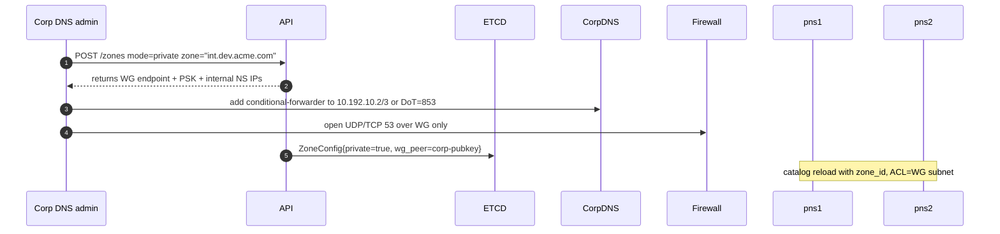

# 📘 **E1i – Private Delegated Zones & Split‑Horizon DNS (Design v0.1)**

> *Enable customers to delegate an **internal-only** sub‑zone (e.g. `int.dev.acme.com`) to EDF so that labels resolve **exclusively on corporate resolvers/VPN**, while the public Internet still sees NXDOMAIN.*  Ideal for back‑office systems, test data with privacy constraints, and staging APIs not meant to be world‑reachable.

---

## 1 ▪ WHY

| Pain                                                                   | Current gap                           | Private-zone pay‑off                                                                     |
| ---------------------------------------------------------------------- | ------------------------------------- | ---------------------------------------------------------------------------------------- |
| Enterprises prohibit exposing pre‑prod services on public DNS/Internet | EDF today only serves public zones    | Developers can tunnel *inside* corp without firewall exceptions; traffic never exits VPN |
| Regulatory data leaks via external resolvers                           | Requires bespoke on‑prem tunnel infra | Split‑horizon keeps dev traffic on private MPLS / VPN subnets                            |
| Latency / egress cost when corp traffic hits public anycast PoP        | Could degrade integration tests       | Internal NS endpoints run in customer VPC or EDF private peered network                  |

Success metric: **<5min** onboarding, <50ms extra latency vs. on‑prem DNS, and zero leakage to public root servers.

---

## 2 ▪ WHAT (requirements)

1. Support **ZoneConfig.mode = "private"**
2. EDF serves zone **only on internal NS addresses/IPs** (10.192.0.0/16) that are reachable via WireGuard or AWS PrivateLink.
3. Public queries to same FQDN return **NXDOMAIN** (or no DS) to avoid enumeration.
4. Conditional-forwarding guide for common corp DNS stacks (Active Directory, BIND, Cisco Umbrella).
5. TLS‑encrypted DNS (**DoT/DoH**) option for zero‑trust networks.

---

## 3 ▪ HOW – Architecture graph

```mermaid
flowchart LR
  subgraph CorpLAN[Corporate Resolver]
    CorpDNS[(Active Directory DNS)]
  end
  WG[WireGuard tunnel]
  subgraph EDF_Private_Fleet
     pns1[pns1.edf.run 10.192.10.2]
     pns2[pns2.edf.run 10.192.10.3]
  end
  CorpDNS -- conditional forward "int.dev.acme.com" --> WG --> pns1 & pns2
  pns1 & pns2 --> Hub --> Tunnel --> DevWorkstation
```

*Public Internet → NXDOMAIN for `*.int.dev.acme.com` because Trust‑DNS public catalog excludes that zone.*

---

## 4 ▪ Zone onboarding (NS‑delegation variant)



---

## 5 ▪ Trust-DNS modifications

```rust
impl PrivateAuthority {
   fn allow_source(addr: IpAddr) -> bool {
       WG_SUBNET.contains(addr)
   }
   // fallback: NXDOMAIN for non‑WG IPs
}
```

*Nodes expose two listeners:* `0.0.0.0:53` (public) and `10.192.10.2:53` (private). Private catalog only mounted on the latter.

---

## 6 ▪ Security

| Threat                                                          | Mitigation                                                                          |
| --------------------------------------------------------------- | ----------------------------------------------------------------------------------- |
| Split‑horizon confusion (resolver accidentally queries 8.8.8.8) | Corporation sets `DNSSEC=on`, public path has no DS so validation fails => NXDOMAIN |
| Data exfil via private zone label                               | Logs & audit per zone;rate limits (E1h) apply                                      |
| Spoofing private NS                                             | WG enforces mutual PSK/mTLS; source IP ACL                                          |

---

## 7 ▪ TLS‑encrypted variant (optional)

* Pods expose **DoT** on `853/tcp` behind WG or directly on public if customer wants zero‑trust.
* Use same zone‑derived wildcard cert (E1h ACME) for `dev.acme.com` NS.
* Conditional forwarder example (BIND):

```bind
forwarders {
   192.0.2.1 tls port 853 verify‑hostname "pns1.edf.run";
   192.0.2.2 tls port 853 verify‑hostname "pns2.edf.run";
};
```

---

## 8 ▪ Deliverables

* [ ] Update ZoneConfig schema: `private:bool`, `wg_peer_pub`, `wg_net_cidr`.
* [ ] WireGuard orchestrator micro‑service (`edf-wg`) auto‑adds peer config.
* [ ] Private DNS listeners with ACL.
* [ ] Docs: setup guides (AD DS, BIND, CoreDNS) + Terraform module.
* [ ] CI test: spin Kind cluster, forwarder to private NS, resolve label.

---
# 📗 **E1i – Private Delegated Zones & Split‑Horizon DNS**
*Sub-Epic → User‑story breakdown (v0.1)*

Adds private RFC1918 views and split‑horizon capabilities so customers can delegate an internal zone (e.g., `*.dev.acme.local`) that resolves differently inside their VPC / VPN than on the public internet, while still using FleetingDNS tunnel labels.

---

## Epic Goal
> “Deliver dual‑view DNS where private queries (over VPC‑peering, VPN, or WireGuard) resolve to 10.x ‘internal ingress’ addresses and public queries resolve to the anycast edge, allowing secure on‑prem integration tests and zero‑trust networking.”

---

## 🗂️ Story List
| ID | Story | Outcome |
|----|-------|---------|
| **E1i‑S1** | As a *Corp‑Net admin*, delegate **`dev.acme.internal`** via Private DNS Peering to FleetingDNS and have queries resolve over my VPC only. |
| **E1i‑S2** | As *EdgeHub*, detect **`view=private`** query and answer with reserved 10.10.0.0/16 addresses (tunnel’s WireGuard IP). |
| **E1i‑S3** | As *Platform*, ensure **split‑horizon configs** reload without pod restarts when new customer VPCs peer. |
| **E1i‑S4** | As *Security*, block leakage: private zone never served on public interface and vice‑versa. |
| **E1i‑S5** | As *SRE*, expose metrics `private_view_queries_total` & alert if ratio >30% (indicates mis‑routing). |
| **E1i‑S6** | As *Customer*, tunnel over **WireGuard** instead of VPC‑peering and still resolve internal view via DNS64 if needed. |

---

## E1i‑S1 — Private Zone Delegation Flow
**Tasks**
1. Portal wizard “Add private zone” → collect CIDR(s) that will query the zone.
2. Create Cloud DNS **Private Managed Zone** `dev-acme-internal` inside customer workload project with `peering` to customer VPC network or Hub‑Spoke VPN.
3. Return instructions to add **VPC Peering** (`gcloud compute networks peerings create`).

**Functional Reqs**
* Query from 10.50.0.5 returns 10.x‎ address; query from internet gets NXDOMAIN.
* Supports up to 5 CIDR ranges per zone.

**Non‑Functional**
* Setup automation completes in <10min.
* All configs managed by Crossplane CRs.

---

## E1i‑S2 — Private‑View Answer Logic
**Tasks**
1. In `dnsd`, inspect **client IP**; if src in `private_ranges` list AND qname matches zone, switch to *private* view.
2. Pull slot metadata WireGuard IP (`10.10.x.x`) and answer A record with that.
3. TXT / RRSIG signed by separate ZSK for private view.

**Functional**
* Same label resolves to **public anycast IP** externally, **WireGuard IP** internally.
* TTL equal both views.

**Non‑Functional**
* View lookup adds ≤5µs.
* Memory per range list ≤32KiB.

---

## E1i‑S3 — Dynamic View Reload
**Tasks**
1. Store `private_ranges` JSON in ConfigMap; watch for change.
2. Atomically swap in‑memory RangeTrie.
3. Rollout new private zone without dropping queries.

**Functional**
* New CIDR active in ≤60s after portal save.
* No UDP packet loss observed.

**Non‑Functional**
* Reload CPU spike <5%.
* Race‑condition tests with loom.

---

## E1i‑S4 — Leakage Prevention
**Tasks**
1. Add integration test: query private zone from public IP → expect REFUSED.
2. IPtables / eBPF rule on Edge public interface denies `*.internal.`.
3. Audit logs if attempted leak.

**Functional**
* `dig dev.acme.internal @8.8.8.8` returns NXDOMAIN.
* Security scorecard pass.

**Non‑Functional**
* False leak alarm <1 / year.
* eBPF rule latency <0.1µs.

---

## E1i‑S5 — Metrics & Alert
**Tasks**
1. Counter `private_view_queries_total` and `public_view_queries_total`.
2. Alert if private/public ratio >0.3 or <0.01 (anomaly by tenant).
3. Grafana dashboard heatmap by view.

**Functional**
* Alert route to SRE within 5min.
* Metric scraped by Mimir.

**Non‑Functional**
* Metric label cardinality ≤ tenants.
* Alert false positive <1/mo.

---

## E1i‑S6 — WireGuard‑Only Private View
**Tasks**
1. EdgeHub label includes `wg_ip=10.10.x.x`.
2. If query via WG tunnel IP (source 172.16.0.2), treat as private view without peering.
3. DNS64 plugin optional to map AAAA.

**Functional**
* Developer on laptop ↔ WireGuard to Edge can resolve `*.dev.acme.internal` to 10.x IP.
* Works even without GCP VPC peering.

**Non‑Functional**
* Added handshake latency none (DNS over WG).
* WG path QPS limited to 5k per peer.

---

© 2025 FleetingDNS — Private Delegated Zones & Split‑Horizon stories

