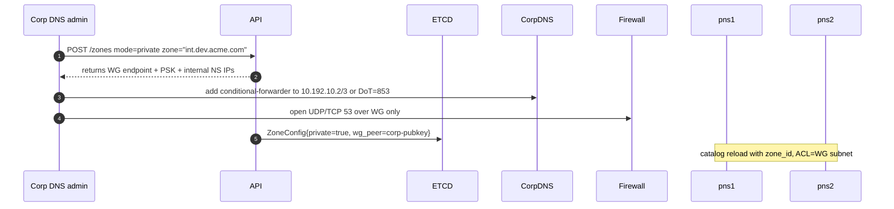

# 📘 **E1i – Private Delegated Zones & Split‑Horizon DNS (Design v0.1)**

> *Enable customers to delegate an **internal-only** sub‑zone (e.g. `int.dev.acme.com`) to EDF so that labels resolve **exclusively on corporate resolvers/VPN**, while the public Internet still sees NXDOMAIN.*  Ideal for back‑office systems, test data with privacy constraints, and staging APIs not meant to be world‑reachable.

---

## 1 ▪ WHY

| Pain                                                                   | Current gap                           | Private-zone pay‑off                                                                     |
| ---------------------------------------------------------------------- | ------------------------------------- | ---------------------------------------------------------------------------------------- |
| Enterprises prohibit exposing pre‑prod services on public DNS/Internet | EDF today only serves public zones    | Developers can tunnel *inside* corp without firewall exceptions; traffic never exits VPN |
| Regulatory data leaks via external resolvers                           | Requires bespoke on‑prem tunnel infra | Split‑horizon keeps dev traffic on private MPLS / VPN subnets                            |
| Latency / egress cost when corp traffic hits public anycast PoP        | Could degrade integration tests       | Internal NS endpoints run in customer VPC or EDF private peered network                  |

Success metric: **<5min** onboarding, <50ms extra latency vs. on‑prem DNS, and zero leakage to public root servers.

---

## 2 ▪ WHAT (requirements)

1. Support **ZoneConfig.mode = "private"**
2. EDF serves zone **only on internal NS addresses/IPs** (10.192.0.0/16) that are reachable via WireGuard or AWS PrivateLink.
3. Public queries to same FQDN return **NXDOMAIN** (or no DS) to avoid enumeration.
4. Conditional-forwarding guide for common corp DNS stacks (Active Directory, BIND, Cisco Umbrella).
5. TLS‑encrypted DNS (**DoT/DoH**) option for zero‑trust networks.

---

## 3 ▪ HOW – Architecture graph

```mermaid
flowchart LR
  subgraph CorpLAN[Corporate Resolver]
    CorpDNS[(Active Directory DNS)]
  end
  WG[WireGuard tunnel]
  subgraph EDF_Private_Fleet
     pns1[pns1.edf.run 10.192.10.2]
     pns2[pns2.edf.run 10.192.10.3]
  end
  CorpDNS -- conditional forward "int.dev.acme.com" --> WG --> pns1 & pns2
  pns1 & pns2 --> Hub --> Tunnel --> DevWorkstation
```

*Public Internet → NXDOMAIN for `*.int.dev.acme.com` because Trust‑DNS public catalog excludes that zone.*

---

## 4 ▪ Zone onboarding (NS‑delegation variant)



---

## 5 ▪ Trust-DNS modifications

```rust
impl PrivateAuthority {
   fn allow_source(addr: IpAddr) -> bool {
       WG_SUBNET.contains(addr)
   }
   // fallback: NXDOMAIN for non‑WG IPs
}
```

*Nodes expose two listeners:* `0.0.0.0:53` (public) and `10.192.10.2:53` (private). Private catalog only mounted on the latter.

---

## 6 ▪ Security

| Threat                                                          | Mitigation                                                                          |
| --------------------------------------------------------------- | ----------------------------------------------------------------------------------- |
| Split‑horizon confusion (resolver accidentally queries 8.8.8.8) | Corporation sets `DNSSEC=on`, public path has no DS so validation fails => NXDOMAIN |
| Data exfil via private zone label                               | Logs & audit per zone;rate limits (E1h) apply                                      |
| Spoofing private NS                                             | WG enforces mutual PSK/mTLS; source IP ACL                                          |

---

## 7 ▪ TLS‑encrypted variant (optional)

* Pods expose **DoT** on `853/tcp` behind WG or directly on public if customer wants zero‑trust.
* Use same zone‑derived wildcard cert (E1h ACME) for `dev.acme.com` NS.
* Conditional forwarder example (BIND):

```bind
forwarders {
   192.0.2.1 tls port 853 verify‑hostname "pns1.edf.run";
   192.0.2.2 tls port 853 verify‑hostname "pns2.edf.run";
};
```

---

## 8 ▪ Deliverables

* [ ] Update ZoneConfig schema: `private:bool`, `wg_peer_pub`, `wg_net_cidr`.
* [ ] WireGuard orchestrator micro‑service (`edf-wg`) auto‑adds peer config.
* [ ] Private DNS listeners with ACL.
* [ ] Docs: setup guides (AD DS, BIND, CoreDNS) + Terraform module.
* [ ] CI test: spin Kind cluster, forwarder to private NS, resolve label.

---

© 2025 Ephemeral DNS Forwarder – Private Zones
