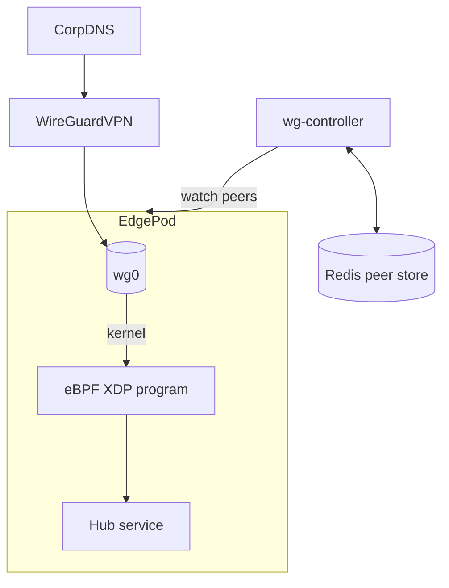
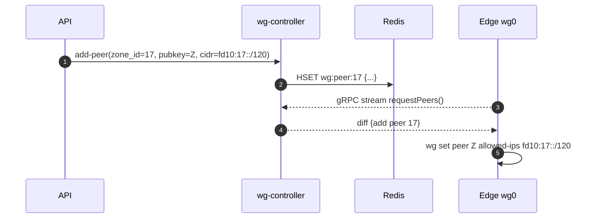
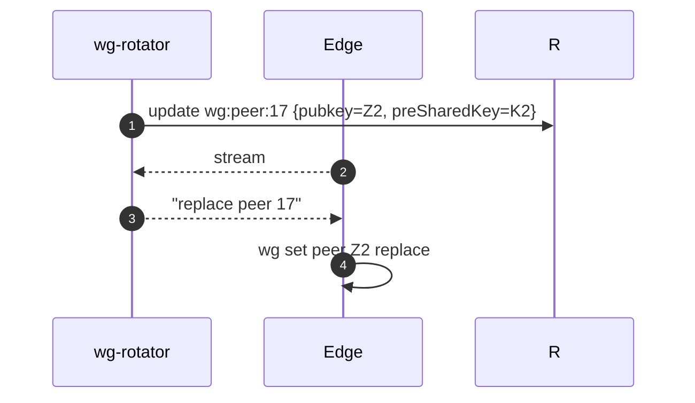

# 📘 **E1j – WireGuard & eBPF Orchestration (Design v0.1)**

> *Extends private‐zone Epic (E1i) by specifying a control‑plane for dynamic **WireGuard tunnel provisioning** and exploring an alternative **eBPF dataplane** for per‑tenant traffic isolation and metering.*

---

## 1 ▪ WHY

| Requirement                                                         | Today                                                | Gap                                                                      |
| ------------------------------------------------------------------- | ---------------------------------------------------- | ------------------------------------------------------------------------ |
| **Automated peer lifecycle** when customers create private zones    | Manual delivery of PSK/pubkey, static config on edge | Need zero‑touch add/remove peers, rotation, HA across N edge pods        |
| Fine‑grained **per‑tenant network policies** without iptables bloat | iptables rules per zone → >10k rules                 | **eBPF** allows in‑kernel maps & per‑socket/label filtering at line‑rate |
| **Metrics / accounting** (MB/s per zone) for billing & alerting     | Redis counters at L7 only                            | eBPF XDP counters at L3 save CPU & are tamper‑proof                      |

Goal: orchestrate WireGuard peers via a Rust control service (**wg‑controller**) and optionally enable an **eBPF dataplane** path (Cilium‑like) for high‑scale clusters.

---

## 2 ▪ WHAT (feature breakdown)

1. `wg-controller` micro‑service (Rust, grpc):

    * Manages **WireGuard device** on each edge pod via **wgctrl** userspace API.
    * Stores peer configs in Redis (`wg:peer:{zone_id}`) with pubkey, allowed‑IPs.
    * Handles **key rotation** every 24h per tenant.
    * Emits Prom metrics: handshakes, rx/tx bytes.
2. **gRPC watch**: Edge pods stream peer diff from controller, patch `wg set` via `nix::execvp`.
3. **CIDR allocation**: Each private zone gets `/120` (IPv6) or `/30` (IPv4) internal subnet for tunnel addresses.
4. **eBPF dataplane (opt‑in)**

    * Attach XDP program on WireGuard interface.
    * Map `zone_id → rate_limit` (BPF hash map) — fed by Redis.
    * Count bytes per zone and enforce 1Gbit cap (drop or ECN mark when exceeded).
    * Export counters via **BPF perf events** → Prometheus exporter.

---

## 3 ▪ Architecture graph



*Edge pods pull peer diffs → `wg set` without pod restart.  eBPF enforces per‑zone bandwidth.*

---

## 4 ▪ Sequence diagrams

### 4.1 Peer onboarding



### 4.2 Key rotation (daily)



---

## 5 ▪ eBPF program sketch (redbpf)

```rust
// XDP context
pub fn xdp_firewall(ctx: XdpContext) -> XdpResult {
    let pkt = ctx.packet();
    let zone = pkt.src_ipv6().segments()[4]; // embed zone_id in /120 subnet
    if let Some(limit) = LIMIT_MAP.get(&zone) {
        let cnt = BYTE_CNT_MAP.get_mut(&zone).unwrap_or(0);
        *cnt += pkt.len() as u64;
        if *cnt > limit.bytes_per_sec {
            return Ok(xdp_action::XDP_DROP);
        }
    }
    Ok(xdp_action::XDP_PASS)
}
```

*The userspace `wg-controller` updates `LIMIT_MAP` via bpffs.*

---

## 6 ▪ Rust crate choices

| Function          | Crate                                                       |
| ----------------- | ----------------------------------------------------------- |
| WireGuard control | `boringtun` (userspace WG) **or** `wgctrl-rs` for kernel WG |
| gRPC watch        | `tonic`                                                     |
| eBPF              | `aya` or `redbpf`                                           |

---

## 7 ▪ Deliverables & Timeline (2 sprints)

| Sprint | Item                                                                         |
| ------ | ---------------------------------------------------------------------------- |
| 1      | `wg-controller` + Redis schema; Edge watcher; unit tests                     |
| 1      | API integration: zone create => peer add                                     |
| 2      | eBPF prototype path; perf test 10Gbit; fallback to iptables if kernel <5.10 |
| 2      | Prom exporter for byte counters & drops                                      |

---

## 8 ▪ Risks

| Risk                                            | Mitigation                                                                                      |
| ----------------------------------------------- | ----------------------------------------------------------------------------------------------- |
| Kernel WG not available on alpine images        | Vendor statically‑linked `boringtun` option                                                     |
| eBPF program verifier rejects complex map loops | Keep XDP code minimal; precompile & test on target kernels                                      |
| Stateful firewall requirements (TCP handshake)  | Use **tc egress** programs for connection‑tracking if needed; XDP drop only on bandwidth exceed |

---

# 📗 **E1j – WireGuard & eBPF Orchestration**
*Sub-Epic → User-story breakdown (v0.1)*

Brings kernel‑mode performance and policy enforcement to FleetingDNS WireGuard transport by orchestrating peer lifecycle, key rotation, NAT‑less routing, and tenant fire‑walls through eBPF (Cilium) programs.

---

## Epic Goal
> “Evolve the userspace `boringtun` prototype into a fully‑orchestrated WireGuard dataplane using eBPF (either Cilium or standalone XDP), delivering sub‑millisecond latency, automatic peer provisioning, per‑tenant policy, and seamless rotation—without giving up stateless tunnel semantics.”

---

## 🗂️ Story List
| ID | Story | Outcome |
|----|-------|---------|
| **E1j-S1** | As a *NetOps*, spin up an **Edge node** that loads Cilium with WireGuard encryption enabled and advertises the anycast IP. |
| **E1j-S2** | As *API*, generate **peer config CRDs** (`FdnsPeer`) that Cilium agent consumes to create wg endpoints. |
| **E1j-S3** | As *Security*, rotate WireGuard public keys every 30min automatically with zero‑packet loss. |
| **E1j-S4** | As *SRE*, attach **eBPF L4 firewall** that enforces per‑tenant byte quota & blocks port scans. |
| **E1j-S5** | As *Perf engineer*, offload NAT‑less routing via **eBPF XDP** achieving ≥3Gbit/s on e2‑standard‑4 node. |
| **E1j-S6** | As *Observability*, export **eBPF perf events** to Otel → Mimir (`wg_packets_dropped_total`). |

---

## E1j-S1 — Cilium WireGuard Edge Node
**Tasks**
1. HelmRelease `cilium` with `encryption.mode=wireguard` and `encryption.interface=wg0`.
2. Advertise anycast IP via kube‑router `bgp` or keep local route table.
3. Health probe: `cilium status --wait`.

**Functional Reqs**
* Packets from client decrypt → pod in ≤1ms.
* Anycast IP reachable from internet.

**Non-Functional**
* Node CPU overhead <5%.
* Control‑plane latency unaffected.

---

## E1j-S2 — FdnsPeer CRD & Controller
**Tasks**
1. Define CRD `FdnsPeer` (spec: pubKey, allowedIps, expiresAt, tenantId).
2. Controller (Rust operator) watches Redis keyspace events and creates peer CR objs.
3. Cilium agent reconciles to `ciliumwireguardendpoint`.

**Functional**
* Peer appears within 5s of tunnel creation.
* Deletes when TTL expired / tunnel closed.

**Non-Functional**
* Controller memory <128MiB.
* CRD prop latency p95 ≤3s.

---

## E1j-S3 — Zero‑Downtime Key Rotation
**Tasks**
1. Gateway issues new pubKey (`pubKey2`) 5min before expire.
2. Controller adds second peer entry; client allowedIps unchanged.
3. After ACK, remove old key.

**Functional**
* No packet loss measured in iperf.
* Rotation event logged.

**Non-Functional**
* Over‑the‑air rotation ≤30s.
* No duplicate peers leak.

---

## E1j-S4 — eBPF Tenant Firewall / Quota
**Tasks**
1. Insert Cilium policy: `TenantID` label → allow port 80/443, deny others.
2. eBPF map counts bytes per `tenant_id`.
3. If > quota, drop & send trace event.

**Functional**
* Quota enforcement within ±1%.
* 403 (RST) returned once quota reached.

**Non-Functional**
* Map memory ≤32B * tenants.
* Policy compile <200ms.

---

## E1j-S5 — XDP Fast‑Path Routing
**Tasks**
1. Write XDP program in C → attach to `eth0`.
2. Skip stack; use BPF map `tunnel_id -> pod veth`.
3. Fallback to kernel if map miss.

**Functional**
* iperf shows ≥3Gbit/s throughput.
* CPU util drop ≥30% vs userspace path.

**Non-Functional**
* Program size <8KB.
* Verified with `bpftool prog load` CI.

---

## E1j-S6 — eBPF Metrics Export
**Tasks**
1. Use `libbpf-rs` perf events → user‑space scraper.
2. Otel metric `wg_packets_dropped_total{reason, tenant}`.
3. 1s scraping interval.

**Functional**
* Metric visible in Grafana within 10s.
* Alert packets_dropped >100 / min.

**Non-Functional**
* Scraper CPU <2%.
* Perf event rate limited (ring buffer 64KB).

---

© 2025 FleetingDNS — WireGuard & eBPF Orchestration stories

