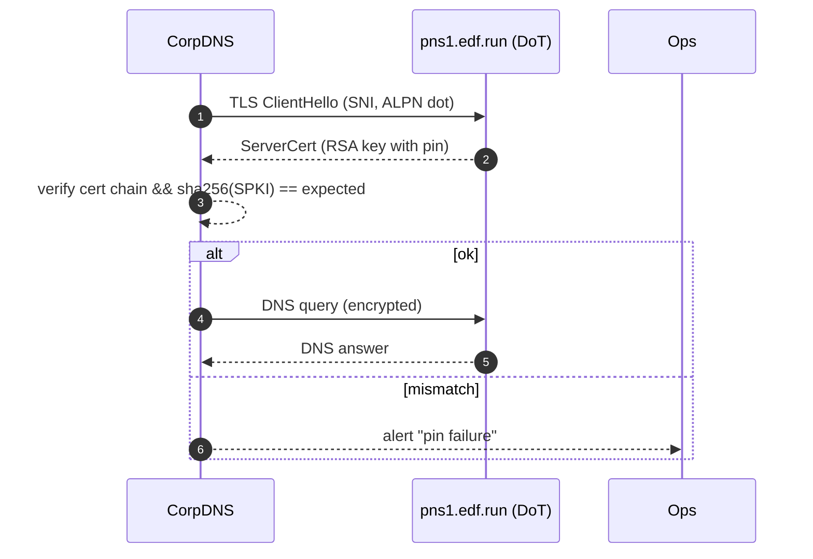

# 📘 **E1k – DNS‑over‑TLS Certificate Pinning (Design v0.1)**

> Part of the private delegated zones initiative (E1i). We secure DNS‑over‑TLS (DoT, RFC7858) sessions between **corporate resolvers** and EDF’s private name servers by **pinning the server’s SPKI fingerprint**, protecting against on‑path TLS MITM and rogue CAs.

---

## 1 ▪ WHY

| Threat                                                                           | Impact if no pinning                                                          | Pinning benefit                                                                          |
| -------------------------------------------------------------------------------- | ----------------------------------------------------------------------------- | ---------------------------------------------------------------------------------------- |
| Compromised public CA issues rogue cert for `pns1.edf.run`, attacker hijacks DoT | Corporate resolver trusts fake NS → answers poisoned, dev traffic exfiltrated | Resolver validates **expected SHA‑256 SPKI**, rogue cert rejected regardless of CA chain |
| Internal proxy re‑signs TLS to inspect traffic                                   | Breaks DNS privacy goals                                                      | Pinning forces true E2E encryption; inspection attempts fail & alert ops                 |
| Downgrade to plaintext port53                                                   | Attack intercepts queries                                                     | Resolver locked to DoT + pin ⇒ plaintext refused                                         |

Success metric: *zero* successful TLS MITM in red‑team test; disconnection rather than silent downgrade.

---

## 2 ▪ WHAT (requirements)

1. Publish **SPKI fingerprints** (base64SHA‑256) for each private NS (`pns*.edf.run`) via HTTPS API & dashboard.
2. Provide **resolver config snippets** for: BIND9.18+, Unbound, CoreDNS, WindowsServer2022 AD.
3. Automate pin rollover when EDF rotates ACME wildcard cert (E1h) — notifying customers N‑days prior.
4. Optional: **mTLS** mode where corporate resolver presents client cert signed by customer CA.

---

## 3 ▪ HOW

### 3.1 Generate pin

```bash
openssl x509 -in pns1.edf.run.pem -noout -pubkey | \
  openssl pkey -pubin -outform der | sha256sum | awk '{print $1}'
# -> 7e051aa0f7c8c2... (hex)
```

Expose via API:

```json
GET /v1/zones/17/dot-pin
{ "spki_sha256": "7e051aa0f7..." }
```

### 3.2 Resolver configuration examples

**Unbound:**

```unbound.conf
server:
  tls-cert-bundle: "/etc/ssl/certs/ca-certificates.crt"
forward-zone:
  name: "int.dev.acme.com."
  forward-tls-upstream: yes
  forward-addr: 10.192.10.2@853#pns1.edf.run,7e051aa0f7...
  forward-addr: 10.192.10.3@853#pns2.edf.run,4af0c99d5e...
```

**BIND9.18+ (with `tls pin-sha256`):**

```bind
server 10.192.10.2 tls "pns1" {
    pin-sha256 "7e051aa0f7...";
};
```

### 3.3 Renewal & rollover

* 30 days before cert expiry, `acme-renewer` issues new cert (E1h) but **keeps old SPKI** by re‑using RSA keypair (ACME allows certificate reuse  – only signature updated).
* If key compromise detected → generate new keypair → new SPKI; publish **`pins.next`** field plus `Valid‑From` date.
* Grace period:7days where both pins accepted. Unbound & BIND allow multiple pins.

### 3.4 Pin distribution

* Dashboard card per zone with current `pin` and optional `next_pin`.
* Webhook `zone.pin.changed` for API users.

### 3.5 Optional mTLS

* Customers upload client cert via `/zones/{id}/dot-client-cert`.
* `rustls::ServerConfig` on pns\* adds `ClientCertVerifier` requiring that cert.
* Prevents open recursion misuse.

---

## 4 ▪ Sequence diagram (query with pin)



---

## 5 ▪ Failure modes

| Scenario                                    | Resolver behaviour                                    | EDF guidance                     |
| ------------------------------------------- | ----------------------------------------------------- | -------------------------------- |
| Pin mismatch                                | TLS terminated, query fails; fallback nameserver used | Alert SRE, check cert compromise |
| Cert reused but pin unchanged               | Connection ok (pin stable)                            | No action needed                 |
| Certificate near expiry but renewer crashed | Prometheus alert `edf_tls_cert_expiry_days{zone}<7`   | PagerDuty                        |

---

## 6 ▪ Deliverables

* [ ] API endpoint & dashboard displaying `pin` and `next_pin`.
* [ ] rustls config retaining key across cert renew.
* [ ] Examples for Unbound/BIND/CoreDNS/WinAD.
* [ ] Doc: key compromise rota & pin‑roll procedure.

---
# 📗 **E1k – DNS‑over‑TLS Certificate Pinning**
*Sub‑Epic → User‑story breakdown (v0.1)*

Adds a DNS‑over‑TLS (DoT, RFC7858) endpoint with public‑key pinning to prevent on‑path TLS interception and guarantee query integrity for CI runners and security‑sensitive customers.

---

## Epic Goal
> “Expose `tls.fleetingdns.run:853` as a first‑class DoT service secured by a pinned SPKI hash, integrate pin‑set distribution into the CLI/SDKs, and rotate certificates without breaking clients.”

---

## 🗂️ Story List
| ID | Story | Outcome |
|----|-------|---------|
| **E1k‑S1** | As a *DevOps*, resolve tunnel labels via **DoT endpoint** that supports TLS1.3 and ALPN `dot`. |
| **E1k‑S2** | As a *CLI user*, have **SPKI pin** embedded so MITM attempts fail hard. |
| **E1k‑S3** | As *Security*, implement **pin‑set rotation** (old+new overlap) every 90days. |
| **E1k‑S4** | As *SDK maintainer*, fetch **pin‑set JSON** from control API to stay up‑to‑date. |
| **E1k‑S5** | As *SRE*, monitor handshake failures with metric `dot_tls_pin_mismatch_total` and alert. |
| **E1k‑S6** | As *Client*, gracefully **fallback** to DoH → UDP if DoT unavailable. |

---

## E1k‑S1— DoT Server Deployment
**Tasks**
1. Add `tcp://0.0.0.0:853` listener in `dnsd` (rustls).
2. Negotiate ALPN `dot`; enforce TLS1.2+ (pref1.3).
3. Expose anycast IP via same L4 LB (TCP853).
4. Cert from ACME wildcard `*.fleetingdns.run`.

**Functional**
* `kdig @tls.fleetingdns.run +tls-ca +tls-host=tls.fleetingdns.run <label>.fleetingdns.run` works.
* p95 handshake≤50ms.

**Non‑Functional**
* CPU overhead <10% at 10k QPS.
* HSTS‑style preload header documented.

---

## E1k‑S2— SPKI Pin Embedded in Clients
**Tasks**
1. Calculate base64SHA‑256 of leaf public key (`pin‑v1`).
2. Publish in `/v1/dot/pins` endpoint.
3. Embed in `edf‑cli`, SDKs constant list `[pin‑v1]`.

**Functional**
* CLI fails with explicit error if server cert hash ≠ pin set.
* `--insecure‑dot` bypass flag for dev.

**Non‑Functional**
* Pin list update via `edf update` command (<200ms).
* No silent fallback without pin.

---

## E1k‑S3— Pin‑Set Rotation Policy
**Tasks**
1. Generate new keypair `pin‑v2` every 90days.
2. Serve **both** public keys in pin‑set JSON for 30‑day overlap.
3. Roll server cert to new key after overlap passes.

**Functional**
* Clients with old binaries (pin‑v1) continue to connect until overlap ends.
* Email reminder to upgrade SDK if pin >180days.

**Non‑Functional**
* Overlap window configurable (env).
* Rotation cron job logs success.

---

## E1k‑S4— Pin‑Set Fetch in SDKs
**Tasks**
1. SDKs on init GET `/v1/dot/pins` (cached 24h).
2. Merge with embedded list.
3. Verify SPKI hash against union.

**Functional**
* Even if client embed outdated, live fetch provides new pins.
* Offline mode still works with embedded pin.

**Non‑Functional**
* Fetch timeout 500ms; cached response in memory.
* Pin JSON size ≤1KiB.

---

## E1k‑S5— Metrics & Alerts
**Tasks**
1. Expose `dot_tls_pin_mismatch_total` & `dot_handshake_fail_total`.
2. Alert if mismatch >10/min.
3. Grafana panel handshake duration histogram.

**Functional**
* Alert routed to #security within 5min.
* Panel loads <3s.

**Non‑Functional**
* Metrics cardinality small.
* Alert false positive <1/mo.

---

## E1k‑S6— Client Fallback Chain
**Tasks**
1. CLI/SDK resolver order: DoT → DoH (`https://dns.fleetingdns.run/dns‑query`) → UDP53.
2. Record diagnostic reason.
3. Surface warning if DoT fails but others succeed.

**Functional**
* Test: block 853 → DoH still resolves.
* Exit code non‑zero if only UDP path worked and `--require‑dot` set.

**Non‑Functional**
* Fallback latency adds <50ms.
* Stats on fallback reasons collected.

---

©2025FleetingDNS— DNS‑over‑TLS Certificate Pinning stories

