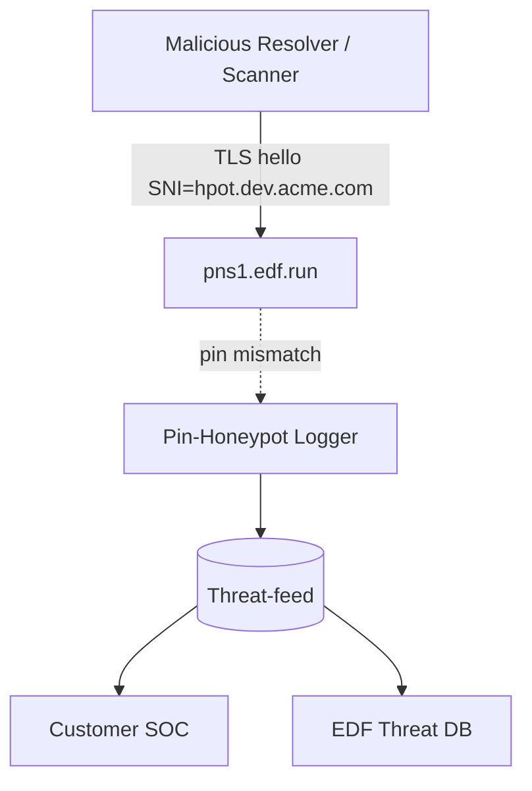
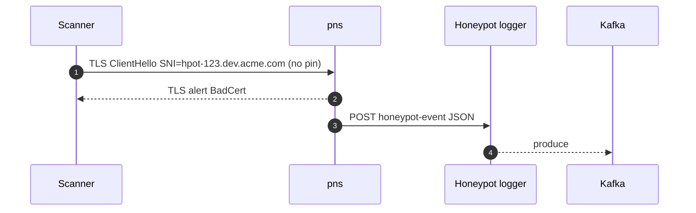

# 📘 **E1l – DoT Pinning Honeypot & Threat‑Intel (Design v0.1)**

> *Pivot on the certificate‑pin reporting hooks (E1k): we weaponise pin‑violation data as an early‑warning honeypot to detect scanners, red‑teamers, or malicious insiders probing vanity sub‑domains before they exist.*

---

## 1 ▪ WHY

| Motivation                                                                                                                 | Existing gap                                                                                        | Honeypot value                                                                                                                            |
| -------------------------------------------------------------------------------------------------------------------------- | --------------------------------------------------------------------------------------------------- | ----------------------------------------------------------------------------------------------------------------------------------------- |
| Malicious actors may brute‑force or dictionary‑scan vanity labels (`*.dev.example.com`) looking for exploitable endpoints. | EDF currently sees queries only **after** legitimate tunnels exist; cannot spot recon before abuse. | By advertising **fake pins** for non‑existent zones and capturing mis‑pinned DoT handshakes, we detect enumeration attempts in real time. |
| Corporate IR/SOC teams want actionable intel on who’s probing internal namespaces.                                         | No native telemetry today.                                                                          | Pin‑violation reports include source IP & resolver ID ➜ feed into SIEM.                                                                   |
| Security research / marketing: publish quarterly “DNS tunnel threat” report.                                               | Not possible.                                                                                       | Position EDF as security‑first tunnel vendor.                                                                                             |

Success criterion: <1 % false positives; ability to attribute scanners within 30min of first touch.

---

## 2 ▪ WHAT (feature scope)

1. **Decoy sub‑zones**: for every customer private zone we auto‑create **N honeypot labels** (e.g., `hpot‑x123.ZONE`).
2. Each honeypot label has **invalid SPKI pin** published via the `/dot-pin` API (intentional mismatch).
3. If any resolver attempts DoT handshake **without** pin list (or with pin mismatch), our PNS drops but logs event.
4. **Reporting collector** aggregates events; tags as `type=honey_pot`.
5. Optional: return **bogus but instrumented A record** pointing to EDF sink service that captures HTTP headers.

---

## 3 ▪ HOW – data flow graph



*No legitimate client should ever speak to `hpot-*.zone`; any traffic == suspicious.*

---

## 4 ▪ Implementation details

### 4.1 Decoy generation

```rust
fn gen_honeypots(zone_id: u8, n: u8) -> Vec<String> {
    (0..n).map(|i| format!("hpot-{:02x}.{}", rand_u16(), zone_domain(zone_id))).collect()
}
```

*Defaults: `n=10` per private zone; TTL 1 h; rotated daily.*

### 4.2 Invalid pin strategy

*Publish *fake* SHA‑256 that doesn’t match any real key → any strict‑pin resolver will immediately fail handshake.*
\*Casual scanners that don’t pin proceed; hub then returns NXDOMAIN or 444.

### 4.3 Logger path (rustls server callback)

```rust
match pin_verify(result) {
   Ok(()) => continue,
   Err(PinMismatch) if sni.starts_with("hpot-") => {
        log_honeypot(zone_id, sni, client_ip, presented_fp);
        return Err(Alert::BadCertificate);
   },
}
```

*`log_honeypot` pushes JSON to Kafka topic `edf.hpot.events`.*

### 4.4 Event schema

```json
{
  "ts": "2025-07-04T15:20:31Z",
  "zone": "dev.acme.com",
  "sni": "hpot-9ab2.dev.acme.com",
  "client_ip": "203.0.113.55",
  "resolver_id": "corp-dns-03",
  "presented_fp": "ee32bf..."
}
```

### 4.5 Customer opt‑in

*ZoneConfig flag `honeypot=true` (default *on* for private zones, off for public).*  GDPR note: IP is pseudonymous data ➜ include in DPA.

---

## 5 ▪ Sequence diagram



---

## 6 ▪ Alerting & dashboards

| Metric                    | Alert                                                     |
| ------------------------- | --------------------------------------------------------- |
| `hpot_events_total{zone}` | >50 in 10 min = severity=high (possible mass enumeration) |
| `distinct_client_ip`      | sudden spike triggers anomaly detection                   |

Customers can stream topic to Splunk/Elastic; EDF keeps long-term aggregate for “Threat report”.

---

## 7 ▪ Deliverables

* [ ] Honeypot label generator + etcd row.
* [ ] rustls pin‑verify callback hooks.
* [ ] `edf-hpot-collector` micro‑service (axum + kafka).
* [ ] Grafana dashboard panel per zone.
* [ ] Docs & GDPR note.

---

# 📗 **E1l – DoT Pinning Honeypot & Threat‑Intel**
*Sub-Epic → User-story breakdown (v0.1)*

Deploys a decoy DoT endpoint advertising **bogus SPKI pins** to lure on‑path TLS‑stripping attackers or mis‑configured corporate middleboxes.  Captured connections feed an abuse–IP intelligence pipeline that automatically blocks, rate‑limits, or flags accounts exhibiting suspicious behaviour.

---

## Epic Goal
> “Detect and respond to Man‑In‑The‑Middle attempts against FleetingDNS DoT by operating a pin‑mismatch honeypot, analysing fingerprints, enriching with Geo/IP data, and shipping actionable threat intel to EdgeHub fire‑wall tables within 10minutes.”

---

## 🗂️ Story List
| ID | Story | Outcome |
|----|-------|---------|
| **E1l‑S1** | As a *Security engineer*, stand up a **honeypot DoT endpoint** (`badpin.fleetingdns.run`) presenting a valid cert but **unsigned SPKI**. |
| **E1l‑S2** | As *Threat‑Intel*, log **client hello fingerprints & SNI** of any connection that proceeds despite pin mismatch. |
| **E1l‑S3** | As *Abuse automation*, push offending **source IP / ASN** to Redis `abuse:set` and propagate to EdgeHub eBPF block‑list. |
| **E1l‑S4** | As *Ops*, enrich events with **MaxMind GeoIP + GreyNoise** reputation and display in security dashboard. |
| **E1l‑S5** | As *Compliance*, export anonymised intel feed to **MISP/STIX** for community sharing every 24h. |
| **E1l‑S6** | As *SRE*, alert if honeypot hits >100/min (possible widespread MITM) or if known customer CIDR appears. |

---

## E1l‑S1 — Honeypot Endpoint Deployment
**Tasks**
1. Allocate DNS `badpin.fleetingdns.run` → LB same anycast IP but different **TLS cert key pair**.
2. Serve DoT on TCP853 with **rustls**; intentionally omit pin from `/v1/dot/pins`.
3. Run in isolated k8s namespace `honeypot-dot` (no internal services).

**Functional**
* Legit clients with embedded pins will reject connection (verify in integration test).
* Only mis‑configured or malicious middleboxes proceed and send queries. |

**Non‑Functional**
* Service CPU <50m.
* No route back into production pods (NetworkPolicy default‑deny). |

---

## E1l‑S2 — Fingerprint Collection
**Tasks**
1. Capture TLS ClientHello via **rustls callback**; extract JA3 hash, SNI, ALPN.
2. Log JSON to **Cloud Pub/Sub** topic `dot‑honeypot`.
3. Strip query payload; collect only metadata. |

**Functional**
* Event JSON: `{ts, ip, ja3, sni, country, asn}`.
* Pseudonymise IP (hash last /24 for GDPR). |

**Non‑Functional**
* Event size ≤200B.
* Throughput sustain 1k events/s without loss. |

---

## E1l‑S3 — Abuse Propagation Pipeline
**Tasks**
1. Dataflow job aggregates events: count per IP per hour.
2. Threshold: >10 hits/hr → add to Redis `abuse:set ttl 7d`.
3. EdgeHub eBPF program reads set every 5min → drops packets. |

**Functional**
* Block active within 10min of detection.
* Redis set capped 100k entries (LRU). |

**Non‑Functional**
* False‑block rate <0.01%.
* Expiry auto‑removes IP after 7days. |

---

## E1l‑S4 — Threat Enrichment Dashboard
**Tasks**
1. CloudFunction enrich event with **MaxMind ASN, Geo, GreyNoise “noise” flag**.
2. Push to BigQuery `honeypot_events`.
3. Grafana JSON datasource panel & map visual. |

**Functional**
* Dashboard shows top ASNs, countries, time‑series.
* Supports drill‑down to raw event. |

**Non‑Functional**
* Enrichment latency <2s.
* Dashboard loads <5s for 1million rows. |

---

## E1l‑S5 — MISP/STIX Export
**Tasks**
1. Nightly Cloud Run job queries events where score >0.8.
2. Build STIX `ipv4‑addr` objects; bundle; POST to `https://misp.fdns.net/events/add`.
3. Publish changelog in security RSS feed. |

**Functional**
* Export contains only de‑identified IP / ASN / JA3.
* 200 OK response logged. |

**Non‑Functional**
* Job runtime <3min.
* InfoSec admin approves first export (manual). |

---

## E1l‑S6 — Alerting & Safety Nets
**Tasks**
1. Prometheus rule `rate(honeypot_hits_total[5m]) > 100`.
2. PagerDuty “Possible MITM epidemic”.
3. If source CIDR matches known customer, open internal Jira ticket rather than block. |

**Functional**
* Alert fires within 2min of surge.
* Customer ticket contains instructions to check TLS‑intercept appliances. |

**Non‑Functional**
* False positive <1 / quarter.
* Blocklist excludes customer CIDR allow‑list. |

---

©2025FleetingDNS — DoT Pinning Honeypot & Threat‑Intel stories

