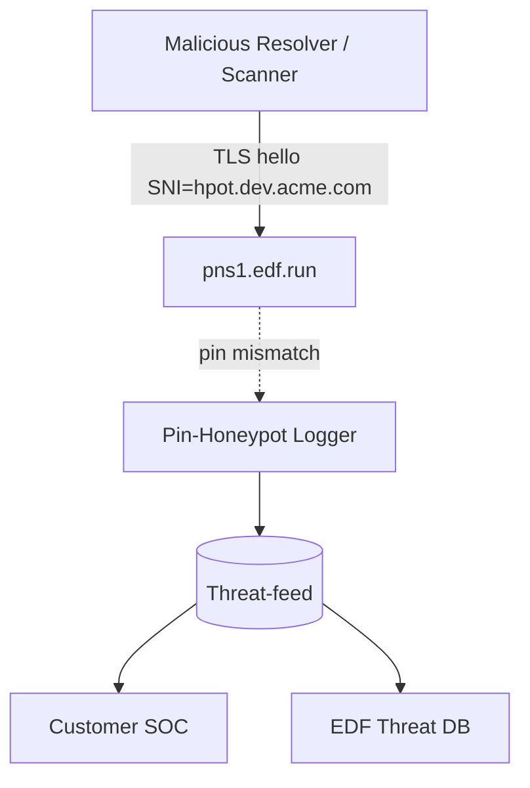
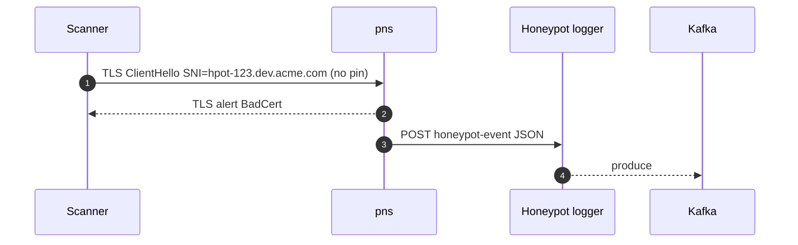

# 📘 **E1l – DoT Pinning Honeypot & Threat‑Intel (Design v0.1)**

> *Pivot on the certificate‑pin reporting hooks (E1k): we weaponise pin‑violation data as an early‑warning honeypot to detect scanners, red‑teamers, or malicious insiders probing vanity sub‑domains before they exist.*

---

## 1 ▪ WHY

| Motivation                                                                                                                 | Existing gap                                                                                        | Honeypot value                                                                                                                            |
| -------------------------------------------------------------------------------------------------------------------------- | --------------------------------------------------------------------------------------------------- | ----------------------------------------------------------------------------------------------------------------------------------------- |
| Malicious actors may brute‑force or dictionary‑scan vanity labels (`*.dev.example.com`) looking for exploitable endpoints. | EDF currently sees queries only **after** legitimate tunnels exist; cannot spot recon before abuse. | By advertising **fake pins** for non‑existent zones and capturing mis‑pinned DoT handshakes, we detect enumeration attempts in real time. |
| Corporate IR/SOC teams want actionable intel on who’s probing internal namespaces.                                         | No native telemetry today.                                                                          | Pin‑violation reports include source IP & resolver ID ➜ feed into SIEM.                                                                   |
| Security research / marketing: publish quarterly “DNS tunnel threat” report.                                               | Not possible.                                                                                       | Position EDF as security‑first tunnel vendor.                                                                                             |

Success criterion: <1 % false positives; ability to attribute scanners within 30min of first touch.

---

## 2 ▪ WHAT (feature scope)

1. **Decoy sub‑zones**: for every customer private zone we auto‑create **N honeypot labels** (e.g., `hpot‑x123.ZONE`).
2. Each honeypot label has **invalid SPKI pin** published via the `/dot-pin` API (intentional mismatch).
3. If any resolver attempts DoT handshake **without** pin list (or with pin mismatch), our PNS drops but logs event.
4. **Reporting collector** aggregates events; tags as `type=honey_pot`.
5. Optional: return **bogus but instrumented A record** pointing to EDF sink service that captures HTTP headers.

---

## 3 ▪ HOW – data flow graph



*No legitimate client should ever speak to `hpot-*.zone`; any traffic == suspicious.*

---

## 4 ▪ Implementation details

### 4.1 Decoy generation

```rust
fn gen_honeypots(zone_id: u8, n: u8) -> Vec<String> {
    (0..n).map(|i| format!("hpot-{:02x}.{}", rand_u16(), zone_domain(zone_id))).collect()
}
```

*Defaults: `n=10` per private zone; TTL 1 h; rotated daily.*

### 4.2 Invalid pin strategy

*Publish *fake* SHA‑256 that doesn’t match any real key → any strict‑pin resolver will immediately fail handshake.*
\*Casual scanners that don’t pin proceed; hub then returns NXDOMAIN or 444.

### 4.3 Logger path (rustls server callback)

```rust
match pin_verify(result) {
   Ok(()) => continue,
   Err(PinMismatch) if sni.starts_with("hpot-") => {
        log_honeypot(zone_id, sni, client_ip, presented_fp);
        return Err(Alert::BadCertificate);
   },
}
```

*`log_honeypot` pushes JSON to Kafka topic `edf.hpot.events`.*

### 4.4 Event schema

```json
{
  "ts": "2025-07-04T15:20:31Z",
  "zone": "dev.acme.com",
  "sni": "hpot-9ab2.dev.acme.com",
  "client_ip": "203.0.113.55",
  "resolver_id": "corp-dns-03",
  "presented_fp": "ee32bf..."
}
```

### 4.5 Customer opt‑in

*ZoneConfig flag `honeypot=true` (default *on* for private zones, off for public).*  GDPR note: IP is pseudonymous data ➜ include in DPA.

---

## 5 ▪ Sequence diagram



---

## 6 ▪ Alerting & dashboards

| Metric                    | Alert                                                     |
| ------------------------- | --------------------------------------------------------- |
| `hpot_events_total{zone}` | >50 in 10 min = severity=high (possible mass enumeration) |
| `distinct_client_ip`      | sudden spike triggers anomaly detection                   |

Customers can stream topic to Splunk/Elastic; EDF keeps long-term aggregate for “Threat report”.

---

## 7 ▪ Deliverables

* [ ] Honeypot label generator + etcd row.
* [ ] rustls pin‑verify callback hooks.
* [ ] `edf-hpot-collector` micro‑service (axum + kafka).
* [ ] Grafana dashboard panel per zone.
* [ ] Docs & GDPR note.

---

©2025 Ephemeral DNS Forwarder — DoT Pin Honeypot
