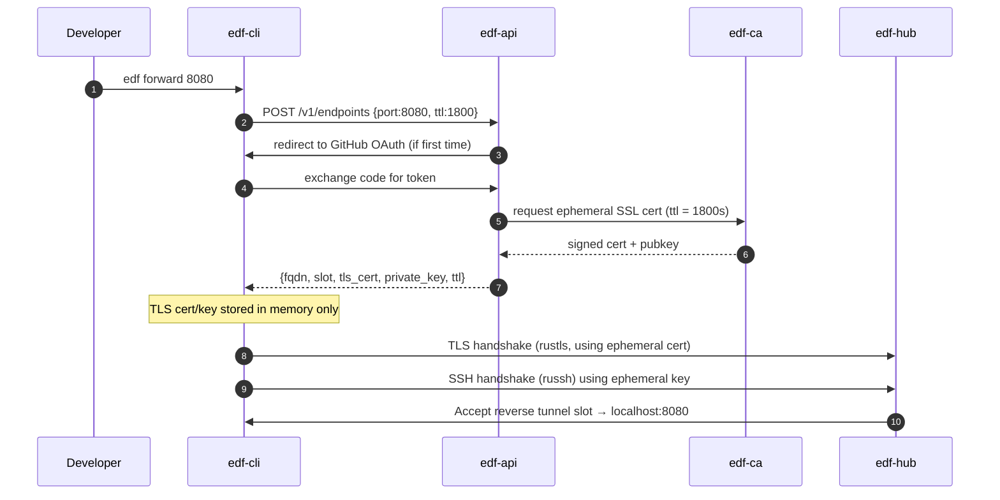

# 📘 E2 – Tunnel Server & CLI (Design v0.2)

> **⚠️ STATUS (2026-07-17): PARTIALLY DEPRECATED.** The tunnel data-plane stories are now
> maintained in `docs/engineering/stories_detailed/E2_E3_tunnel_data_plane_user_stories_v0.3.md`,
> which is authoritative. Known divergences between this design and the as-built system:
>
> - **No TLS-wrapped SSH**: the hub accepts plain SSH on :2222. TLS wrapping is backlog (D-7).
> - **No HTTP2 edge→hub stream**: the edge raw-splices TCP to `127.0.0.1:<slot>` (D-3).
> - **No GitHub OAuth, no ephemeral client cert on the TLS handshake, no SSH compression**
>   in the live path (D-7). The "Security Guarantees" section below does NOT hold today.
> - **Keep-alive is unimplemented** and the current CLI self-disconnects idle sessions after
>   30 s — see story TDP-11 (D-6).
> - The control-plane story list (E2-S1…S7) at the bottom of this file remains valid.

## 🧭 Overview

This document defines the design of the **Tunnel Server and CLI** for FleetingDNS. It establishes the secure reverse tunnel layer between the developer’s local machine or CI job and the cloud edge infrastructure, using **TLS-wrapped SSH with compression**, entirely implemented in **Rust** using `russh`, `tokio`, and `rustls`.

The tunnel allows ephemeral subdomains (e.g. `abc123.edf.run`) to route back to a developer’s local port, for integration testing of external webhooks, OAuth, or multi-tenant logic.

---

## 🎯 Objectives

* Create secure, ephemeral reverse tunnels from user machine to FDF hub
* TLS-wrap SSH sessions for strong encryption and ingress defense
* Support SSH-level compression to reduce cloud traffic
* Enforce client identity verification via GitHub authentication
* Use session-scoped ephemeral SSL client certificates for authorization

---

## 🔒 Security Principles

* **TLS outer layer** wraps all SSH traffic to make it indistinguishable from HTTPS
* **SSH inner layer** uses Ed25519 keypair per session (issued via API)
* **Compression** negotiated at SSH level (e.g., `zlib@openssh.com`)
* **Client authentication** tied to GitHub OAuth login with signed token
* **Ephemeral SSL certificate** is issued for the tunnel session (not written to disk)
* **PKI infrastructure** signs ephemeral certs per session
* **Ephemeral system user** used for SSH tunnel; no shell access or login capability

---

## 🔧 Architecture Summary

| Component  | Role                                                         |
| ---------- | ------------------------------------------------------------ |
| `edf-cli`  | CLI binary initiating the reverse tunnel from user’s machine |
| `edf-hub`  | SSH-over-TLS listener accepting reverse tunnels on port 443  |
| `edf-edge` | HTTP router speaking to hub over HTTP2 multiplexed stream    |
| `edf-api`  | Authenticates client via GitHub, generates cert + SSH keys   |
| `edf-ca`   | Rust PKI component signing ephemeral client certificates     |

---

## 🔄 Sequence – CLI Startup Flow



---

## 📦 Data Structures

```rust
struct TunnelSession {
  pub fqdn: String,
  pub slot: u16,
  pub pubkey: Vec<u8>,
  pub cert: Vec<u8>,
  pub private_key: EphemeralKey, // memory-only keypair
  pub expires_at: DateTime<Utc>,
  pub github_id: String,
}
```

---

## 🔐 TLS + SSH Wrapping Design

* CLI uses `rustls::ClientConnection` and connects to `edf-hub` on port 443
* The TLS handshake uses the **ephemeral client certificate** (valid for 30 mins)
* The certificate is signed by our internal **edf-ca** PKI
* SSH handshake occurs inside the TLS stream, authenticated via ephemeral Ed25519 key
* SSH is run as an **ephemeral non-login user**, restricted to reverse port-forward only

### Benefits

* TLS-wrapped SSH traffic hides protocol and enables fine-grained cert control
* Short-lived cert + key reduces risk if intercepted
* Prevents CLI from ever gaining shell access to `edf-hub` host

---

## 🗜️ SSH Compression

* SSH layer uses `zlib@openssh.com`
* `russh` negotiates compression during key exchange
* CLI activates compression for all reverse forwarded channels
* Saves bandwidth for webhook-heavy or API-testing tunnels

---

## 🔁 Keep-Alive & Expiry

* Keep-alive: CLI sends `SSH_MSG_GLOBAL_REQUEST keepalive@edf`
* Expiry:

    * TLS cert expires at `expires_at`
    * SSH session is closed by hub once `now() >= expires_at`
    * CLI logs expiration, exits cleanly

---

## 🧾 Logging and Cert Transparency

* Cert metadata is logged (subject, issuer, fingerprint) to local CLI log file
* Private key is held in memory only (heap-backed `EphemeralKey` wrapper)
* No cert, key, or sensitive token is ever written to disk

---

## 📁 Code Responsibilities

| Crate     | Module              | Responsibility                                         |
| --------- | ------------------- | ------------------------------------------------------ |
| `edf-cli` | `cli::tunnel`       | Memory-only TLS+SSH session init, key mgmt, port proxy |
| `edf-api` | `api::auth`         | GitHub OAuth handshake, session token issuance         |
| `edf-ca`  | `ca::signer`        | Issue TLS cert signed for `edf-hub` CN + expiry        |
| `edf-hub` | `hub::tls_acceptor` | TLS termination, cert fingerprint verification         |

---

## 🧪 Testing Plan

* [ ] CLI startup flow including GitHub login and cert request
* [ ] Validate TLS handshake with cert fingerprint enforcement
* [ ] Simulate expiry and verify auto shutdown
* [ ] Ensure key/cert never touch disk (memory inspection)

---

## ✅ Deliverables for E2 Completion (Expanded)

* [ ] GitHub auth via CLI + API + OAuth redirect
* [ ] Ephemeral SSL cert issuance and verification
* [ ] TLS-wrapped SSH reverse tunnel with compression
* [ ] No login access granted to any system user
* [ ] Integration test verifying SNI route ⇄ local port

---

## 🔐 Summary Security Guarantees

* One-time-use TLS cert per session
* GitHub identity gating via OAuth
* No shell / user login possible
* In-memory-only private key handling

---

# 📗 **E2 – Tunnel API & Control‑Plane**
*Epic → User‑story breakdown (v0.1)*

This epic covers the Rust REST+gRPC service (`api-gateway` crate) that issues tunnels, signs short‑lived certs, stores slot metadata in Redis, enforces quotas, and feeds EdgeHub.

---

## Epic Goal
> “Expose a secure, multi‑tenant API that developers (CLI, SDK, CI) call to create, inspect, and revoke tunnels. It must mint 30‑minute mTLS/WireGuard creds, respect rate‑limits per plan, push events to Stripe webhooks, and run statelessly atop Redis + Postgres.”

---

## 🗂️ Story List
| ID        | Story                                                                                              | Outcome |
|-----------|----------------------------------------------------------------------------------------------------|---------|
| **E2‑S1** | As a *CLI user*, **POST /v1/tunnels** and receive `fqdn`, `expires_at`, creds JSON.                |
| **E2‑S2** | As an *SDK maintainer*, query **/v1/plans/{token}** to know plan limits (tunnel TTL, concurrency). |
| **E2‑S3** | As *Billing system*, receive **Webhook event** `tunnel.created`, `tunnel.closed`.                  |
| **E2‑S4** | As *EdgeHub*, fetch **slot metadata** (`GET /v1/slots/{id}`) for debugging & TXT record.           |
| **E2‑S5** | As *SecOps*, rate‑limit API per token & IP; 429 on abuse.                                          |
| **E2‑S6** | As *CLI user*, **DELETE /v1/tunnels/{id}** to tear down early.                                     |
| **E2‑S7** | As *Admin*, list active tunnels per plan via **/v1/admin/tunnels?plan=team** (JWT admin).          |

---

### Story template below
---

## E2‑S1 — Create Tunnel Endpoint
**Tasks**
1. Define OpenAPI schema (`openapi.yaml`).
2. Implement `POST /tunnels` in axum handler.
3. Generate HMAC label, slot row in Redis, short‑lived cert via `ca_service`.
4. Unit tests + integration test with `edf-cli`.

**Functional Reqs**
* Accepts JSON `{mode, ttl, meta}`; returns 201 with `fqdn`, `expires_at`, `cert_pem`, `private_key` (base64).
* Writes `slot:{id}` hash in Redis with TTL = `ttl+60s`.

**Non‑Functional**
* p95 latency < 60 ms (including cert sign).
* Redis write failure returns 503; no partial state.

---

## E2‑S2 — Plan Lookup
**Tasks**
1. Add `/plans/{token}` route.
2. Cache plan policy in Redis (24 h).
3. Integrate with Stripe subscription lookup.

**Functional**
* Returns `max_ttl`, `daily_quota`, `rate_rps`.
* 404 if token invalid or revoked.

**Non‑Functional**
* Cached read miss < 10 %.
* External Stripe call timeout 500 ms.

---

## E2‑S3 — Webhook Events
**Tasks**
1. Fire event to Stripe `usage_record` API on tunnel create/close.
2. Fan‑out internal Pub/Sub topic for analytics.

**Functional**
* At least‑once delivery; retries 5× with backoff.
* Payload JSON includes `plan_id`, `bytes_tx`, `duration`.

**Non‑Functional**
* Event backlog queue depth < 1 000.
* Lost event < 0.01 % month.

---

## E2‑S4 — Slot Metadata Endpoint
**Tasks**
1. Add `/slots/{id}` (GET) with JWT auth `aud=edgehub`.
2. Returns JSON used for TXT record.

**Functional**
* Returns 200 if slot in Redis; 404 if expired.
* Field `cluster_id` must match EdgeHub requesting.

**Non‑Functional**
* Latency < 5 ms (same region).
* Auth failure < 0.1 % legitimate calls.

---

## E2‑S5 — Rate Limiting Middleware
**Tasks**
1. Integrate `tower::limit::ConcurrencyLimitLayer`.
2. Key = token+IP; config from plan.
3. Return `429` with `Retry‑After` header.

**Functional**
* Enforces burst+RPS per plan table.
* `X‑RateLimit‑Remaining` header returned.

**Non‑Functional**
* Overhead < 2 µs per request.
* Memory footprint < 10 MiB (dashmap buckets).

---

## E2‑S6 — Delete Tunnel
**Tasks**
1. Implement `DELETE /tunnels/{id}`; soft delete.
2. EdgeHub listens Redis keyspace‑notifications to close socket.

**Functional**
* Returns 204 if successful; idempotent.
* Redis TTL immediately set to 1s.

**Non‑Functional**
* Full teardown < 2 s observed.
* No orphan sockets > 5 min.

---

## E2‑S7 — Admin‑List Endpoint
**Tasks**
1. JWT middleware for admin scope.
2. `GET /admin/tunnels?plan=` query; stream JSON.
3. Pagination via cursor.

**Functional**
* Supports `cursor` param; default page 100.
* Response includes `plan_id`, `ip`, `created_at`.

**Non‑Functional**
* Query time < 100 ms for 5 k tunnels.
* Authz error returns 403.

---

© 2025 FleetingDNS — Tunnel API stories

