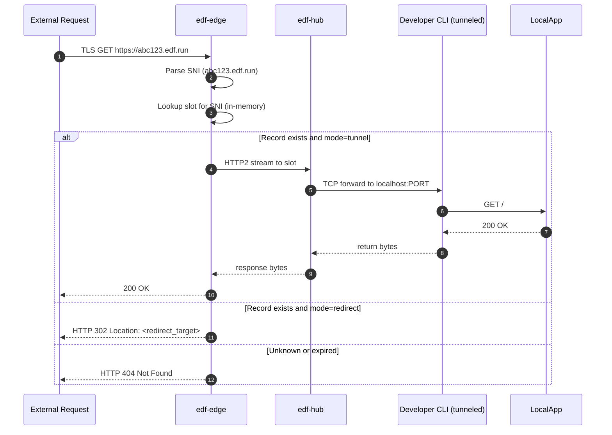

# 📘 E3 – Edge Proxy (Design v0.1)

> **⚠️ STATUS (2026-07-17): PARTIALLY DEPRECATED.** Authoritative stories now live in
> `docs/engineering/stories_detailed/E2_E3_tunnel_data_plane_user_stories_v0.3.md`.
> Divergences from the as-built system:
>
> - **E3-S1 is DEPRECATED (D-1)**: it specifies `direct-tcpip` — the local-forwarding
>   primitive, and the root cause of the S1 reverse-tunnel outage (see
>   `POSTMORTEM-reverse-tunnel-connectivity.md` §5). The live implementation uses
>   `tcpip-forward` + `forwarded-tcpip` (story TDP-1). Do not implement from E3-S1.
> - **E3-S2 is CORRECTED (D-2)**: no Unix sockets, no etcd. Routing is SNI (sniffed from
>   the ClientHello before handshake) → Redis subdomain→slot → TCP splice to
>   `127.0.0.1:<slot>` (story TDP-2).
> - **E3-S3 is SUPERSEDED (D-5)** by session-grant cookie gating (FR-EDGE-3, story TDP-5).
> - **E3-S4, E3-S5, E3-S6 remain valid** and are not started.

## 🧭 Overview

The **Edge Proxy** (`edf-edge`) is responsible for accepting incoming traffic from the public internet over HTTPS and routing it to the correct tunnel slot within the `edf-hub`. It is designed to operate securely, efficiently, and with zero configuration for end users.

### Key Responsibilities

* Terminate TLS for ephemeral subdomains (e.g. `abc123.edf.run`)
* Inspect SNI / Host header to determine the associated slot
* Forward TCP/HTTP traffic to the correct active tunnel in the hub
* Optionally perform HTTP 302/308 redirect if the endpoint is configured in `redirect` mode
* Rate-limit and reject unknown or expired endpoints

---

## 🎯 Objectives

* Provide reliable and low-latency HTTPS termination
* Route to correct reverse tunnel session
* Ensure security with SNI validation and denial of invalid endpoints
* Avoid overhead: never hit disk, never spawn subprocesses

---

## 🌐 Components Involved

| Component  | Role                                                |
| ---------- | --------------------------------------------------- |
| `edf-edge` | Accepts TLS connections, routes to hub via stream   |
| `edf-hub`  | Maintains active tunnel slots and TCP channels      |
| `etcd`     | Optional fallback for slot lookup (edge cache miss) |
| `edf-api`  | Controls TTL expiry, issues/tears down slots        |

---

## 🔄 Sequence – Incoming Request Flow



---

## 🔐 TLS Termination (rustls)

* Uses wildcard TLS cert for `*.edf.run`
* TLS implemented in-process via `rustls`
* Supports ALPN negotiation and modern cipher suites only (TLS 1.3)
* SNI extracted directly from TLS stream for routing

### Session Reuse

* TLS sessions are stored in ephemeral in-memory cache for improved performance
* No session state written to disk

---

## 🗃️ Slot Resolution & Routing

* `edf-edge` maintains a cache: `{fqdn → slot}` with expiration
* On cache miss:

    * Queries `etcd` for `/dns/{fqdn}`
    * Parses slot and TTL
    * Caches result until expiry
* Resolved slot is used to multiplex into hub over HTTP2

---

## 🧭 Routing Modes

| Mode       | Behavior                                    |
| ---------- | ------------------------------------------- |
| `tunnel`   | Forward raw TCP stream to hub → tunnel slot |
| `redirect` | Respond with HTTP 302/308 to `redirect_url` |

---

## 📁 Data Structures

```rust
struct ResolvedEndpoint {
  pub fqdn: String,
  pub mode: EndpointMode,  // Tunnel or Redirect
  pub slot: Option<u16>,
  pub redirect_to: Option<String>,
  pub expires_at: DateTime<Utc>
}
```

---

## 🛡️ Security Features

* TLS enforced (port 80 optionally closed or redirected to 443)
* No fallback to HTTP; no plaintext option
* Rejects all requests without valid tunnel or expired endpoint
* Requests per IP rate-limited (e.g., 100 RPM default)
* Logs structured trace with `tracing::info_span`

---

## 📊 Observability & Metrics

* Histogram: request duration (by SNI)
* Counter: 2xx / 3xx / 4xx / 5xx responses
* Gauge: active slots
* Log: SNI, slot, method, response time, status

---

## ✅ Deliverables for E3 Completion

* [ ] TLS listener with SNI routing and HTTP2 tunnel support
* [ ] Per-SNI slot cache with TTL logic
* [ ] Functional 302 redirect mode with CLI option to enable
* [ ] Connection stream between edge and hub, routed by slot
* [ ] Edge test harness simulating incoming HTTPS traffic

---

## 🔮 Future Enhancements

* Static asset fallback (serve HTML page for known endpoints)
* Wildcard sub-subdomain routing (e.g., `tenant1.abc123.edf.run`)
* Country-based firewall rules

---

# 📗 **E3 – Edge Proxy**
*Epic → User-story breakdown (v0.1)*

Edge Proxy is the **EdgeHub data‑plane module** that terminates client tunnels (TLS‑wrapped SSH or WireGuard), validates certs, enforces auth/redirect policies, compresses traffic, and forwards streams to the developer’s reverse‑tunnel socket.

---

## Epic Goal
> “Accept public traffic on anycast IP, validate short‑lived client credentials, multiplex compressed TCP streams to the correct reverse tunnel, and expose metrics for billing — all within 1 ms added latency.”

---

## 🗂️ Story List
| ID        | Story                                                                                        | Outcome |
|-----------|----------------------------------------------------------------------------------------------|---------|
| **E3-S1** | As a *tunnel client*, initiate **TLS‑wrapped SSH** to edge and get a working reverse tunnel. |
| **E3-S2** | As *EdgeHub*, decode `fqdn` label → Redis slot and **route traffic** to correct Unix socket. |
| **E3-S3** | As a *dev*, enable **HTTP Basic Auth / redirect** so only test harness can hit my tunnel.    |
| **E3-S4** | As a *Finance team*, count **bytes in/out** per tunnel for billing.                          |
| **E3-S5** | As *NetOps*, compress traffic with **zstd** when `accept‑encoding: zstd` to save egress.     |
| **E3-S6** | As *SRE*, have **K8s HPA / Flagger Canary** rules for Edge pod autoscale + health checks.    |

---

## ~~E3-S1 — TLS‑SSH Handshake~~ **DEPRECATED (D-1)**

> Uses the wrong SSH primitive (`direct-tcpip`). Replaced by TDP-1 in
> `stories_detailed/E2_E3_tunnel_data_plane_user_stories_v0.3.md`. Retained for history only.

**Tasks**
1. Implement listener on port 443 in `edge-hub/src/tls_ssh.rs`.
2. Use `tokio-rustls` server config with **client‑cert auth required**.
3. On handshake, extract `tunnel_id` from cert SAN.

**Functional Requirements**
* Accepts TLS 1.3 only; certificate chain must be signed by in‑house CA & notExpired.
* Upgrades to OpenSSH `direct‑tcpip` reverse tunnel over same connection.

**Non-Functional**
* p95 handshake < 50 ms (including TLS).
* Reject invalid certs with alert `bad_certificate`.

---

## E3-S2 — Slot Router **(CORRECTED — see D-2 / TDP-2)**

> As built: SNI from ClientHello (not `:authority`), Redis tunnel record (no etcd), TCP splice
> to `127.0.0.1:<slot>` (no Unix sockets). Task list below is historical.

**Tasks**
1. Parse incoming `:authority` / SNI host → label.
2. Validate HMAC with shared key.
3. Lookup `slot:{id}` in Redis; retrieve Unix socket path.
4. Proxy bytes bidirectionally (`tokio::io::copy_bidirectional`).

**Functional**
* 404 (HTTP) or `Channel open failure` (SSH) if slot missing/expired.
* Close connection when Redis key TTL <= 0.

**Non-Functional**
* Added latency per packet ≤ 1 ms.
* Concurrent sockets per pod ≥ 2 000.

---

## E3-S3 — Basic Auth & Redirect Mode
**Tasks**
1. Add `--auth=basic|none|oidc` flag.
2. For basic: read `Authorization` header, compare bcrypt hash from Redis slot metadata.
3. For redirect‑only: respond 302 to `location:` set in metadata.

**Functional**
* CLI receives `basic_user`/`basic_pass` JSON when requesting tunnel.
* Edge returns `401` if creds missing/wrong.

**Non-Functional**
* Hash comparison constant‑time.
* Redirect preserves query params.

---

## E3-S4 — Byte Accounting Metrics
**Tasks**
1. Wrap proxy streams in `ByteMeter` struct counting IN and OUT.
2. Push to Redis `HINCRBY slot:{id} tx_bytes rx_bytes` every 5 s.
3. On slot expiry, push usage record to Stripe via API.

**Functional**
* Accuracy ±1 % compared to tcpdump sample.
* Stripe usage record includes plan_id.

**Non-Functional**
* Meter overhead < 5 µs per flush.
* Redis pipeline batch keeps updates <500 ops/s.

---

## E3-S5 — zstd Compression
**Tasks**
1. Detect `accept-encoding: zstd`.
2. Wrap stream in `zstd::stream::Encoder` / `Decoder`.
3. Add `--compression-threshold=16k` flag.

**Functional**
* Throughput gain >30 % at compression ratio >1.3.
* Falls back gracefully if header absent.

**Non-Functional**
* CPU overhead < 5 % at 100 Mbps.
* Latency budget increase < 2 ms for compressed path.

---

## E3-S6 — Autoscaling & Health Probes
**Tasks**
1. Add liveness `/healthz` and readiness `/readyz`.
2. Define Flagger Canary metrics (p95 < 200 ms, 5xx <2 %).
3. HPA: scale pods 1→8 on `connections_per_pod > 1 000`.

**Functional**
* Pod ready in < 5 s.
* Canary rollback on failed metrics.

**Non-Functional**
* Scale‑up time < 30 s to add pod.
* No dropped connections during rollout.

---

© 2025 FleetingDNS — Edge Proxy stories

