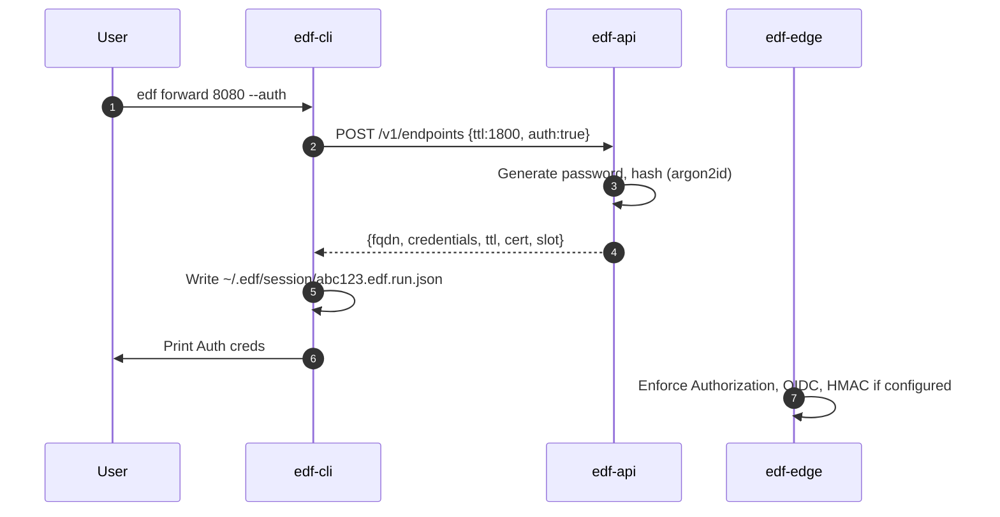

# 📘 E4 – Basic Auth, Redirect, and Auth Modes (Design v0.2)

## 🧭 Overview

This design document defines the behavior and implementation of optional **Basic Authentication**, **HTTP Redirect Mode**, **HMAC Signature Verification**, and **OIDC-based token validation** for FleetingDNS (FDF) endpoints. These features enable fine-grained control over who can access ephemeral endpoints and how the identity of callers is verified.

---

## 🎯 Objectives

* Allow users to optionally protect their endpoint using Basic Auth
* Support HTTP redirect mode with authentication
* Add webhook HMAC validation support
* Allow users to configure OIDC token validation from a provider they control
* Ensure CLI-generated credentials can be programmatically consumed

---

## 🔐 Basic Auth

### Behavior

* On endpoint creation, the backend API issues a unique Basic Auth `username:password` pair per session if requested
* Passwords are hashed with Argon2id and stored in etcd
* `edf-edge` enforces validation of HTTP `Authorization: Basic` headers
* On failure, returns `401 Unauthorized` with `WWW-Authenticate`

### CLI Integration

* When the user runs `edf forward`, the CLI:

    * Requests endpoint with `--auth` or default flag
    * Receives `{username, password}` in the response JSON
    * Writes the auth pair to disk (e.g. `~/.edf/session/<fqdn>.json`)
    * Displays one-time copy-paste credentials to stdout
* Fully automated CI jobs can parse this JSON for test setup

### Response Output

```json
{
  "fqdn": "abc123.edf.run",
  "ttl": 1800,
  "auth": {
    "username": "u7x82q",
    "password": "dkT9!qH0"
  }
}
```

---

## 🔁 Redirect Mode

See original E4. Still supports Basic Auth on redirect endpoints. Authentication is enforced before issuing 302/308.

---

## 🧾 HMAC Signature Validation

### Use Case

Some webhook providers (e.g., GitHub, Stripe) sign webhook requests using a shared secret and HMAC. We allow FDF users to define a `shared_secret` and an expected header name.

### Behavior

* User defines:

```json
{
  "hmac": {
    "secret": "my_shared_secret",
    "header": "X-Hub-Signature-256",
    "algo": "sha256"
  }
}
```

* `edf-edge` inspects inbound requests for matching header
* Computes HMAC using body and compares with constant-time equality
* On mismatch → `403 Forbidden`

---

## 🔓 OIDC Token Validation (Advanced)

### Use Case

A user running a secure test environment may wish to enforce OAuth2/OIDC token validation using their existing identity provider (e.g., Auth0, Google Workspace).

### Behavior

* User provides:

```json
{
  "oidc": {
    "issuer": "https://auth.mycompany.com",
    "audience": "edf",
    "alg": "RS256"
  }
}
```

* `edf-api` stores OIDC config under the endpoint metadata
* `edf-edge` fetches the provider’s JWKS and caches public keys
* For every request:

    * Validates `Authorization: Bearer <JWT>` header
    * Checks `iss`, `aud`, `exp`, and `sub` claims
    * Fails with `401` if token invalid or missing

### Configuration UI (Web Dashboard / API)

* A secure user dashboard allows users to configure accepted issuers, audiences, and toggle JWT enforcement per endpoint
* Endpoints can combine OIDC with Basic Auth and HMAC (all must pass)

---

## 🔄 Sequence – Tunnel Request with Auth Outputs



---

## ✅ Deliverables for E4 Completion (Expanded)

* [ ] Auth output via CLI and JSON file
* [ ] Argon2id credential hashing
* [ ] HMAC validation handler in edge router
* [ ] OIDC middleware in edge: JWKS cache, bearer token verification
* [ ] Web UI and API fields to configure OIDC and HMAC options per endpoint

---

## 🔐 Summary

| Auth Type   | Config Source               | Enforced By |
| ----------- | --------------------------- | ----------- |
| Basic Auth  | Auto-issued or user-defined | `edf-edge`  |
| HMAC Header | Shared secret + hash algo   | `edf-edge`  |
| OIDC JWT    | Issuer / audience config    | `edf-edge`  |

---

# 📗 **E4 – Authentication & Redirect Modes**
*Epic → User-story breakdown (v0.1)*

E4 layers access‑control on top of the Edge Proxy: Basic Auth, OIDC provider chaining, HMAC-signed webhook validation and per‑tunnel redirect policies.

---

## Epic Goal
> “Provide lightweight yet flexible authentication options (Basic, OIDC callback, HMAC header) and automatic redirect modes, so developers can secure tunnels during tests without external proxies.”

---

## 🗂️ Story List
| ID        | Story                                                                                                                 | Outcome |
|-----------|-----------------------------------------------------------------------------------------------------------------------|---------|
| **E4-S1** | As a *developer*, receive **Basic‑Auth creds** with tunnel response and protect my webhook endpoint.                  |
| **E4-S2** | As *QA*, configure **static 302 redirect** so hitting my tunnel bounces to a staging site.                            |
| **E4-S3** | As a *SaaS team*, request **HMAC-shared secret** so webhooks from FleetingDNS carry `X-EDF-Sig` header.               |
| **E4-S4** | As an *enterprise customer*, register **custom OIDC endpoint** (Auth0, Okta) so EdgeHub verifies JWT before proxying. |
| **E4-S5** | As *DevOps*, rotate Basic Auth + HMAC secrets automatically at tunnel TTL expiry.                                     |

---

## E4-S1 — Basic Auth Flow
**Tasks**
1. Extend Tunnel API to generate `basic_user`, `basic_pass` using `rand` crate.
2. Store bcrypt hash in Redis slot meta.
3. Edge Proxy middleware validates `Authorization` header.

**Functional**
* Client receives creds JSON `{auth: {user, pass}}`.
* Requests without / wrong creds get `401` with `WWW-Authenticate: Basic`.

**Non-Functional**
* Hash calc time constant ±5 %.
* Credential length 16 chars alphanum.

---

## E4-S2 — Static Redirect Mode
**Tasks**
1. Add `redirect_url` field in `/tunnels` request body.
2. Edge returns 302 for any HTTP request, Location=`redirect_url`.

**Functional**
* Redirect preserves original path + query.
* Works only for `mode=http` tunnels.

**Non-Functional**
* Redirect latency < 1 ms.
* Disallowed for raw TCP mode.

---

## E4-S3 — HMAC Header Validation
**Tasks**
1. Tunnel API issues `shared_hmac_key` (base64).
2. Edge attaches `X-EDF-Sig: hmac_sha256(body)` header.
3. CLI/SDK helper `verify_sig()`.

**Functional**
* Signature verified equals server‑side calc for body bytes.
* Key rotation when tunnel expires.

**Non-Functional**
* Added CPU < 3 µs per request @ 64 KB body.
* Header size 44 B.

---

## E4-S4 — Custom OIDC Provider
**Tasks**
1. Extend API `/users/{id}/oidc` to store provider metadata, JWKS URL.
2. Edge Proxy JWKS fetch & cache 5 min.
3. Validate `Authorization: Bearer` JWT on inbound request.

**Functional**
* 200 OK if token valid `aud=tunnel_id` & `exp>now`.
* 401/403 otherwise.

**Non-Functional**
* JWKS cache miss p95 ≤ 300 ms.
* Max token size 2 KB.

---

## E4-S5 — Secret Rotation & Cleanup
**Tasks**
1. Redis key TTL governs Basic/HMAC secret lifetime.
2. Edge Hub clears in‑memory cache on `keyspace:expired` event.
3. Stripe usage record includes bytes until expiry.

**Functional**
* Secrets invalid immediately after expiry (≤2 s).
* New tunnel get fresh secrets, not reused.

**Non-Functional**
* Memory leak < 1 KB per expired slot.
* Event loss tolerance: Edge polls Redis fallback every 30 s.

---

© 2025 FleetingDNS — Auth & Redirect stories

