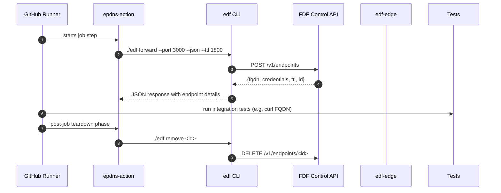

# 📘 E6 – CI Integration: GitHub Action (Design v0.1)

## 🧭 Overview

This document details the implementation and behavior of the official **GitHub Action for FleetingDNS** (`epdns-action`) that allows automated test pipelines to create ephemeral DNS endpoints using the FDF CLI. This ensures full lifecycle automation and guaranteed teardown of reverse tunnels when the CI job exits.

---

## 🎯 Objectives

* Seamlessly integrate FDF into CI workflows (GitHub Actions first)
* Provision and teardown ephemeral DNS + tunnel endpoints during a job
* Ensure teardown occurs on success or failure
* Support JSON output for further automated use (e.g., test scripts)

---

## 🧱 Components

| Component       | Role                                             |
| --------------- | ------------------------------------------------ |
| GitHub Action   | Wrapper around the `edf` CLI with inputs/outputs |
| `edf` CLI       | Provision DNS + tunnel session                   |
| `entrypoint.sh` | Internal action script for lifecycle control     |

---

## 🔁 Sequence – CI Tunnel Lifecycle



---

## 🔧 Action Inputs

```yaml
inputs:
  port:
    description: "Local port to forward"
    required: true
  ttl:
    description: "TTL in seconds (default: 1800)"
    required: false
  output:
    description: "File path to write JSON output"
    required: false
  auth:
    description: "Enable basic auth"
    default: true
```

---

## 📦 Action Output

```json
{
  "fqdn": "abc123.edf.run",
  "auth": {
    "username": "uabc",
    "password": "abc!123"
  },
  "expires_at": "2025-07-02T14:30:00Z",
  "id": "ep-f1a3b"
}
```

Written to `GITHUB_WORKSPACE/endpoint.json` or a user-specified path.

---

## 🛡️ Cleanup & Teardown

* Action implements a `post` hook using `post-entrypoint.sh`
* Uses stored `endpoint_id` to call `edf remove` upon job exit
* This ensures ephemeral tunnels never linger past job duration

---

## 📁 Project Layout (Dist)

```text
/.github/actions/epdns-action/
├── action.yml
├── entrypoint.sh
├── post-entrypoint.sh
├── Dockerfile
└── edf (CLI binary included)
```

---

## 🧪 Example Usage

```yaml
jobs:
  test:
    runs-on: ubuntu-latest
    steps:
      - uses: actions/checkout@v3
      - name: Setup FDF Tunnel
        uses: epdns/epdns-action@v1
        with:
          port: 3000
          ttl: 1200
          output: endpoint.json
      - name: Run Integration Tests
        run: |
          FQDN=$(jq -r .fqdn endpoint.json)
          curl https://$FQDN/healthz
```

---

## ✅ Deliverables for E6 Completion

* [ ] GitHub Action published to `epdns/epdns-action`
* [ ] Dockerfile with embedded CLI binary
* [ ] Lifecycle hook for teardown (post)
* [ ] Full usage example with GitHub Actions + `jq` + test script
* [ ] README + badges + action.yml metadata

---

## 🔮 Future Enhancements

* Support matrix testing with multiple endpoints
* Auto-detect port from `dev.yml` or `docker-compose.yml`
* Add optional Slack notification on teardown

---

# 📗 **E5 – SDK Libraries & CLI Enhancements**
*Epic → User-story breakdown (v0.1)*

This epic delivers client libraries for major languages plus extra CLI ergonomics so developers never hand‑roll HTTP calls.

---

## Epic Goal
> “Offer idiomatic SDKs (Rust, Go, Node, Python, Java) generated from the OpenAPI spec, each with test harnesses, Pact contracts, and clear docs; extend CLI with quality-of-life commands for tunnelling, logs, and troubleshooting.”

---

## 🗂️ Story List
| ID | Story | Outcome |
|----|-------|---------|
| **E5-S1** | As a *Rust dev*, import `fleetingdns` crate and call `Tunnel::create()` with one line. |
| **E5-S2** | As a *Go developer*, use `go get github.com/fdns/sdk-go` and get typed client, Retry + context. |
| **E5-S3** | As a *JS/TS developer*, install `npm i @fleetingdns/sdk` — fully typed via OpenAPI. |
| **E5-S4** | As a *Python engineer*, `pip install fleetingdns` and get asyncio client. |
| **E5-S5** | As a *Java/Kotlin* team, consume Maven package `io.fdns:fleetingdns-sdk`. |
| **E5-S6** | As *QA*, have **Pact contracts** auto‑verified in CI for all SDKs. |
| **E5-S7** | As a *CLI user*, run `edf tunnel ls`, `edf tunnel logs`, and `edf diag` for connectivity. |

---

## E5-S1 — Rust SDK Crate
**Tasks**
1. Run `openapi-generator` rust‑reqwest template to scaffold.
2. Replace default with `rustls` TLS + serde.
3. Publish `0.1.0` to crates.io with docs.rs.

**Functional**
* `Tunnel::create(ttl=1800)` returns struct with `fqdn`.
* `Tunnel::delete(id)` returns Result<()>.

**Non‑Functional**
* Zero unsafe code.
* Build size < 1 MB.

---

## E5-S2 — Go SDK
**Tasks**
1. Generate with `oapi-codegen`.
2. Wrap in `fdns.Client` adding retry (backoff) & context.
3. CI linter `golangci-lint` passes.

**Functional**
* Supports `WithAPIKey(token)` auth helper.
* Context cancel propagates to HTTP client.

**Non‑Functional**
* go‑vet zero issues.
* Module SEMVER tags.

---

## E5-S3 — Node SDK
**Tasks**
1. OpenAPI → `typescript-fetch` template.
2. Publish `@fleetingdns/sdk` on npm.
3. Bundle types with `tsc --declaration`.

**Functional**
* `import { createTunnel } from '@fleetingdns/sdk';`
* Promise resolves with typed `TunnelResponse`.

**Non‑Functional**
* Tree‑shakable build < 20 KB min‑gzip.
* Node ≥18 + browser support.

---

## E5-S4 — Python SDK
**Tasks**
1. `openapi-python-client` generate asyncio code.
2. Publish to PyPI (`twine upload`).
3. Add `pydantic` models.

**Functional**
* Async context manager for tunnel: `async with client.create_tunnel(): …`.

**Non‑Functional**
* Wheels manylinux, mac, win.
* mypy passes – 0 type errors.

---

## E5-S5 — Java/Kotlin SDK
**Tasks**
1. openapi-generator `java-kotlin` template.
2. Publish to Maven Central via Sonatype.
3. Provide Spring‑Boot autoconfig.

**Functional**
* Fluent API `new TunnelRequest().ttl(1800).execute()`.

**Non‑Functional**
* Bytecode target 1.8.
* Javadoc generated.

---

## E5-S6 — Pact Contracts
**Tasks**
1. Define consumer pact in each SDK test.
2. Publish to Pactflow broker.
3. Provider (Tunnel API) CI verifies against all.

**Functional**
* CI fails if breaking API change.
* At least 90% interaction coverage.

**Non‑Functional**
* Pact test suite time < 2 min per SDK.
* Broker retention 90 days.

---

## E5-S7 — CLI Enhancements
**Tasks**
1. Add `edf tunnel ls` (calls `/tunnels?self=true`).
2. Add `edf tunnel logs --follow`.
3. Add `edf diag` ping, DNS lookup, tls‑handshake check.

**Functional**
* `ls` prints table ID, FQDN, Expires.
* `diag` exits 0 on success; non‑zero otherwise.

**Non‑Functional**
* CLI sub‑command latency < 300 ms.
* Log follow buffers 100 lines.

---

# 📗 **E5B – CI Integration (GitHub Action)**
*Sub-Epic → User-story breakdown (v0.1)*

Delivers an official GitHub Action that spins up a FleetingDNS tunnel at job start and tears it down automatically, exposing the public URL as an output for test pipelines.

---

## Epic Goal
> “Enable any GitHub Actions workflow to add `uses: fleetingdns/action@v1` and instantly receive a temporary tunnel for webhooks or end-to-end tests, with zero manual token handling and auto-cleanup on job finish.”

---

## 🗂️ Story List
| ID | Story | Outcome |
|----|-------|---------|
| **E5B-S1** | As a *CI user*, reference the Action and get `$TUNNEL_URL` output env var. |
| **E5B-S2** | As *Security*, authenticate Action via **GitHub OIDC workload identity** — no static token secrets. |
| **E5B-S3** | As *SRE*, ensure tunnel is **deleted on success, failure, or cancelled job** to avoid leaks. |
| **E5B-S4** | As *DX*, Action supports **matrix jobs**, opening independent tunnels per shard. |
| **E5B-S5** | As *Marketplace maintainer*, publish Action with **README + badge** and semantic version tags. |

---

## E5B-S1 — Action Core Logic
**Tasks**
1. Create `action.yml` with `uses: docker://ghcr.io/fdns/gha-runner:<tag>`.
2. Entry script `start_tunnel.sh` calls `edf-cli tunnel --json` and sets `TUNNEL_URL` via `set-output`.
3. `post` step stored to run on cleanup.

**Functional Reqs**
* Output variable `url` accessible in workflow.
* Supports inputs `ttl`, `mode`, `redirect-url`.

**Non-Functional**
* Start time ≤10 s.
* Image size < 80 MB.

---

## E5B-S2 — OIDC Auth
**Tasks**
1. Configure GCP Workload Identity Pool provider for `repo:*`, audience `fdns-gha`.
2. Action obtains OIDC JWT via `${{ steps.auth.outputs.id_token }}`.
3. Exchange JWT for short-lived API token via `/v1/auth/gha-token`.

**Functional**
* No PAT or secret needed in repo.
* Token TTL ≤ 60 min.

**Non-Functional**
* Token exchange latency < 200 ms.
* Audit log entry in GCP.

---

## E5B-S3 — Auto Clean-up
**Tasks**
1. Use composite action `post:` script `cleanup_tunnel.sh`.
2. Trap EXIT, INT signals.
3. Retry DELETE if 5xx.

**Functional**
* Tunnel deleted within 5 s regardless of job outcome.
* Logs show `Deleted tunnel id ...`.

**Non-Functional**
* Orphan rate < 0.1 %.
* Cleanup network errors logged.

---

## E5B-S4 — Matrix Support
**Tasks**
1. Action accepts `matrix-index` input to create unique tunnel per job.
2. Output var names include index suffix.
3. Docs example with `strategy.matrix.browser`.

**Functional**
* Each matrix shard gets distinct URL.
* No collisions.

**Non-Functional**
* Additional runtime per shard < 1 s.
* Max 10 parallel tunnels (Team quota enforced).

---

## E5B-S5 — Marketplace Publishing
**Tasks**
1. Add README with usage, inputs, outputs, example workflow.
2. Tag v1, v1.0.0 on GitHub.
3. Submit listing; add Shields.io badge.

**Functional**
* Action visible in Marketplace search within 24 h.
* README renders badge and example.

**Non-Functional**
* Release workflow auto-publishes on tag push.
* Semantic-release changelog generated.

---

© 2025 FleetingDNS — GitHub Action CI Integration stories

