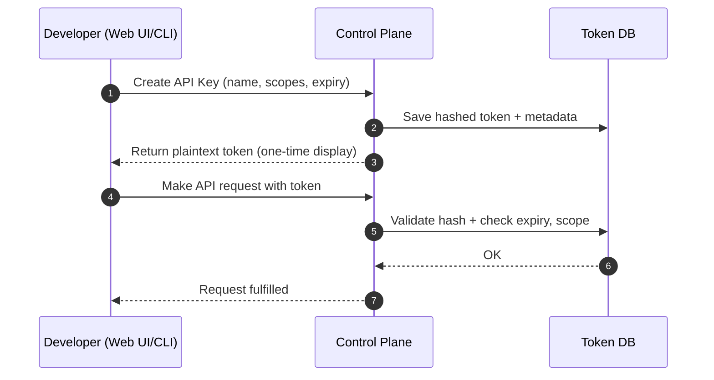

# 📘 E8 – API Key Strategy (Design v0.1)

## 🧭 Overview

This document defines the strategy and architecture for **API key issuance and management** in the FleetingDNS (FDF) platform. It establishes how scoped, rate-limited, and expirable API tokens will be created, authenticated, and used to access both control-plane and operational endpoints.

---

## 🎯 Objectives

* Enable developers to generate and manage scoped API keys via CLI or Web UI
* Support fine-grained access controls with action-specific scopes
* Allow API keys to carry metadata (TTL, usage quotas, expiry)
* Ensure key lifecycle security: issuance, rotation, revocation

---

## 🔐 Token Format

### API Key Encoding

* 256-bit random secret (e.g., UUIDv4 + random salt) encoded as Base62
* Prefix: `epk_` + environment marker + HMAC signature
* Example: `epk_live_0ef83ac9b70d4b6a98a3f10c9d...`

### Storage

* Keys are hashed [Argon2id](https://docs.rs/argon2/latest/argon2/) and stored server-side 
* Only the one-time token preview is shown to the user (never retrievable again)
* Each token is linked to a user or team ID and embedded with policy metadata

---

## 🗝️ Schema

```json
{
  "token_id": "api-k-79d2c",
  "name": "github-ci-token",
  "user_id": "user-123",
  "scopes": ["endpoints:create", "endpoints:delete"],
  "max_tunnels": 3,
  "rate_limit": {
    "burst": 10,
    "sustained_rps": 1
  },
  "created_at": "2025-07-01T12:00:00Z",
  "expires_at": "2025-09-01T00:00:00Z",
  "revoked": false
}
```

---

## 🎛️ Scope Types

| Scope              | Description                                |
| ------------------ | ------------------------------------------ |
| `endpoints:create` | Allows issuing new endpoint or tunnel      |
| `endpoints:delete` | Allows deleting an active endpoint         |
| `tunnels:read`     | List current tunnels (optional)            |
| `metrics:read`     | Query usage metrics for billing/monitoring |
| `admin:*`          | Reserved for platform or team admins       |

Scopes are statically defined and checked in request middleware.

---

## 🔁 Token Flow



---

## 📡 CLI Integration

* Users can list, revoke, and create keys using:

```bash
edf token create --name "ci" --scopes endpoints:create --expires 30d
edf token list
edf token revoke <id>
```

* The token is saved to a local config store (\~/.edf/tokens.json)

---

## 🚫 Revocation & Expiry

* Tokens can be revoked manually via CLI or web
* Expired tokens are ignored by the API and marked as stale
* Revoked tokens are soft-deleted with audit trail

---

## 🔐 Security Practices

* Argon2id used for secure hash storage
* Tokens never stored in plaintext after issuance
* Rate limiting and audit logging per token
* Signed token ID prefix protects against enumeration or tampering

---

## ✅ Deliverables for E6C Completion

* [ ] API: create/list/revoke token endpoints
* [ ] CLI integration: `edf token` commands
* [ ] Dashboard token management UI (basic v1)
* [ ] Middleware for scope/rate checks on incoming token usage

---

## 🔮 Future Enhancements

* JWT-based tokens with internal claims (expiry, scopes)
* Personal vs team tokens (scoped to org or project)
* Time-boxed temporary session tokens (e.g., 1-hour test tokens)
* Service account keys with webhook-bound roles

---

# 📗 **E6C – API Key Strategy**
*Sub-Epic → User-story breakdown (v0.1)*

Defines issuance, scope, rotation, audit, and governance model for API keys used by CLI, SDKs, and CI systems.

---

## Epic Goal
> “Provide fine-grained, revocable API tokens that support per-scope permissions, expiry, audit logging, and team/organization ownership—enabling secure automation without over-privileged credentials.”

---

## 🗂️ Story List
| ID | Story | Outcome |
|----|-------|---------|
| **E6C-S1** | As a *user*, create a **personal API key** with default scopes via portal. |
| **E6C-S2** | As a *Team admin*, issue **team-scoped key** limited to `endpoints:create` & `endpoints:delete`. |
| **E6C-S3** | As *DevOps*, set **expiry date** (e.g., 30 days) when creating a key. |
| **E6C-S4** | As *Security*, rotate keys with zero downtime using **overlapping validity window**. |
| **E6C-S5** | As *Auditor*, view **API key usage logs** (timestamp, route, IP) via portal. |
| **E6C-S6** | As *API*, validate key prefix quickly (Bloom filter) before Redis lookup. |
| **E6C-S7** | As *Admin*, revoke key instantly and ensure subsequent requests get 401 ≤5 s. |

---

## E6C-S1 — Personal Key Creation
**Tasks**
1. Portal endpoint `/api-keys` POST with scopes [].
2. Generate token `epk_live_<base62(32)>` + HMAC prefix.
3. Save hash (bcrypt) in Postgres table `api_keys`.

**Functional**
* UI shows `token_id`, `scopes`, `created_at`.
* Copy button one-time reveal.

**Non-Functional**
* Token entropy ≥ 256 bits.
* Key creation latency < 200 ms.

---

## E6C-S2 — Team-Scoped Keys
**Tasks**
1. Add `owner_type` enum (user/team) in DB.
2. Portal restrict UI to team admins only.
3. SDK includes `X-EDF-Team` header to disambiguate (optional).

**Functional**
* Plan quotas enforced at team level.
* Key lookup filters by owner.

**Non-Functional**
* Role-based guard checked server-side.
* UI lists keys grouped by owner.

---

## E6C-S3 — Expiry & Automatic Disable
**Tasks**
1. `expires_at` column; nullable (∞).
2. Redis TTL mirror for cache.
3. Portal default 90 days.

**Functional**
* 401 if key expired.
* Email notification 7 days before expiry.

**Non-Functional**
* Expiry check overhead none (epoch compare).
* Email CRON cost <€1/mo.

---

## E6C-S4 — Rotation Workflow
**Tasks**
1. Portal `rotate` button duplicates scopes, sets overlap window 24 h.
2. Old key `status=grace`.
3. CLI `edf key rotate` helper.

**Functional**
* Both keys valid during overlap.
* Old key auto-revoked after window.

**Non-Functional**
* Overlap adjustable 5–168 h.
* No double billing entries.

---

## E6C-S5 — Usage Audit Log
**Tasks**
1. API middleware logs `token_id`, route, status, IP to BigQuery.
2. Portal UI filter by date range.
3. CSV export.

**Functional**
* Audit retention 1 year.
* Download completes <5 s (100 K rows).

**Non-Functional**
* Ingest cost <€5/mo.
* PII—IP hashed last octet.

---

## E6C-S6 — Fast Validation Bloom
**Tasks**
1. Build Bloom filter of active key prefixes (`epk_live_<first6>`).
2. Load into memory at API start, refresh every 5 min.
3. Reject obviously invalid keys before hitting Redis.

**Functional**
* False‑positive rate <0.1 %.
* Drop invalid attempts early (saves 70 µs).

**Non-Functional**
* Bloom size <1 MB for 100 K keys.
* Update latency <2 s.

---

## E6C-S7 — Instant Revocation
**Tasks**
1. Portal `revoke` sets `revoked_at` timestamp.
2. Publish Redis pub/sub `key:revoked`.
3. API removes from in-memory Bloom filter immediately.

**Functional**
* Requests with revoked key get 401 within 5 s.
* Audit log entry created.

**Non-Functional**
* Pub/sub message delivery latency <1 s.
* Memory leak none.

---

© 2025 FleetingDNS — API Key Strategy stories

