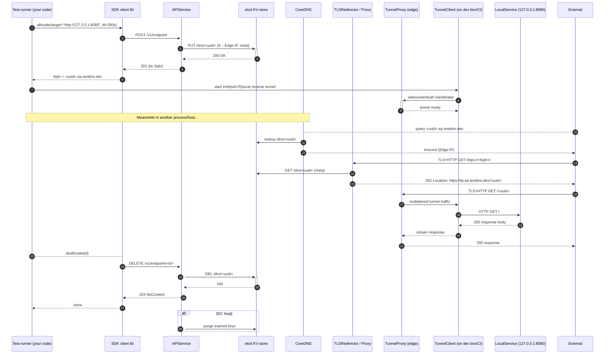

 # Engineering Index
 
 This document provides an overview of the system architecture, key components, and workflows involved in the engineering platform. It includes sequence diagrams and detailed explanations to help engineers understand the interactions between services, APIs, and infrastructure elements.


## Document Index

- [E1‑Core DNS Service (Design v0.1)](E1-Core_DNS_Service_(Design_v0.1).md)
- [E2‑Tunnel Server & CLI (Design v0.2)](E2-Tunnel_Server_&_CLI_(Design_v0.2).md)
- [E3‑Edge Proxy (Design v0.1)](E3-Edge_Proxy_(Design_v0.1).md)
- [E4‑Basic Auth Redirect and Auth Modes (Design v0.2)](E4-Basic_Auth_Redirect_and_Auth_Modes_(Design_v0.2).md)
- [E5‑SDK Integration (Design v0.2)](E5-SDK_Integration_(Design_v0.2).md)
- [E6‑CI Integration GitHub Action (Design v0.1)](E6-CI_Integration_GitHub_Action_(Design_v0.1).md)
- [E7‑Rate Limiting Design (v0.1)](E7-Rate_Limiting_Design(v0.1).md)
- [E8‑Security & Hardening (Design v0.1)](E8-Security_&_Hardening_(Design_v0.1).md)
- [E9‑Api Key Strategy Design (V0.1)](E9-Api_Key_Strategy_Design_(V0.1).md)

---

###  End to end backend sequence diagram for the (Ephemeral) Fleeting DNS Forwarder (FDF) system




### Yes — you can do the entire GitHub-OIDC ⇄ GCP Workload Identity setup **purely with Crossplane**

(no Terraform required).
The pieces are already in the **Upbound `provider-gcp` (v0.35+)** and the auto-generated **`provider-jet-gcp`**:

| GCP object                        | Crossplane CR (Jet)               | Crossplane CR (classic provider-gcp) | Status |
| --------------------------------- | --------------------------------- | ------------------------------------ | ------ |
| Workload-identity **pool**        | `IAMWorkloadIdentityPool`         | (same)                               | ✅ GA   |
| OIDC **provider** inside the pool | `IAMWorkloadIdentityPoolProvider` | (same)                               | ✅ GA   |
| Service-account **binding**       | `IAMPolicyMember` or `IAMPolicy`  | (same)                               | ✅ GA   |

> Upbound’s **reference-gcp** configuration already uses these CRDs for GitHub Actions examples—you can copy those patterns.

---

## 1 / Minimal Crossplane YAML (all in the *infra cluster*)

```yaml
# 1. Workload Identity Pool
apiVersion: iam.gcp.jet.crossplane.io/v1alpha2
kind: WorkloadIdentityPool
metadata:
  name: gha-pool
spec:
  forProvider:
    project: ${PROJECT_ID}
    displayName: "GitHub OIDC pool"
  providerConfigRef:
    name: gcp-org
---
# 2. OIDC Provider for GitHub
apiVersion: iam.gcp.jet.crossplane.io/v1alpha2
kind: WorkloadIdentityPoolProvider
metadata:
  name: gha-provider
spec:
  forProvider:
    project: ${PROJECT_ID}
    workloadIdentityPoolIdRef:
      name: gha-pool
    displayName: "GitHub repo federation"
    oidc:
      issuerUri: "https://token.actions.githubusercontent.com"
    attributeMapping:
      "google.subject": "assertion.sub"
      "attribute.repository": "assertion.repository"
  providerConfigRef:
    name: gcp-org
---
# 3. Bind Flux/ARC service-account to the principalSet
apiVersion: iam.gcp.crossplane.io/v1beta1
kind: IAMPolicyMember
metadata:
  name: arc-controller-wi
spec:
  forProvider:
    role: roles/iam.workloadIdentityUser
    member: >-
      principalSet://iam.googleapis.com/${PROJECT_NUMBER}/locations/global/workloadIdentityPools/gha-pool/attribute.repository/myorg/myrepo
    serviceAccountRef:
      name: arc-controller          # SA already created by Crossplane earlier
  providerConfigRef:
    name: gcp-org
```

After this, **any GitHub workflow** from `myorg/myrepo` can exchange its OIDC JWT for a short-lived token that impersonates `arc-controller@project.iam.gserviceaccount.com` — without storing a JSON key anywhere.

---

## 2 / How your runner Pods use it

1. **annotations** in the runner Deployment:

```yaml
serviceAccount:
  annotations:
    iam.gke.io/gcp-service-account: arc-controller@${PROJECT_ID}.iam.gserviceaccount.com
```

2. **GitHub workflow permission block**:

```yaml
permissions:
  id-token: write
  contents: read
```

The `actions-runner-controller` pod uses the projected GCP token to `docker push` to Artifact Registry or `kubectl` to the cluster — **no static creds**.

---

## 3 / Where to put the manifests

* All three CRs go in the **infra-cluster** Flux repo (e.g. `infra/gcp-iam/` kustomization).
* They reference the existing `ProviderConfig` (`gcp-org`) you already defined.
* No change is required inside the workload cluster.

---

## 4 / Function provider?

If you want to *generate* those IAMPolicyMember bindings dynamically for many repos, you can:

* Use the **`provider-kubernetes` + Composition Functions** (e.g., `function-go-template`) to template the IAMPolicyMember out of a Claim object (`GithubRepoAccess`).
* Or wait for Upbound’s experimental **policy-jet** function (still alpha).

But for a single private repo the static YAML above is simpler and production-ready.

---

### Bottom line

* **Everything can stay declarative in Crossplane/Flux; no Terraform needed.**
* You remove *all* GCP credentials from Secret Manager while still running GitHub Actions via `actions-runner-controller`.


---
### Yes — you can do the entire GitHub-OIDC ⇄ GCP Workload Identity setup **purely with Crossplane**

(no Terraform required).
The pieces are already in the **Upbound `provider-gcp` (v0.35+)** and the auto-generated **`provider-jet-gcp`**:

| GCP object                        | Crossplane CR (Jet)               | Crossplane CR (classic provider-gcp) | Status |
| --------------------------------- | --------------------------------- | ------------------------------------ | ------ |
| Workload-identity **pool**        | `IAMWorkloadIdentityPool`         | (same)                               | ✅ GA   |
| OIDC **provider** inside the pool | `IAMWorkloadIdentityPoolProvider` | (same)                               | ✅ GA   |
| Service-account **binding**       | `IAMPolicyMember` or `IAMPolicy`  | (same)                               | ✅ GA   |

> Upbound’s **reference-gcp** configuration already uses these CRDs for GitHub Actions examples—you can copy those patterns.

---

## 1 / Minimal Crossplane YAML (all in the *infra cluster*)

```yaml
# 1. Workload Identity Pool
apiVersion: iam.gcp.jet.crossplane.io/v1alpha2
kind: WorkloadIdentityPool
metadata:
  name: gha-pool
spec:
  forProvider:
    project: ${PROJECT_ID}
    displayName: "GitHub OIDC pool"
  providerConfigRef:
    name: gcp-org
---
# 2. OIDC Provider for GitHub
apiVersion: iam.gcp.jet.crossplane.io/v1alpha2
kind: WorkloadIdentityPoolProvider
metadata:
  name: gha-provider
spec:
  forProvider:
    project: ${PROJECT_ID}
    workloadIdentityPoolIdRef:
      name: gha-pool
    displayName: "GitHub repo federation"
    oidc:
      issuerUri: "https://token.actions.githubusercontent.com"
    attributeMapping:
      "google.subject": "assertion.sub"
      "attribute.repository": "assertion.repository"
  providerConfigRef:
    name: gcp-org
---
# 3. Bind Flux/ARC service-account to the principalSet
apiVersion: iam.gcp.crossplane.io/v1beta1
kind: IAMPolicyMember
metadata:
  name: arc-controller-wi
spec:
  forProvider:
    role: roles/iam.workloadIdentityUser
    member: >-
      principalSet://iam.googleapis.com/${PROJECT_NUMBER}/locations/global/workloadIdentityPools/gha-pool/attribute.repository/myorg/myrepo
    serviceAccountRef:
      name: arc-controller          # SA already created by Crossplane earlier
  providerConfigRef:
    name: gcp-org
```

After this, **any GitHub workflow** from `myorg/myrepo` can exchange its OIDC JWT for a short-lived token that impersonates `arc-controller@project.iam.gserviceaccount.com` — without storing a JSON key anywhere.

---

## 2 / How your runner Pods use it

1. **annotations** in the runner Deployment:

```yaml
serviceAccount:
  annotations:
    iam.gke.io/gcp-service-account: arc-controller@${PROJECT_ID}.iam.gserviceaccount.com
```

2. **GitHub workflow permission block**:

```yaml
permissions:
  id-token: write
  contents: read
```

The `actions-runner-controller` pod uses the projected GCP token to `docker push` to Artifact Registry or `kubectl` to the cluster — **no static creds**.

---

## 3 / Where to put the manifests

* All three CRs go in the **infra-cluster** Flux repo (e.g. `infra/gcp-iam/` kustomization).
* They reference the existing `ProviderConfig` (`gcp-org`) you already defined.
* No change is required inside the workload cluster.

---

## 4 / Function provider?

If you want to *generate* those IAMPolicyMember bindings dynamically for many repos, you can:

* Use the **`provider-kubernetes` + Composition Functions** (e.g., `function-go-template`) to template the IAMPolicyMember out of a Claim object (`GithubRepoAccess`).
* Or wait for Upbound’s experimental **policy-jet** function (still alpha).

But for a single private repo the static YAML above is simpler and production-ready.

---

### Bottom line

* **Everything can stay declarative in Crossplane/Flux; no Terraform needed.**
* You remove *all* GCP credentials from Secret Manager while still running GitHub Actions via `actions-runner-controller`.
