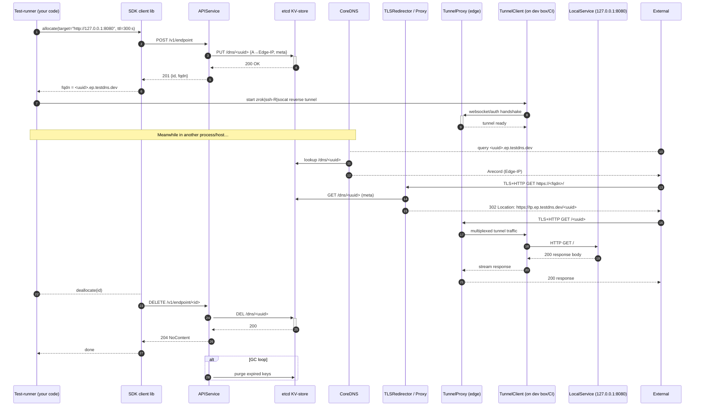

 # Engineering Index
 
 This document provides an overview of the system architecture, key components, and workflows involved in the engineering platform. It includes sequence diagrams and detailed explanations to help engineers understand the interactions between services, APIs, and infrastructure elements.

## Document Index

- [E1‑Core DNS Service (Design v0.1)](E1-Core_DNS_Service_(Design_v0.1).md)
- [E2‑Tunnel Server & CLI (Design v0.2)](E2-Tunnel_Server_&_CLI_(Design_v0.2).md)
- [E3‑Edge Proxy (Design v0.1)](E3-Edge_Proxy_(Design_v0.1).md)
- [E4‑Basic Auth Redirect and Auth Modes (Design v0.2)](E4-Basic_Auth_Redirect_and_Auth_Modes_(Design_v0.2).md)
- [E5‑SDK Integration (Design v0.2)](E5-SDK_Integration_(Design_v0.2).md)
- [E6‑CI Integration GitHub Action (Design v0.1)](E6-CI_Integration_GitHub_Action_(Design_v0.1).md)
- [E7‑Rate Limiting Design (v0.1)](E7-Rate_Limiting_Design(v0.1).md)
- [E8‑Security & Hardening (Design v0.1)](E8-Security_&_Hardening_(Design_v0.1).md)
- [E9‑Api Key Strategy Design (V0.1)](E9-Api_Key_Strategy_Design_(V0.1).md)

---

###  End to end backend sequence diagram for the Ephemeral DNS Forwarder (FDF) system

