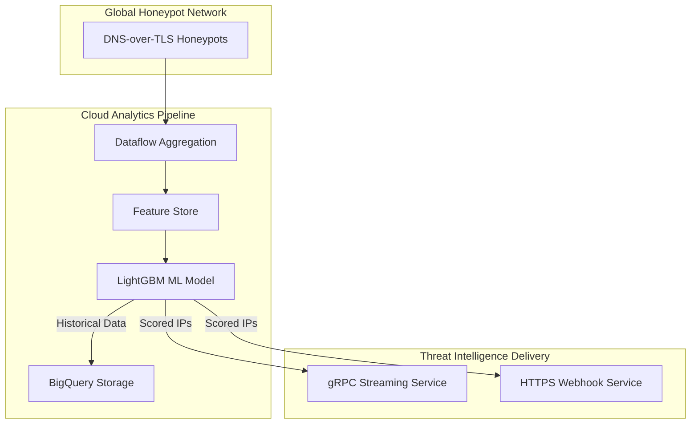
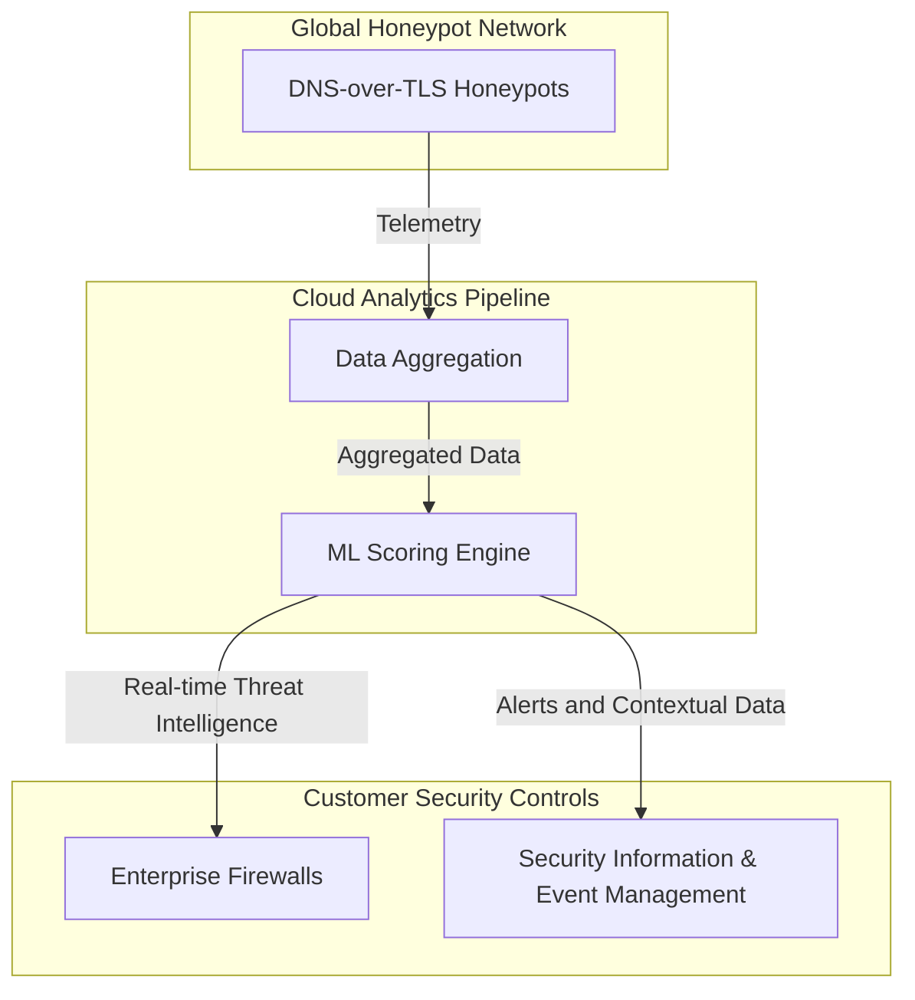
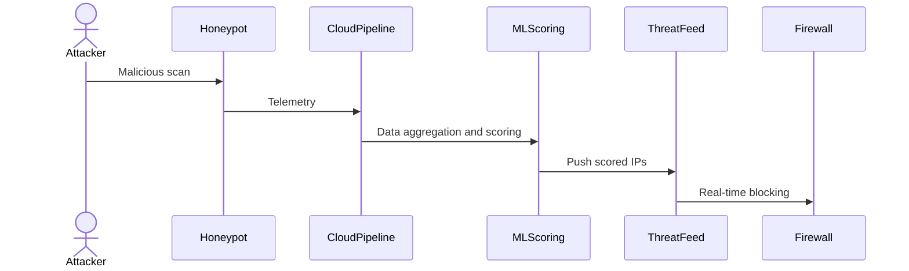

# FDNS Shield: Monetizing Honeypot-Derived Threat Intelligence

## Executive Summary

Cybersecurity threats are evolving rapidly, and enterprises need proactive, real-time threat intelligence to protect their infrastructure. FDNS Shield leverages a global network of DNS-over-TLS honeypots, capturing detailed telemetry from attackers and providing enterprises with enriched, machine-learning scored threat intelligence feeds. These feeds enable customers to proactively block threats, dramatically reducing the window of vulnerability.

---

## Market Opportunity

The threat intelligence market is projected to reach \$16–25 billion within the next 5–7 years. FDNS Shield uniquely positions itself by offering:

* Real-time threat blocking (latency <60s)
* Machine-learned risk scoring
* Rich contextual metadata for SOC analysis
* Seamless firewall and SOC integration
* Proprietary intelligence derived from DNS honeypots

---

## Technical Architecture

### High-Level System Architecture

### Solution Overview: FDNS Shield Feed

### Telemetry Collection and Blocking Sequence

---

## Competitive Analysis

FDNS Shield vs Competitors:

| Feature                    | FDNS Shield | GreyNoise | ThreatStream |
| -------------------------- | ----------- | --------- | ------------ |
| Real-time Updates          | ✅           | ❌         | ✅            |
| Machine-Learning Scoring   | ✅           | ❌         | ✅            |
| Rich Contextual Metadata   | ✅           | ❌         | ✅            |
| DNS Honeypot-derived Intel | ✅           | ❌         | ❌            |
| Easy Firewall Integration  | ✅           | ✅         | ✅            |
| Subscription Pricing       | ✅           | ✅         | ✅            |

---

## Monetization Strategy

FDNS Shield employs a tiered SaaS subscription model:

| Tier       | Monthly Pricing | Features                                                              |
| ---------- | --------------- | --------------------------------------------------------------------- |
| Insight    | €500            | Limited alerts, basic analytics                                       |
| Hunt       | €1,500          | Advanced analytics, multi-endpoint integration, ML scoring insights   |
| Enterprise | €5,000+         | Unlimited endpoints, full ML scores, premium SLA, custom integrations |

### Revenue Projections

| Year | Customers | Projected ARR |
| ---- | --------- | ------------- |
| 1    | 50        | €1M - €2M     |
| 3    | 200       | €5M - €10M    |
| 5    | 1000+     | €20M+         |

---

## Conclusion

FDNS Shield transforms traditional honeypots into a powerful, proactive threat intelligence platform, delivering significant operational benefits and attractive revenue potential. By leveraging advanced ML and AI enhancements, FDNS Shield stands out as a cutting-edge solution in the rapidly growing cybersecurity market.

---

©2025 FleetingDNS
